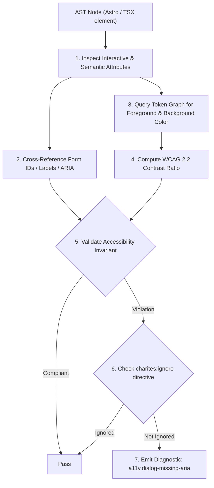
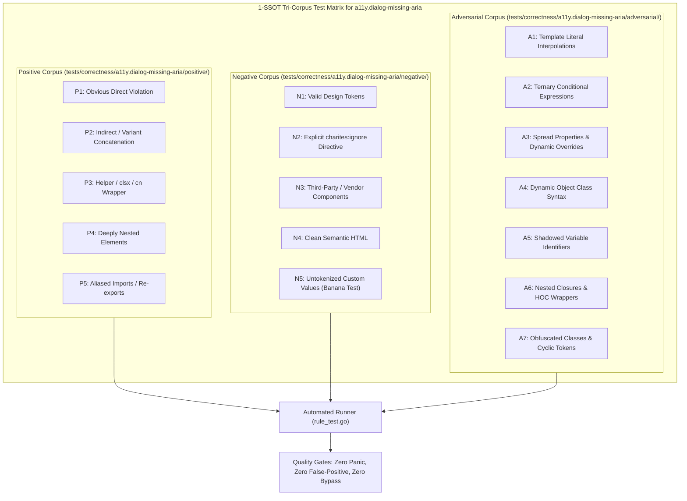

# a11y.dialog-missing-aria

> **Rule ID:** `a11y.dialog-missing-aria`
> **Severity:** `ERROR`
> **Category:** `a11y`
> **Target Standards:** W3C Web Content Accessibility Guidelines (WCAG) 2.2 SC 4.1.2 (Name, Role, Value), W3C WAI-ARIA 1.2 Dialog (Modal) Pattern Specification, W3C WAI-ARIA Authoring Practices Guide (APG)

---

## 1. Overview & Core Invariant

Enforces that custom modal dialogs declare aria-modal="true" and have an accessible name

### Core Invariant:
> **"Any element with role="dialog" or role="alertdialog" must specify aria-modal="true" and declare an accessible name via aria-labelledby or aria-label."**

---
## 2. Technical Grounding & Engine Realities

In web applications, declaring role="dialog" on a <div> establishes the container as an accessible dialog in the accessibility tree.

However, role="dialog" alone is insufficient without two mandatory attributes:
1. Modal Boundary (aria-modal="true"): Without aria-modal="true", screen readers treat the dialog as a non-modal popup, allowing reading cursor navigation to bleed into background page elements behind the backdrop.
2. Accessible Name (aria-labelledby or aria-label): Screen readers announce "dialog" but cannot state what the dialog is about (e.g. "Konfirmasi Hapus Data") if aria-labelledby or aria-label is omitted.

Charites inspects custom dialog nodes to verify both boundary demarcation and accessible naming.

---
## 3. Vulnerability & Risk Taxonomy

| Risk Vector | Severity | Impact |
| :--- | :---: | :--- |
| **Screen Reader Background Bleed** | HIGH | Screen readers navigate into background DOM elements behind the dialog overlay. |
| **Unnamed Modal Context** | HIGH | Assistive technologies announce an unnamed generic dialog without purpose or context. |

---
## 4. Non-Compliant Code Patterns (Bad Examples)
### TSX (Custom dialog missing aria-modal and accessible name):
```tsx
<div role="dialog" className="fixed inset-0 z-50 flex items-center justify-center bg-black/50">
  <div className="bg-background p-6 rounded-xl">
    <h2>Konfirmasi Tindakan</h2>
    <p>Apakah Anda ingin melanjutkan?</p>
  </div>
</div>
```

---
## 5. Compliant Implementation Patterns (Good Examples)
### TSX (Compliant custom modal dialog with aria-modal and aria-labelledby):
```tsx
<div role="dialog" aria-modal="true" aria-labelledby="dialog-title" className="fixed inset-0 z-50 flex items-center justify-center bg-black/50">
  <div className="bg-background p-6 rounded-xl">
    <h2 id="dialog-title" className="text-lg font-semibold">Konfirmasi Tindakan</h2>
    <p className="text-sm text-muted-foreground mt-2">Apakah Anda ingin melanjutkan?</p>
  </div>
</div>
```

---

## 6. Detection & Verification Pipeline (How The Rule Evaluates Code)
This `a11y` rule evaluates template markup and cross-references resolved design tokens for accessibility:



### Step-by-Step Evaluation:
1. **AST Traversal:** Inspects semantic elements, form controls, images, and landmark containers.
2. **Structural & Attribute Invariant Check:** Verifies accessible names, heading hierarchies, label/input bindings, and positive tabindex avoidance.
3. **Token-Aware Contrast Verification:** If analyzing color classes, queries `token.Context` to resolve foreground and background values, calculating relative luminance ratios.
4. **Directive Suppression Check:** Inspects preceding comments for `charites:ignore a11y.dialog-missing-aria`.
5. **Diagnostic Emission:** Emits WCAG-grounded diagnostics for non-compliant patterns.

---

## 7. Verification & Test Harness (How The Test Works: 1-SSOT Tri-Corpus)

This rule is rigorously tested and validated across the canonical **1-SSOT Tri-Corpus** in `tests/correctness/a11y.dialog-missing-aria/`:



- **Positive Fixtures (P1-P5):** Verified to trigger diagnostics at exact lines and column spans.
- **Negative Fixtures (N1-N5):** Verified to produce zero diagnostics on valid tokens and legitimate exemptions.
- **Adversarial Fixtures (A1-A7):** Verified to prevent evasion across dynamic expressions, string interpolations, and cyclic references.

---

## 8. How to Suppress (Ignore Directives)

If this pattern is required for an intentional exception, suppress the diagnostic using the canonical Charites Rule ID:

```astro
<!-- charites:ignore a11y.dialog-missing-aria intentional exception -->
```

```tsx
// charites:ignore a11y.dialog-missing-aria intentional exception
```

---

## 9. Configuration Reference (`charites.yaml`)

```yaml
rules:
  a11y.dialog-missing-aria:
    severity: error # error | warn | info | off
```

