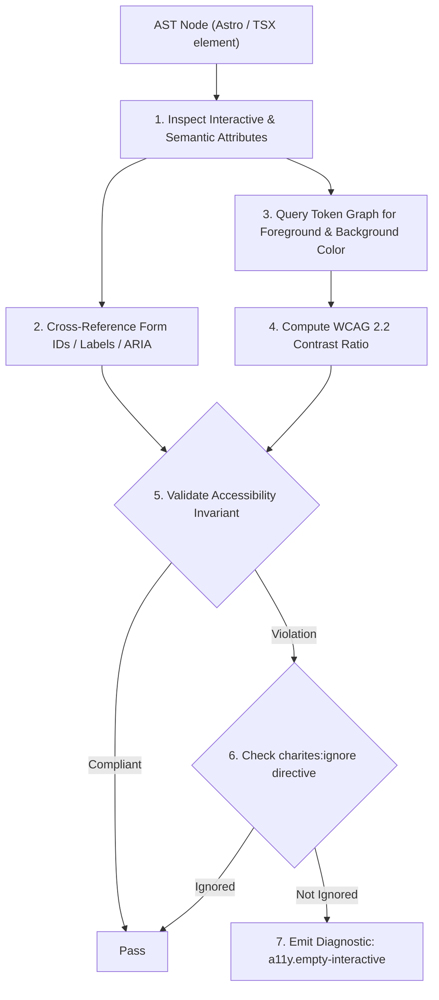
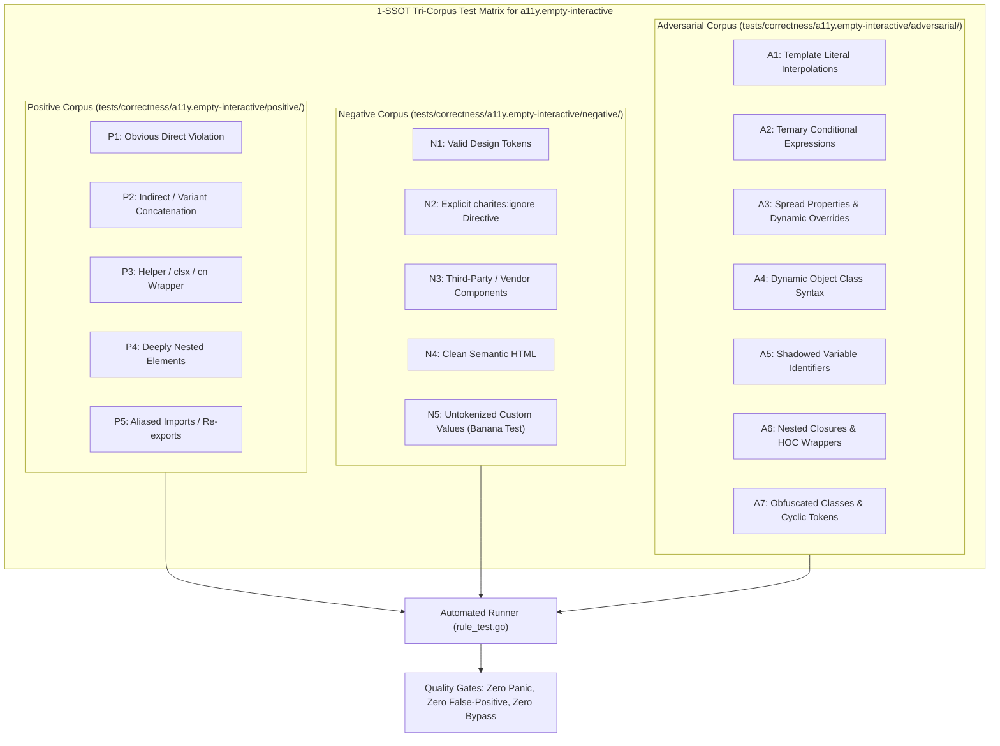

# a11y.empty-interactive

> **Rule ID:** `a11y.empty-interactive`
> **Severity:** `ERROR`
> **Category:** `a11y`
> **Target Standards:** W3C Web Content Accessibility Guidelines (WCAG) 2.2 SC 4.1.2 (Name, Role, Value), W3C Web Content Accessibility Guidelines (WCAG) 2.2 SC 2.4.4 (Link Purpose in Context), W3C Accessible Name and Description Computation (AccName) 1.2

---

## 1. Overview & Core Invariant

Enforces accessible names on interactive elements (buttons, links) containing only icons or visual elements

### Core Invariant:
> **"Interactive controls (<button>, <a>, role="button") must provide an accessible name via text content, aria-label, aria-labelledby, or title."**

---
## 2. Technical Grounding & Engine Realities

Modern UI designs frequently employ icon-only buttons (such as trash cans for delete, pencils for edit, or magnifying glasses for search) without visible text labels.

When developers render icon components (e.g. Lucide, Heroicons, or native <svg>) inside <button> or <a> without aria-label:
1. Unnamed Interactive Elements: Assistive technologies announce "button" or "link" with zero information about the control's purpose or action.
2. Linter Bypass: Conventional linters often pass these elements because the JSX tree contains child elements (<TrashIcon />), failing to realize that rendered SVGs produce no accessible text.
3. Severe Navigation Barrier: Blind or low-vision users cannot determine which action each button executes without activating it.

Charites inspects interactive controls to ensure icon-only elements supply an accessible name.

---
## 3. Vulnerability & Risk Taxonomy

| Risk Vector | Severity | Impact |
| :--- | :---: | :--- |
| **Blank Interactive Control** | HIGH | Screen readers announce an unlabelled button or link without stating its action. |
| **Inaccessible Voice Navigation** | MEDIUM | Voice control software cannot target or activate the unlabelled control. |

---
## 4. Non-Compliant Code Patterns (Bad Examples)
### TSX (Icon-only button without accessible name):
```tsx
<button onClick={handleDelete} className="size-11 flex items-center justify-center">
  <TrashIcon className="size-5 text-destructive" />
</button>
```

---
## 5. Compliant Implementation Patterns (Good Examples)
### TSX (Icon-only button with explicit aria-label):
```tsx
<button type="button" onClick={handleDelete} aria-label="Hapus dokumen ini" className="size-11 flex items-center justify-center">
  <TrashIcon className="size-5 text-destructive" />
</button>
```

---

## 6. Detection & Verification Pipeline (How The Rule Evaluates Code)
This `a11y` rule evaluates template markup and cross-references resolved design tokens for accessibility:



### Step-by-Step Evaluation:
1. **AST Traversal:** Inspects semantic elements, form controls, images, and landmark containers.
2. **Structural & Attribute Invariant Check:** Verifies accessible names, heading hierarchies, label/input bindings, and positive tabindex avoidance.
3. **Token-Aware Contrast Verification:** If analyzing color classes, queries `token.Context` to resolve foreground and background values, calculating relative luminance ratios.
4. **Directive Suppression Check:** Inspects preceding comments for `charites:ignore a11y.empty-interactive`.
5. **Diagnostic Emission:** Emits WCAG-grounded diagnostics for non-compliant patterns.

---

## 7. Verification & Test Harness (How The Test Works: 1-SSOT Tri-Corpus)

This rule is rigorously tested and validated across the canonical **1-SSOT Tri-Corpus** in `tests/correctness/a11y.empty-interactive/`:



- **Positive Fixtures (P1-P5):** Verified to trigger diagnostics at exact lines and column spans.
- **Negative Fixtures (N1-N5):** Verified to produce zero diagnostics on valid tokens and legitimate exemptions.
- **Adversarial Fixtures (A1-A7):** Verified to prevent evasion across dynamic expressions, string interpolations, and cyclic references.

---

## 8. How to Suppress (Ignore Directives)

If this pattern is required for an intentional exception, suppress the diagnostic using the canonical Charites Rule ID:

```astro
<!-- charites:ignore a11y.empty-interactive intentional exception -->
```

```tsx
// charites:ignore a11y.empty-interactive intentional exception
```

---

## 9. Configuration Reference (`charites.yaml`)

```yaml
rules:
  a11y.empty-interactive:
    severity: error # error | warn | info | off
```

