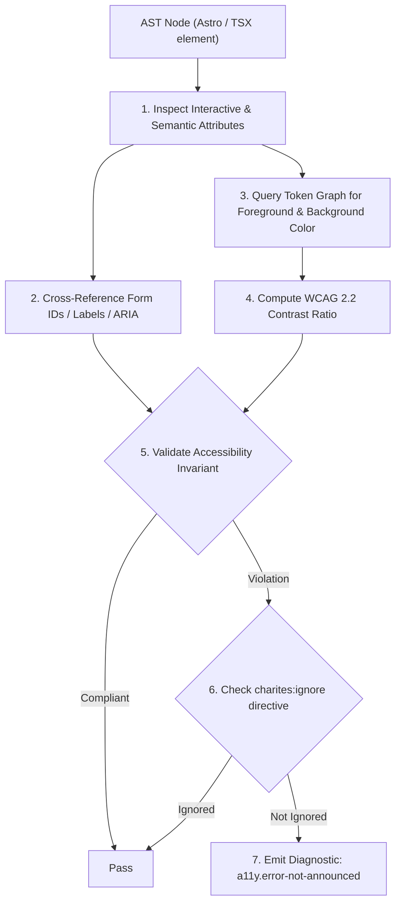
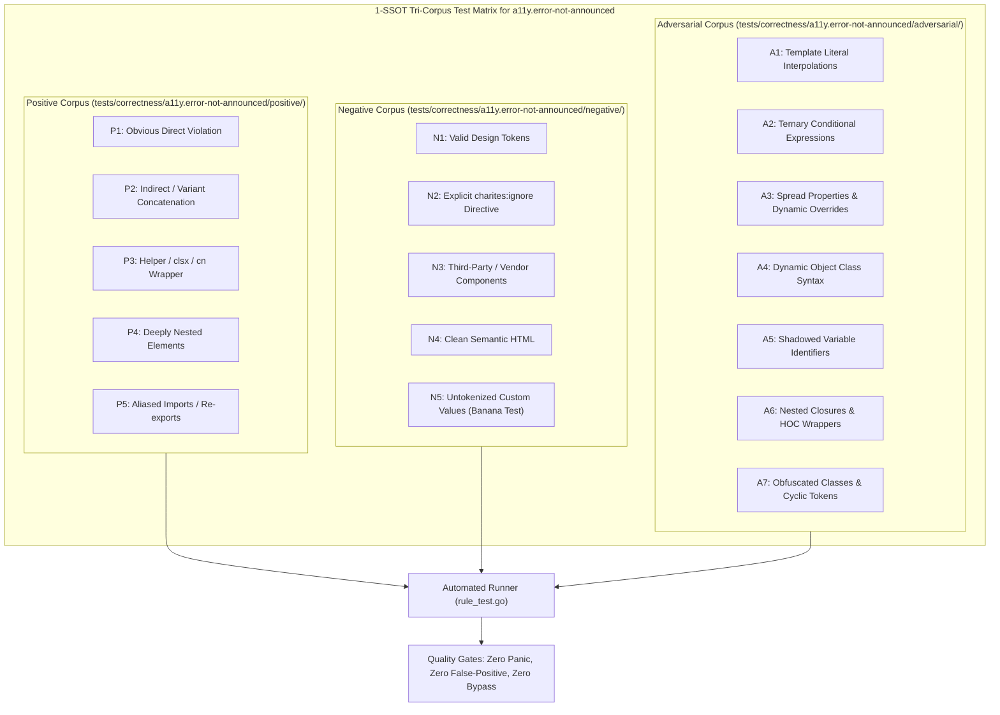

# a11y.error-not-announced

> **Rule ID:** `a11y.error-not-announced`
> **Severity:** `ERROR`
> **Category:** `a11y`
> **Target Standards:** WCAG 2.2 Success Criterion 3.3.1 (Error Identification - Level A), WCAG 2.2 Success Criterion 1.3.1 (Info and Relationships - Level A), WAI-ARIA 1.2 Form Validation Authoring Practices

---

## 1. Overview & Core Invariant

Ensures form controls with aria-invalid are programmatically linked to error messages via aria-describedby (WCAG 3.3.1)

### Core Invariant:
> **"Form input controls (<input>, <select>, <textarea>) declaring 'aria-invalid' must provide an 'aria-describedby' attribute linking to the error message element ID."**

---
## 2. Technical Grounding & Engine Realities

When form validation fails, declaring `aria-invalid` prompts screen readers to announce that the field contains an error.

However, if the control lacks `aria-describedby` referencing the error description container:
1. Blind Error State: Screen reader users are informed that their input is invalid, but are left completely unaware of *why* or what format is expected.
2. Inaccessible Visual Feedback: Visual error banners with `text-destructive` are visible to sighted users but completely disconnected in the accessibility tree.
3. Severe WCAG 3.3.1 Level A Non-Compliance: Automatic audit failure in enterprise accessibility and European Accessibility Act (EAA) reviews.

Charites verifies that any input with active or dynamic `aria-invalid` includes an accompanying `aria-describedby`.

---
## 3. Vulnerability & Risk Taxonomy

| Risk Vector | Severity | Impact |
| :--- | :---: | :--- |
| **Unannounced Form Validation Errors** | HIGH | Screen reader users cannot determine why form submission failed or how to correct invalid inputs. |
| **WCAG 3.3.1 Level A Non-Compliance** | HIGH | Immediate compliance failure during accessibility audits. |

---
## 4. Non-Compliant Code Patterns (Bad Examples)
### TSX (Dynamic aria-invalid without aria-describedby to the error text):
```tsx
<input id="email" aria-invalid={!!errors.email} className="border-destructive" />
```
### ASTRO (Static aria-invalid without programmatic error connection):
```astro
<input id="username" aria-invalid="true" class="border-red-500" />
```

---
## 5. Compliant Implementation Patterns (Good Examples)
### TSX (Input wired to error message ID via aria-describedby):
```tsx
<input id="email" aria-invalid={!!errors.email} aria-describedby={errors.email ? "email-error" : undefined} className="border-destructive" />
```
### ASTRO (Input linked to error container with role='alert'):
```astro
<input id="username" aria-invalid="true" aria-describedby="username-error" class="border-red-500" />
```

---

## 6. Detection & Verification Pipeline (How The Rule Evaluates Code)
This `a11y` rule evaluates template markup and cross-references resolved design tokens for accessibility:



### Step-by-Step Evaluation:
1. **AST Traversal:** Inspects semantic elements, form controls, images, and landmark containers.
2. **Structural & Attribute Invariant Check:** Verifies accessible names, heading hierarchies, label/input bindings, and positive tabindex avoidance.
3. **Token-Aware Contrast Verification:** If analyzing color classes, queries `token.Context` to resolve foreground and background values, calculating relative luminance ratios.
4. **Directive Suppression Check:** Inspects preceding comments for `charites:ignore a11y.error-not-announced`.
5. **Diagnostic Emission:** Emits WCAG-grounded diagnostics for non-compliant patterns.

---

## 7. Verification & Test Harness (How The Test Works: 1-SSOT Tri-Corpus)

This rule is rigorously tested and validated across the canonical **1-SSOT Tri-Corpus** in `tests/correctness/a11y.error-not-announced/`:



- **Positive Fixtures (P1-P5):** Verified to trigger diagnostics at exact lines and column spans.
- **Negative Fixtures (N1-N5):** Verified to produce zero diagnostics on valid tokens and legitimate exemptions.
- **Adversarial Fixtures (A1-A7):** Verified to prevent evasion across dynamic expressions, string interpolations, and cyclic references.

---

## 8. How to Suppress (Ignore Directives)

If this pattern is required for an intentional exception, suppress the diagnostic using the canonical Charites Rule ID:

```astro
<!-- charites:ignore a11y.error-not-announced intentional exception -->
```

```tsx
// charites:ignore a11y.error-not-announced intentional exception
```

---

## 9. Configuration Reference (`charites.yaml`)

```yaml
rules:
  a11y.error-not-announced:
    severity: error # error | warn | info | off
```

