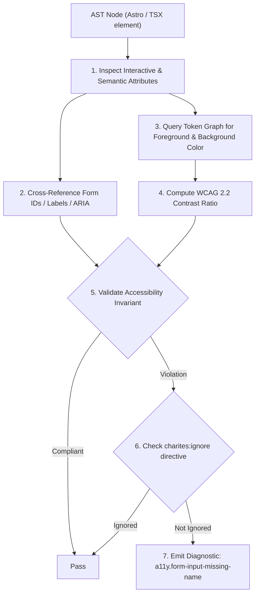
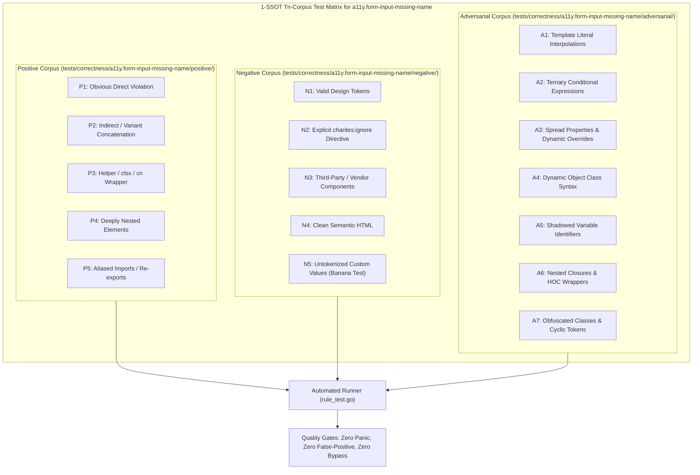

# a11y.form-input-missing-name

> **Rule ID:** `a11y.form-input-missing-name`
> **Severity:** `WARN`
> **Category:** `a11y`
> **Target Standards:** WCAG 2.2 Success Criterion 4.1.2 (Name, Role, Value - Level A), HTML5 Specification (Section 4.10.5 The input element & form submission), W3C Form Usability & Autofill Standards

---

## 1. Overview & Core Invariant

Ensures form input controls declare an identifying name or id attribute for form submission and autofill (WCAG 4.1.2)

### Core Invariant:
> **"Form input controls (<input>, <select>, <textarea>) must declare an identifying 'name' or 'id' attribute."**

---
## 2. Technical Grounding & Engine Realities

Browsers, password managers, and native form processors rely on 'name' and 'id' attributes to identify field context.

When form controls lack both 'name' and 'id':
1. Autofill Failure: Chrome, Safari, and password managers (1Password, Bitwarden) cannot identify whether an input is for email, username, or credit card, forcing users to type manually.
2. Silent Form Data Loss: Standard HTML <form> submission constructs FormData from controls with a 'name' attribute. Inputs without 'name' are completely omitted from the payload.
3. Unidentifiable Tree Nodes: Screen readers and automated testing frameworks cannot reference or locate the input deterministically.

Charites flags form controls that fail to specify at least one identifying key ('name' or 'id').

---
## 3. Vulnerability & Risk Taxonomy

| Risk Vector | Severity | Impact |
| :--- | :---: | :--- |
| **Silent Form Submission Data Loss** | HIGH | Form inputs without 'name' attributes are excluded from native FormData submissions. |
| **Password Manager & Autofill Breakdown** | MEDIUM | Browser autofill cannot populate user credentials, causing login drop-off. |

---
## 4. Non-Compliant Code Patterns (Bad Examples)
### TSX (Input missing both name and id attributes):
```tsx
<input type="email" className="w-full border px-3 py-2" placeholder="nama@domain.com" />
```
### ASTRO (Select dropdown without name or id identifier):
```astro
<select class="border p-2"><option value="id">Indonesia</option></select>
```

---
## 5. Compliant Implementation Patterns (Good Examples)
### TSX (Properly identified input with matching name and id):
```tsx
<input id="user-email" name="email" type="email" className="w-full border px-3 py-2" placeholder="nama@domain.com" />
```
### ASTRO (Select dropdown with descriptive name and id):
```astro
<select name="country" id="country" class="border p-2"><option value="id">Indonesia</option></select>
```

---

## 6. Detection & Verification Pipeline (How The Rule Evaluates Code)
This `a11y` rule evaluates template markup and cross-references resolved design tokens for accessibility:



### Step-by-Step Evaluation:
1. **AST Traversal:** Inspects semantic elements, form controls, images, and landmark containers.
2. **Structural & Attribute Invariant Check:** Verifies accessible names, heading hierarchies, label/input bindings, and positive tabindex avoidance.
3. **Token-Aware Contrast Verification:** If analyzing color classes, queries `token.Context` to resolve foreground and background values, calculating relative luminance ratios.
4. **Directive Suppression Check:** Inspects preceding comments for `charites:ignore a11y.form-input-missing-name`.
5. **Diagnostic Emission:** Emits WCAG-grounded diagnostics for non-compliant patterns.

---

## 7. Verification & Test Harness (How The Test Works: 1-SSOT Tri-Corpus)

This rule is rigorously tested and validated across the canonical **1-SSOT Tri-Corpus** in `tests/correctness/a11y.form-input-missing-name/`:



- **Positive Fixtures (P1-P5):** Verified to trigger diagnostics at exact lines and column spans.
- **Negative Fixtures (N1-N5):** Verified to produce zero diagnostics on valid tokens and legitimate exemptions.
- **Adversarial Fixtures (A1-A7):** Verified to prevent evasion across dynamic expressions, string interpolations, and cyclic references.

---

## 8. How to Suppress (Ignore Directives)

If this pattern is required for an intentional exception, suppress the diagnostic using the canonical Charites Rule ID:

```astro
<!-- charites:ignore a11y.form-input-missing-name intentional exception -->
```

```tsx
// charites:ignore a11y.form-input-missing-name intentional exception
```

---

## 9. Configuration Reference (`charites.yaml`)

```yaml
rules:
  a11y.form-input-missing-name:
    severity: warn # error | warn | info | off
```

