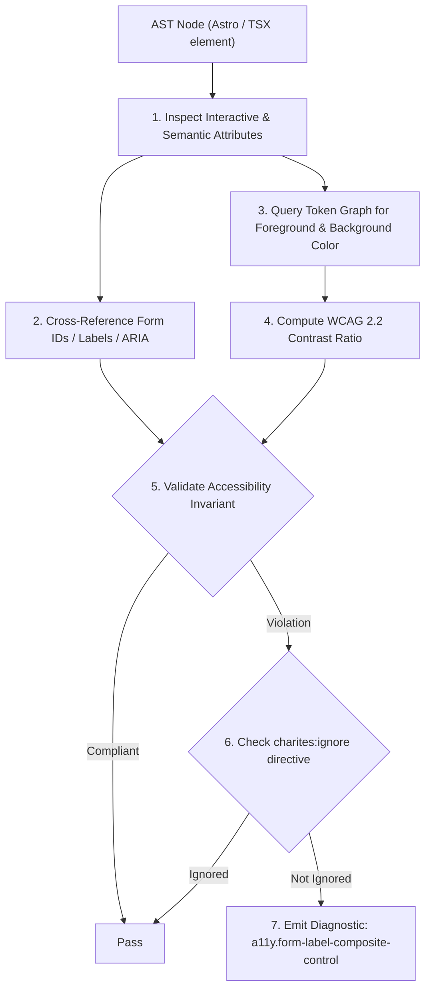
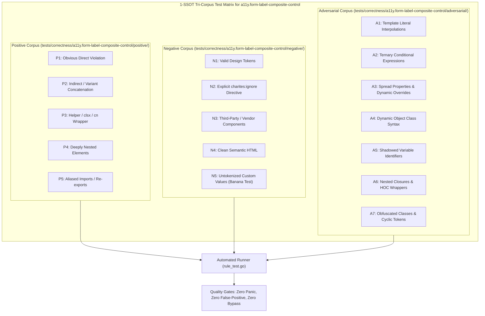

# a11y.form-label-composite-control

> **Rule ID:** `a11y.form-label-composite-control`
> **Severity:** `WARN`
> **Category:** `a11y`
> **Target Standards:** W3C Web Content Accessibility Guidelines (WCAG) 2.2 SC 1.3.1 (Info and Relationships), W3C WAI-ARIA 1.2 Grouping Controls (<fieldset> / <legend> pattern), HTML Living Standard Section 4.10.16 (The fieldset element)

---

## 1. Overview & Core Invariant

Warns when <FormLabel> is directly bound to a composite multi-field control causing screen reader ambiguity

### Core Invariant:
> **"A single <FormLabel> must bind to exactly one discrete interactive input; composite multi-field components must use <fieldset> with <legend>."**

---
## 2. Technical Grounding & Engine Realities

In Shadcn UI and Radix-based form architectures, <FormLabel> generates an HTML <label> linked via htmlFor to the single ID assigned to <FormControl>.

When developers bind a <FormLabel> to a composite multi-field component (such as <DateRangePicker>, <AddressFields>, or multiple <input> fields within one <FormControl>):
1. Ambiguous Screen Reader Announcement: The screen reader announces the label only for the first input or fails to associate it properly with subsequent controls.
2. Inability to Navigate: Keyboard users cannot tell which part of the composite input the label describes.
3. Accessibility Violation: WCAG 1.3.1 requires clear programmatic grouping for related multi-field data.

Charites detects composite component naming patterns and multiple inputs under a single <FormItem>.

---
## 3. Vulnerability & Risk Taxonomy

| Risk Vector | Severity | Impact |
| :--- | :---: | :--- |
| **Screen Reader Control Ambiguity** | MEDIUM | Users of screen readers cannot determine which discrete sub-field is labeled. |
| **Form Autofill Fragmentation** | LOW | Browser password managers and autofill engines fail to parse multi-part composite inputs. |

---
## 4. Non-Compliant Code Patterns (Bad Examples)
### TSX (Single FormLabel bound directly to composite DateRangePicker):
```tsx
<FormItem>
  <FormLabel>Rentang Tanggal</FormLabel>
  <FormControl>
    <DateRangePicker fromDate={from} toDate={to} />
  </FormControl>
</FormItem>
```

---
## 5. Compliant Implementation Patterns (Good Examples)
### TSX (Separated into individual FormItem controls or wrapped with fieldset):
```tsx
<div className="grid grid-cols-1 sm:grid-cols-2 gap-4">
  <FormItem>
    <FormLabel>Tanggal Mulai</FormLabel>
    <FormControl><DatePicker date={from} /></FormControl>
  </FormItem>
  <FormItem>
    <FormLabel>Tanggal Selesai</FormLabel>
    <FormControl><DatePicker date={to} /></FormControl>
  </FormItem>
</div>
```

---

## 6. Detection & Verification Pipeline (How The Rule Evaluates Code)
This `a11y` rule evaluates template markup and cross-references resolved design tokens for accessibility:



### Step-by-Step Evaluation:
1. **AST Traversal:** Inspects semantic elements, form controls, images, and landmark containers.
2. **Structural & Attribute Invariant Check:** Verifies accessible names, heading hierarchies, label/input bindings, and positive tabindex avoidance.
3. **Token-Aware Contrast Verification:** If analyzing color classes, queries `token.Context` to resolve foreground and background values, calculating relative luminance ratios.
4. **Directive Suppression Check:** Inspects preceding comments for `charites:ignore a11y.form-label-composite-control`.
5. **Diagnostic Emission:** Emits WCAG-grounded diagnostics for non-compliant patterns.

---

## 7. Verification & Test Harness (How The Test Works: 1-SSOT Tri-Corpus)

This rule is rigorously tested and validated across the canonical **1-SSOT Tri-Corpus** in `tests/correctness/a11y.form-label-composite-control/`:



- **Positive Fixtures (P1-P5):** Verified to trigger diagnostics at exact lines and column spans.
- **Negative Fixtures (N1-N5):** Verified to produce zero diagnostics on valid tokens and legitimate exemptions.
- **Adversarial Fixtures (A1-A7):** Verified to prevent evasion across dynamic expressions, string interpolations, and cyclic references.

---

## 8. How to Suppress (Ignore Directives)

If this pattern is required for an intentional exception, suppress the diagnostic using the canonical Charites Rule ID:

```astro
<!-- charites:ignore a11y.form-label-composite-control intentional exception -->
```

```tsx
// charites:ignore a11y.form-label-composite-control intentional exception
```

---

## 9. Configuration Reference (`charites.yaml`)

```yaml
rules:
  a11y.form-label-composite-control:
    severity: warn # error | warn | info | off
```

