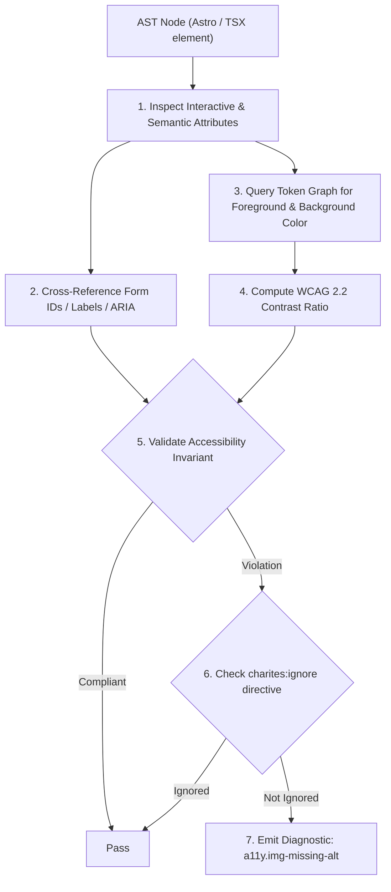
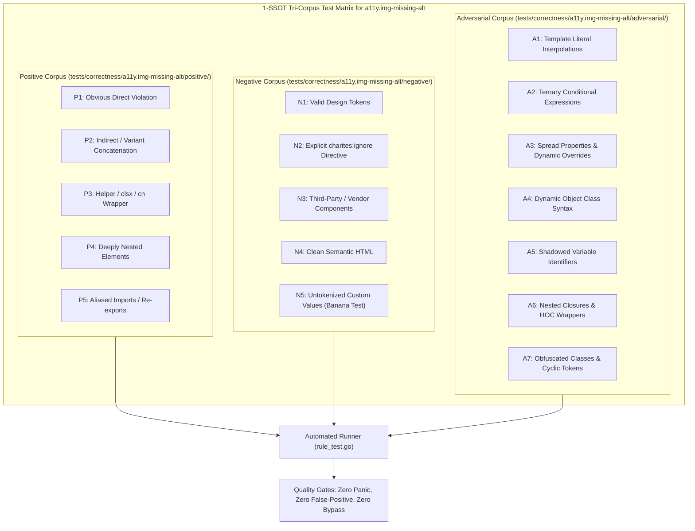

# a11y.img-missing-alt

> **Rule ID:** `a11y.img-missing-alt`
> **Severity:** `ERROR`
> **Category:** `a11y`
> **Target Standards:** W3C Web Content Accessibility Guidelines (WCAG) 2.2 Success Criterion 1.1.1 (Non-text Content), HTML Living Standard Section 4.8.4.4 (Requirements for providing alternative text), Astro Assets Image & Picture Component Specification

---

## 1. Overview & Core Invariant

Enforces required 'alt' attribute on Astro <Image>, <Picture>, and native  elements (WCAG 1.1.1)

### Core Invariant:
> **"All visual image elements (<Image />, <Picture />, ) must provide an 'alt' attribute or explicit accessibility role."**

---
## 2. Technical Grounding & Engine Realities

Alternative text ('alt') conveys the purpose, meaning, or narrative of visual images to blind and low-vision users utilizing screen readers, and displays as fallback text when network requests fail or images are blocked.

When developers omit the 'alt' attribute entirely:
1. Screen Reader Verbosity Failure: Screen readers resort to reciting the entire raw file URL (e.g. '/assets/images/hero_banner_v2_final_compressed.webp'), creating auditory confusion.
2. SEO & Fallback Degradation: Search crawlers and low-bandwidth users receive no descriptive context.
3. Astro Component Blindspot: Standard ESLint jsx-a11y rules only inspect literal  tags, failing to flag Astro <Image /> and <Picture /> components from 'astro:assets'.

Charites validates all image tags, including Astro framework asset components, permitting alt="" exclusively for decorative graphics.

---
## 3. Vulnerability & Risk Taxonomy

| Risk Vector | Severity | Impact |
| :--- | :---: | :--- |
| **Total Information Loss for Screen Readers** | HIGH | Blind users cannot understand the visual information or interactive purpose of images. |
| **Broken Network Fallback** | MEDIUM | When image assets fail to load on slow mobile connections, users see broken boxes without context. |

---
## 4. Non-Compliant Code Patterns (Bad Examples)
### ASTRO (Astro Image component missing required alt attribute):
```astro
<Image src={bannerImage} width={800} height={400} />
```
### TSX (Native img tag without alt):
```tsx

```

---
## 5. Compliant Implementation Patterns (Good Examples)
### ASTRO (Informative image with meaningful alternative description):
```astro
<Image src={bannerImage} alt="Dashboard analitik desa tahun 2026" width={800} height={400} />
```
### TSX (Decorative image explicitly marked with empty alt):
```tsx

```

---

## 6. Detection & Verification Pipeline (How The Rule Evaluates Code)
This `a11y` rule evaluates template markup and cross-references resolved design tokens for accessibility:



### Step-by-Step Evaluation:
1. **AST Traversal:** Inspects semantic elements, form controls, images, and landmark containers.
2. **Structural & Attribute Invariant Check:** Verifies accessible names, heading hierarchies, label/input bindings, and positive tabindex avoidance.
3. **Token-Aware Contrast Verification:** If analyzing color classes, queries `token.Context` to resolve foreground and background values, calculating relative luminance ratios.
4. **Directive Suppression Check:** Inspects preceding comments for `charites:ignore a11y.img-missing-alt`.
5. **Diagnostic Emission:** Emits WCAG-grounded diagnostics for non-compliant patterns.

---

## 7. Verification & Test Harness (How The Test Works: 1-SSOT Tri-Corpus)

This rule is rigorously tested and validated across the canonical **1-SSOT Tri-Corpus** in `tests/correctness/a11y.img-missing-alt/`:



- **Positive Fixtures (P1-P5):** Verified to trigger diagnostics at exact lines and column spans.
- **Negative Fixtures (N1-N5):** Verified to produce zero diagnostics on valid tokens and legitimate exemptions.
- **Adversarial Fixtures (A1-A7):** Verified to prevent evasion across dynamic expressions, string interpolations, and cyclic references.

---

## 8. How to Suppress (Ignore Directives)

If this pattern is required for an intentional exception, suppress the diagnostic using the canonical Charites Rule ID:

```astro
<!-- charites:ignore a11y.img-missing-alt intentional exception -->
```

```tsx
// charites:ignore a11y.img-missing-alt intentional exception
```

---

## 9. Configuration Reference (`charites.yaml`)

```yaml
rules:
  a11y.img-missing-alt:
    severity: error # error | warn | info | off
```

