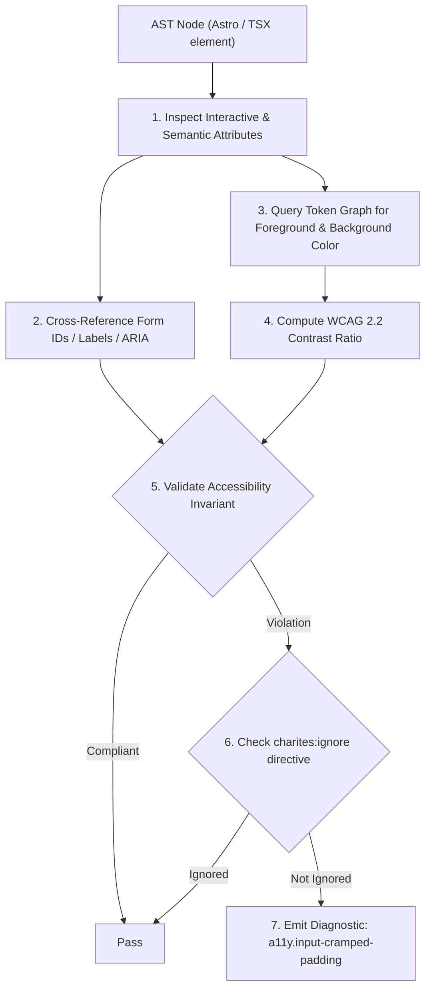
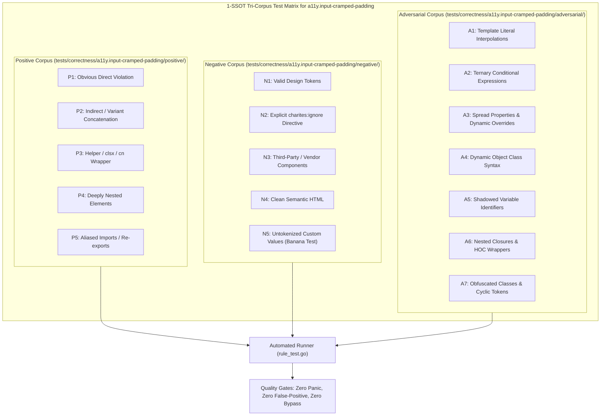

# a11y.input-cramped-padding

> **Rule ID:** `a11y.input-cramped-padding`
> **Severity:** `WARN`
> **Category:** `a11y`
> **Target Standards:** WCAG 2.2 Success Criterion 2.5.8 (Target Size - Minimum), Apple Human Interface Guidelines (Form Controls & Hit Targets: 44pt minimum), Material Design 3 (Text Fields: 48dp baseline, 40-42dp dense minimum)

---

## 1. Overview & Core Invariant

Flags input controls with cramped vertical padding or height under 42px that clip text and impede touch targeting

### Core Invariant:
> **"Form input controls (<input>, <select>, <textarea>) must maintain an effective height of at least 42px with adequate vertical padding ('py-2.5' or 'h-11') to ensure touch comfort and prevent text clipping."**

---
## 2. Technical Grounding & Engine Realities

Text inputs require sufficient spatial breathing room for cursor positioning, focus states, and internationalized typography ascenders and descenders (e.g. g, j, y, and diacritics).

When form controls specify undersized fixed heights like `h-7` (28px) or `h-8` (32px), or cramped vertical padding such as `py-1` (4px) or `p-1`:
1. Motor Targeting Errors: Users frequently miss the input tap area, accidentally tapping adjacent elements or the form background.
2. Glyph Clipping: Font descenders collide with or are cut off by the field's bottom border.
3. Inconsistent Visual Hierarchy: The input appears visually shrunk and uninviting compared to system controls.

Charites checks for undersized explicit heights (< 42px) and cramped padding without minimum height compensation.

---
## 3. Vulnerability & Risk Taxonomy

| Risk Vector | Severity | Impact |
| :--- | :---: | :--- |
| **Touch Targeting Failure** | HIGH | Users experience difficulty tapping inputs on mobile touchscreens due to cramped hit targets. |
| **Text & Glyph Clipping** | MEDIUM | Letters with descenders or accents are visually truncated by field borders. |

---
## 4. Non-Compliant Code Patterns (Bad Examples)
### TSX (Cramped 32px height input with tight padding):
```tsx
<input className="h-8 px-2 text-sm border rounded" placeholder="Nama lengkap" />
```
### ASTRO (Input with cramped py-1 vertical padding):
```astro
<input class="py-1 px-2 text-xs border rounded" placeholder="Kode pos" />
```

---
## 5. Compliant Implementation Patterns (Good Examples)
### TSX (Ergonomic 44px height input with balanced padding):
```tsx
<input className="h-11 px-3.5 py-2.5 text-base sm:text-sm border rounded-lg" placeholder="Nama lengkap" />
```
### ASTRO (Spacious 10px vertical padding input ensuring > 44px total height):
```astro
<input class="py-2.5 px-3.5 text-base border rounded-md" placeholder="Kode pos" />
```

---

## 6. Detection & Verification Pipeline (How The Rule Evaluates Code)
This `a11y` rule evaluates template markup and cross-references resolved design tokens for accessibility:



### Step-by-Step Evaluation:
1. **AST Traversal:** Inspects semantic elements, form controls, images, and landmark containers.
2. **Structural & Attribute Invariant Check:** Verifies accessible names, heading hierarchies, label/input bindings, and positive tabindex avoidance.
3. **Token-Aware Contrast Verification:** If analyzing color classes, queries `token.Context` to resolve foreground and background values, calculating relative luminance ratios.
4. **Directive Suppression Check:** Inspects preceding comments for `charites:ignore a11y.input-cramped-padding`.
5. **Diagnostic Emission:** Emits WCAG-grounded diagnostics for non-compliant patterns.

---

## 7. Verification & Test Harness (How The Test Works: 1-SSOT Tri-Corpus)

This rule is rigorously tested and validated across the canonical **1-SSOT Tri-Corpus** in `tests/correctness/a11y.input-cramped-padding/`:



- **Positive Fixtures (P1-P5):** Verified to trigger diagnostics at exact lines and column spans.
- **Negative Fixtures (N1-N5):** Verified to produce zero diagnostics on valid tokens and legitimate exemptions.
- **Adversarial Fixtures (A1-A7):** Verified to prevent evasion across dynamic expressions, string interpolations, and cyclic references.

---

## 8. How to Suppress (Ignore Directives)

If this pattern is required for an intentional exception, suppress the diagnostic using the canonical Charites Rule ID:

```astro
<!-- charites:ignore a11y.input-cramped-padding intentional exception -->
```

```tsx
// charites:ignore a11y.input-cramped-padding intentional exception
```

---

## 9. Configuration Reference (`charites.yaml`)

```yaml
rules:
  a11y.input-cramped-padding:
    severity: warn # error | warn | info | off
```

