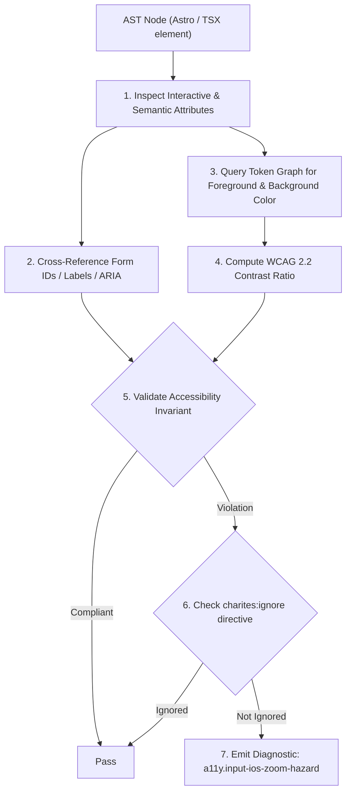
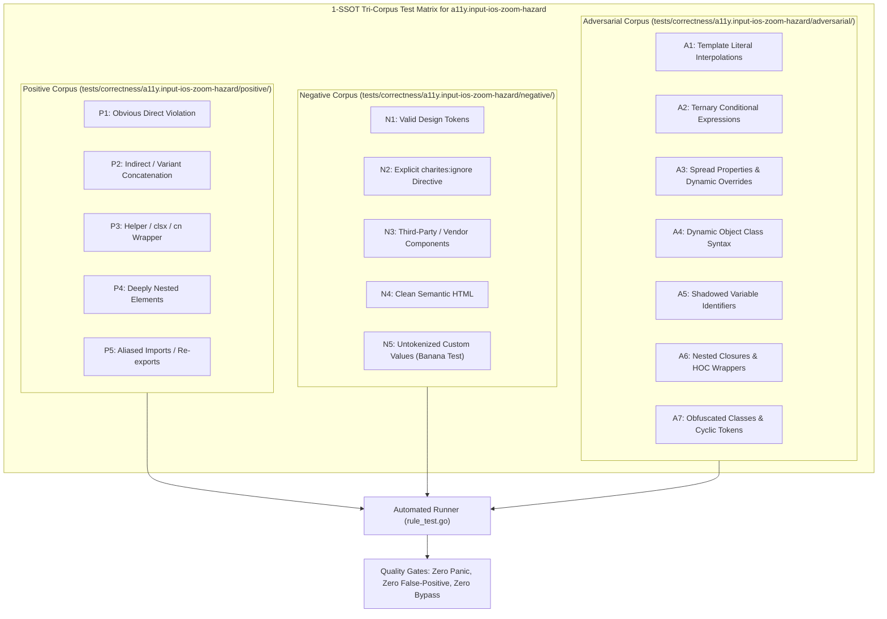

# a11y.input-ios-zoom-hazard

> **Rule ID:** `a11y.input-ios-zoom-hazard`
> **Severity:** `WARN`
> **Category:** `a11y`
> **Target Standards:** WCAG 2.2 Success Criterion 1.4.4 (Resize Text), Apple WebKit iOS Form Viewport Behavior (16px Input Zoom Threshold), Apple Human Interface Guidelines (Form Inputs & Readability)

---

## 1. Overview & Core Invariant

Prevents forced Safari iOS viewport auto-zoom by requiring at least 16px font size on inputs on mobile viewports

### Core Invariant:
> **"Form text inputs (<input>, <select>, <textarea>) must maintain at least 16px font size on mobile viewports ('text-base' or larger) to prevent mandatory iOS Safari viewport auto-zoom."**

---
## 2. Technical Grounding & Engine Realities

Apple iOS WebKit automatically forces a viewport zoom whenever a user focuses on a text input whose computed font-size is strictly below 16px (1rem).

This abrupt viewport magnification causes severe usability issues:
1. Broken Layout: Page content shifts horizontally, hiding submit buttons and neighboring fields off-screen.
2. Manual Pinch-to-Zoom Fatigue: After typing, the user is forced to perform manual two-finger pinch-to-zoom gestures to restore the original page scale.
3. Cognitive Disorientation: Rapid layout shifting during form completion increases cognitive friction and abandonment rates.

Responsive Defense: Providing 'text-base sm:text-sm' provides a safe 16px baseline on mobile viewports while preserving compact 14px typography on desktop screens.

---
## 3. Vulnerability & Risk Taxonomy

| Risk Vector | Severity | Impact |
| :--- | :---: | :--- |
| **Forced iOS Viewport Auto-Zoom** | HIGH | Mobile Safari users experience jarring zoom-ins that throw layout elements out of visible viewport. |
| **Form Abandonment** | MEDIUM | Awkward pinch-to-zoom requirements cause friction during transactional checkout and authentication forms. |

---
## 4. Non-Compliant Code Patterns (Bad Examples)
### TSX (Small 14px text input on mobile triggers Safari auto-zoom):
```tsx
<input className="text-sm px-3 py-2 border rounded" placeholder="Email" />
```
### ASTRO (Dropdown select with 12px text size without mobile 16px baseline):
```astro
<select class="text-xs border rounded p-2"><option>Pilih Opsi</option></select>
```

---
## 5. Compliant Implementation Patterns (Good Examples)
### TSX (16px baseline on mobile, safely scaled to 14px on desktop):
```tsx
<input className="text-base sm:text-sm px-3.5 py-2.5 border rounded" placeholder="Email" />
```
### ASTRO (Standard 16px base font size on select control):
```astro
<select class="text-base border rounded p-2"><option>Pilih Opsi</option></select>
```

---

## 6. Detection & Verification Pipeline (How The Rule Evaluates Code)
This `a11y` rule evaluates template markup and cross-references resolved design tokens for accessibility:



### Step-by-Step Evaluation:
1. **AST Traversal:** Inspects semantic elements, form controls, images, and landmark containers.
2. **Structural & Attribute Invariant Check:** Verifies accessible names, heading hierarchies, label/input bindings, and positive tabindex avoidance.
3. **Token-Aware Contrast Verification:** If analyzing color classes, queries `token.Context` to resolve foreground and background values, calculating relative luminance ratios.
4. **Directive Suppression Check:** Inspects preceding comments for `charites:ignore a11y.input-ios-zoom-hazard`.
5. **Diagnostic Emission:** Emits WCAG-grounded diagnostics for non-compliant patterns.

---

## 7. Verification & Test Harness (How The Test Works: 1-SSOT Tri-Corpus)

This rule is rigorously tested and validated across the canonical **1-SSOT Tri-Corpus** in `tests/correctness/a11y.input-ios-zoom-hazard/`:



- **Positive Fixtures (P1-P5):** Verified to trigger diagnostics at exact lines and column spans.
- **Negative Fixtures (N1-N5):** Verified to produce zero diagnostics on valid tokens and legitimate exemptions.
- **Adversarial Fixtures (A1-A7):** Verified to prevent evasion across dynamic expressions, string interpolations, and cyclic references.

---

## 8. How to Suppress (Ignore Directives)

If this pattern is required for an intentional exception, suppress the diagnostic using the canonical Charites Rule ID:

```astro
<!-- charites:ignore a11y.input-ios-zoom-hazard intentional exception -->
```

```tsx
// charites:ignore a11y.input-ios-zoom-hazard intentional exception
```

---

## 9. Configuration Reference (`charites.yaml`)

```yaml
rules:
  a11y.input-ios-zoom-hazard:
    severity: warn # error | warn | info | off
```

