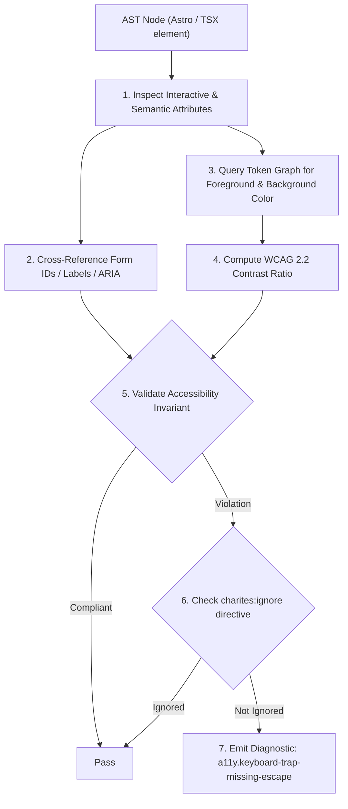
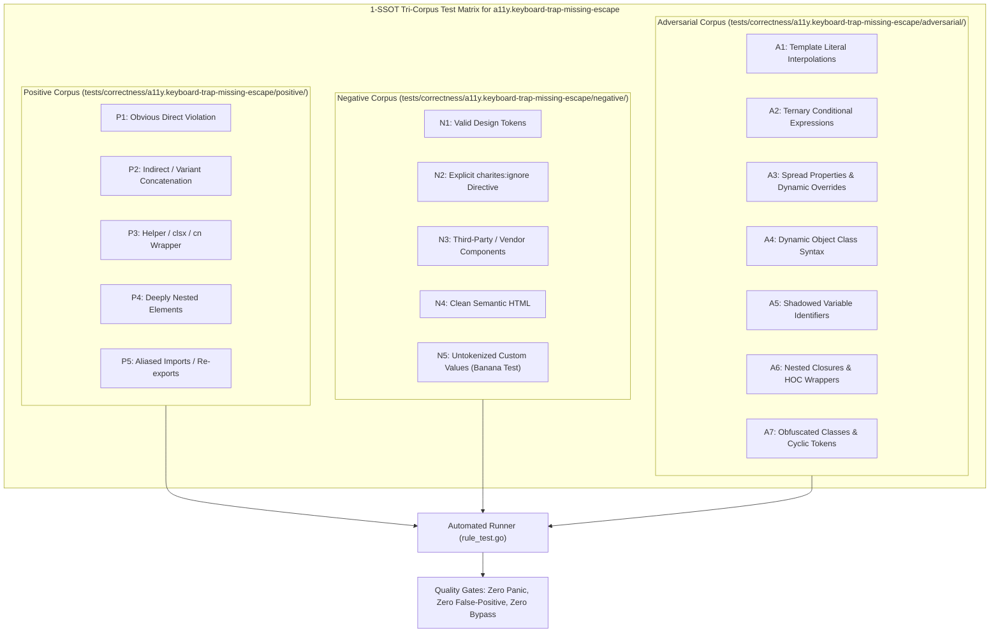

# a11y.keyboard-trap-missing-escape

> **Rule ID:** `a11y.keyboard-trap-missing-escape`
> **Severity:** `ERROR`
> **Category:** `a11y`
> **Target Standards:** W3C Web Content Accessibility Guidelines (WCAG) 2.2 SC 2.1.2 (No Keyboard Trap), W3C WAI-ARIA Authoring Practices Guide (APG) Modal Dialog Pattern

---

## 1. Overview & Core Invariant

Enforces that custom modal dialogs provide an Escape key listener or an accessible dismiss mechanism

### Core Invariant:
> **"Custom modal dialogs (role="dialog" / role="alertdialog") must provide keyboard dismissibility (onKeyDown Escape listener) or an accessible close button."**

---
## 2. Technical Grounding & Engine Realities

When web applications render custom modal overlays using <div> containers instead of accessible headless dialog primitives:
1. Keyboard Trap: Users navigating solely via keyboard or switch devices can become trapped inside the modal overlay with no mechanism to exit.
2. Violation of WCAG 2.1.2: Users must always be able to untrap themselves by pressing the Escape key without navigating through complex hierarchies.
3. Screen Reader Disorientation: If an overlay cannot be dismissed via standard keyboard conventions, assistive technology users are forced to refresh the application.

Charites inspects custom dialog containers to ensure they wire onKeyDown handlers or expose accessible close triggers.

---
## 3. Vulnerability & Risk Taxonomy

| Risk Vector | Severity | Impact |
| :--- | :---: | :--- |
| **Permanent Keyboard Trap** | CRITICAL | Keyboard and switch users become unable to escape the dialog overlay (WCAG SC 2.1.2 Level A failure). |
| **Loss of Focus State** | HIGH | Users are forced to refresh the browser tab, abandoning in-flight data entry. |

---
## 4. Non-Compliant Code Patterns (Bad Examples)
### TSX (Custom dialog overlay without onKeyDown Escape listener or close button):
```tsx
<div role="dialog" aria-modal="true" aria-labelledby="modal-title" className="fixed inset-0 z-50 flex items-center justify-center bg-black/50">
  <div className="bg-background p-6 rounded-xl">
    <h2 id="modal-title" className="text-lg font-semibold">Konfirmasi Hapus</h2>
    <p className="text-sm text-muted-foreground mt-2">Apakah Anda yakin ingin menghapus data ini?</p>
  </div>
</div>
```

---
## 5. Compliant Implementation Patterns (Good Examples)
### TSX (Compliant custom dialog with onKeyDown Escape listener and accessible close button):
```tsx
<div role="dialog" aria-modal="true" aria-labelledby="modal-title" onKeyDown={handleKeyDown} className="fixed inset-0 z-50 flex items-center justify-center bg-black/50">
  <div className="bg-background p-6 rounded-xl relative">
    <button type="button" onClick={onClose} aria-label="Tutup dialog" className="size-11 absolute top-2 right-2 flex items-center justify-center">
      <XIcon className="size-5" />
    </button>
    <h2 id="modal-title" className="text-lg font-semibold">Konfirmasi Hapus</h2>
    <p className="text-sm text-muted-foreground mt-2">Apakah Anda yakin ingin menghapus data ini?</p>
  </div>
</div>
```

---

## 6. Detection & Verification Pipeline (How The Rule Evaluates Code)
This `a11y` rule evaluates template markup and cross-references resolved design tokens for accessibility:



### Step-by-Step Evaluation:
1. **AST Traversal:** Inspects semantic elements, form controls, images, and landmark containers.
2. **Structural & Attribute Invariant Check:** Verifies accessible names, heading hierarchies, label/input bindings, and positive tabindex avoidance.
3. **Token-Aware Contrast Verification:** If analyzing color classes, queries `token.Context` to resolve foreground and background values, calculating relative luminance ratios.
4. **Directive Suppression Check:** Inspects preceding comments for `charites:ignore a11y.keyboard-trap-missing-escape`.
5. **Diagnostic Emission:** Emits WCAG-grounded diagnostics for non-compliant patterns.

---

## 7. Verification & Test Harness (How The Test Works: 1-SSOT Tri-Corpus)

This rule is rigorously tested and validated across the canonical **1-SSOT Tri-Corpus** in `tests/correctness/a11y.keyboard-trap-missing-escape/`:



- **Positive Fixtures (P1-P5):** Verified to trigger diagnostics at exact lines and column spans.
- **Negative Fixtures (N1-N5):** Verified to produce zero diagnostics on valid tokens and legitimate exemptions.
- **Adversarial Fixtures (A1-A7):** Verified to prevent evasion across dynamic expressions, string interpolations, and cyclic references.

---

## 8. How to Suppress (Ignore Directives)

If this pattern is required for an intentional exception, suppress the diagnostic using the canonical Charites Rule ID:

```astro
<!-- charites:ignore a11y.keyboard-trap-missing-escape intentional exception -->
```

```tsx
// charites:ignore a11y.keyboard-trap-missing-escape intentional exception
```

---

## 9. Configuration Reference (`charites.yaml`)

```yaml
rules:
  a11y.keyboard-trap-missing-escape:
    severity: error # error | warn | info | off
```

