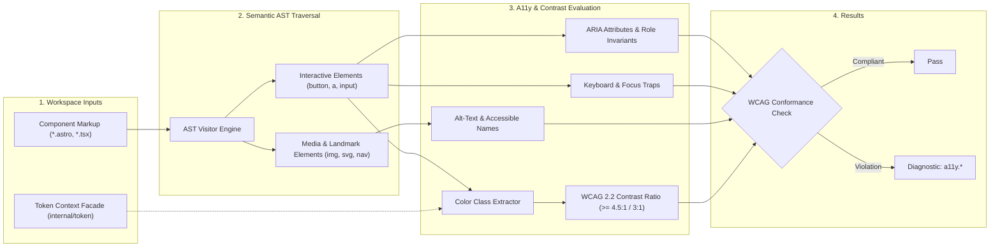

# A11y Rules (`a11y`)

The `a11y` category contains static analysis rules for code quality, architectural constraints, and design system governance.

---

## Category Rule Index

| Rule ID | Severity | Summary | Full Specification | Status |
| :--- | :---: | :--- | :--- | :---: |
| `a11y.button-type-missing` | `WARN` | Enforces explicit type attribute on <button> elements inside forms to prevent unintended form submission | [`a11y.button-type-missing`](a11y.button-type-missing) | `enabled` |
| `a11y.dialog-missing-aria` | `ERROR` | Enforces that custom modal dialogs declare aria-modal="true" and have an accessible name | [`a11y.dialog-missing-aria`](a11y.dialog-missing-aria) | `enabled` |
| `a11y.empty-interactive` | `ERROR` | Enforces accessible names on interactive elements (buttons, links) containing only icons or visual elements | [`a11y.empty-interactive`](a11y.empty-interactive) | `enabled` |
| `a11y.error-not-announced` | `ERROR` | Ensures form controls with aria-invalid are programmatically linked to error messages via aria-describedby (WCAG 3.3.1) | [`a11y.error-not-announced`](a11y.error-not-announced) | `enabled` |
| `a11y.form-input-missing-name` | `WARN` | Ensures form input controls declare an identifying name or id attribute for form submission and autofill (WCAG 4.1.2) | [`a11y.form-input-missing-name`](a11y.form-input-missing-name) | `enabled` |
| `a11y.form-label-composite-control` | `WARN` | Warns when <FormLabel> is directly bound to a composite multi-field control causing screen reader ambiguity | [`a11y.form-label-composite-control`](a11y.form-label-composite-control) | `enabled` |
| `a11y.form-label-missing-control` | `ERROR` | Enforces that Shadcn UI <FormItem> containing <FormLabel> also contains an associated <FormControl> or input element | [`a11y.form-label-missing-control`](a11y.form-label-missing-control) | `enabled` |
| `a11y.img-missing-alt` | `ERROR` | Enforces required 'alt' attribute on Astro <Image>, <Picture>, and native  elements (WCAG 1.1.1) | [`a11y.img-missing-alt`](a11y.img-missing-alt) | `enabled` |
| `a11y.input-cramped-padding` | `WARN` | Flags input controls with cramped vertical padding or height under 42px that clip text and impede touch targeting | [`a11y.input-cramped-padding`](a11y.input-cramped-padding) | `enabled` |
| `a11y.input-ios-zoom-hazard` | `WARN` | Prevents forced Safari iOS viewport auto-zoom by requiring at least 16px font size on inputs on mobile viewports | [`a11y.input-ios-zoom-hazard`](a11y.input-ios-zoom-hazard) | `enabled` |
| `a11y.keyboard-trap-missing-escape` | `ERROR` | Enforces that custom modal dialogs provide an Escape key listener or an accessible dismiss mechanism | [`a11y.keyboard-trap-missing-escape`](a11y.keyboard-trap-missing-escape) | `enabled` |
| `a11y.label-missing-control` | `ERROR` | Ensures label htmlFor attributes match an existing input control ID in the same document (WCAG 1.3.1) | [`a11y.label-missing-control`](a11y.label-missing-control) | `enabled` |
| `a11y.missing-focus-ring` | `WARN` | Enforces visible focus indicator when suppressing default outline with outline-none (WCAG 2.4.7) | [`a11y.missing-focus-ring`](a11y.missing-focus-ring) | `enabled` |
| `a11y.placeholder-as-label` | `ERROR` | Flags form inputs relying solely on placeholder attributes without a persistent label or accessible name (WCAG 3.3.2) | [`a11y.placeholder-as-label`](a11y.placeholder-as-label) | `enabled` |
| `a11y.touch-target-size` | `WARN` | Enforces minimum 44x44px physical touch target size on interactive controls (Apple HIG / WCAG 2.5.8) | [`a11y.touch-target-size`](a11y.touch-target-size) | `enabled` |
| `a11y.touch-target-spacing` | `WARN` | Enforces at least 8px spacing between adjacent interactive elements to prevent miss-taps (WCAG 2.5.8) | [`a11y.touch-target-spacing`](a11y.touch-target-spacing) | `enabled` |

---
## How the Accessibility & Contrast Analysis Pipeline Works

The `a11y` static analysis engine evaluates template markup and cross-references resolved design tokens for WCAG 2.2 accessibility compliance:

### Pipeline Flow:
1. **Semantic DOM Traversal:** Inspects interactive elements, form controls, images, and landmark regions.
2. **Token-Aware Contrast Calculation:** Resolves foreground and background color classes into concrete color values using `token.Context`, computing relative luminance ratios without requiring a headless browser.
3. **Standards Conformance:** Enforces WCAG 2.2 AA standards (minimum 4.5:1 for normal text, 3:1 for large text and UI controls).
4. **Accessible Structure Validation:** Validates image `alt` attributes, accessible button names, and form label associations.

---

## How Accessibility Tests Work (Verification Harness)

Accessibility rules are verified against comprehensive test suites:
1. **1-SSOT Golden Tri-Corpus (`tests/correctness/a11y.*/`):**
   - **Positive:** Flags contrast ratios dropping below 4.5:1 under light or dark themes, missing alt text, and unlabelled icon buttons.
   - **Negative:** Confirms clean passes for semantic HTML5 controls and mathematically verified token pairings.
   - **Adversarial:** Asserts resilience against dynamic aria-labels, visually hidden decorative elements, and complex nested layouts.
