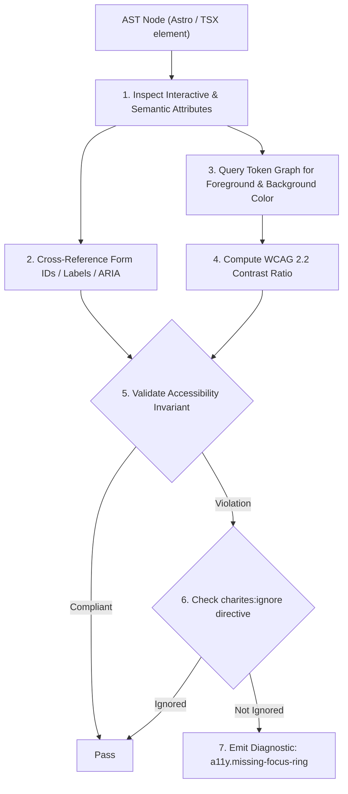
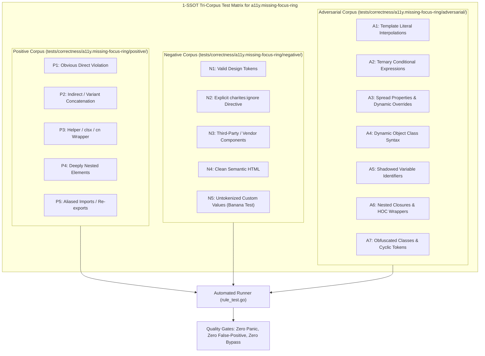

# a11y.missing-focus-ring

> **Rule ID:** `a11y.missing-focus-ring`
> **Severity:** `WARN`
> **Category:** `a11y`
> **Target Standards:** WCAG 2.2 Success Criterion 2.4.7 (Focus Visible - Level AA), WCAG 2.2 Success Criterion 2.4.11 (Focus Appearance - Level AAA), W3C WAI-ARIA Authoring Practices (Keyboard Navigation & Focus Ring Management)

---

## 1. Overview & Core Invariant

Enforces visible focus indicator when suppressing default outline with outline-none (WCAG 2.4.7)

### Core Invariant:
> **"Interactive controls that suppress default browser outlines ('outline-none') must provide an alternative focus indicator (e.g. 'focus-visible:ring-2')."**

---
## 2. Technical Grounding & Engine Realities

Web developers frequently add `outline-none` or `focus:outline-none` to eliminate the default browser blue halo when clicking buttons with a mouse.

However, stripping this outline without providing an alternative completely blinds keyboard and screen reader users:
1. Complete Loss of Focus Context: Users pressing Tab cannot see which button, link, or input is currently active.
2. Form & Transaction Abandonment: Users accidentally activate unexpected actions (like Delete instead of Next) because focus state is invisible.
3. Legal Accessibility Violations: Directly violates WCAG 2.4.7 Level AA criteria across ADA and European Accessibility Act (EAA) audits.

Best Practice: Use `outline-none focus-visible:ring-2 focus-visible:ring-primary` so mouse users see no distraction while keyboard users receive a crisp, visible focus indicator.

---
## 3. Vulnerability & Risk Taxonomy

| Risk Vector | Severity | Impact |
| :--- | :---: | :--- |
| **Keyboard Navigation Blindness** | HIGH | Users relying on keyboard or switch devices lose track of the active element. |
| **WCAG 2.4.7 Compliance Audit Failure** | HIGH | Flagged as a major non-compliance violation in corporate accessibility audits. |

---
## 4. Non-Compliant Code Patterns (Bad Examples)
### TSX (Interactive button stripping outline with no replacement indicator):
```tsx
<button className="outline-none bg-primary text-white px-4 py-2 rounded">Simpan</button>
```
### ASTRO (Navigation link silencing focus outline):
```astro
<a href="/settings" class="focus:outline-none text-blue-600">Pengaturan</a>
```

---
## 5. Compliant Implementation Patterns (Good Examples)
### TSX (Compliant replacement focus ring on keyboard navigation):
```tsx
<button className="outline-none focus-visible:ring-2 focus-visible:ring-primary bg-primary text-white px-4 py-2 rounded">Simpan</button>
```
### ASTRO (Link with replacement focus-visible outline indicator):
```astro
<a href="/settings" class="focus:outline-none focus-visible:ring-2 focus-visible:ring-offset-2 text-blue-600">Pengaturan</a>
```

---

## 6. Detection & Verification Pipeline (How The Rule Evaluates Code)
This `a11y` rule evaluates template markup and cross-references resolved design tokens for accessibility:



### Step-by-Step Evaluation:
1. **AST Traversal:** Inspects semantic elements, form controls, images, and landmark containers.
2. **Structural & Attribute Invariant Check:** Verifies accessible names, heading hierarchies, label/input bindings, and positive tabindex avoidance.
3. **Token-Aware Contrast Verification:** If analyzing color classes, queries `token.Context` to resolve foreground and background values, calculating relative luminance ratios.
4. **Directive Suppression Check:** Inspects preceding comments for `charites:ignore a11y.missing-focus-ring`.
5. **Diagnostic Emission:** Emits WCAG-grounded diagnostics for non-compliant patterns.

---

## 7. Verification & Test Harness (How The Test Works: 1-SSOT Tri-Corpus)

This rule is rigorously tested and validated across the canonical **1-SSOT Tri-Corpus** in `tests/correctness/a11y.missing-focus-ring/`:



- **Positive Fixtures (P1-P5):** Verified to trigger diagnostics at exact lines and column spans.
- **Negative Fixtures (N1-N5):** Verified to produce zero diagnostics on valid tokens and legitimate exemptions.
- **Adversarial Fixtures (A1-A7):** Verified to prevent evasion across dynamic expressions, string interpolations, and cyclic references.

---

## 8. How to Suppress (Ignore Directives)

If this pattern is required for an intentional exception, suppress the diagnostic using the canonical Charites Rule ID:

```astro
<!-- charites:ignore a11y.missing-focus-ring intentional exception -->
```

```tsx
// charites:ignore a11y.missing-focus-ring intentional exception
```

---

## 9. Configuration Reference (`charites.yaml`)

```yaml
rules:
  a11y.missing-focus-ring:
    severity: warn # error | warn | info | off
```

