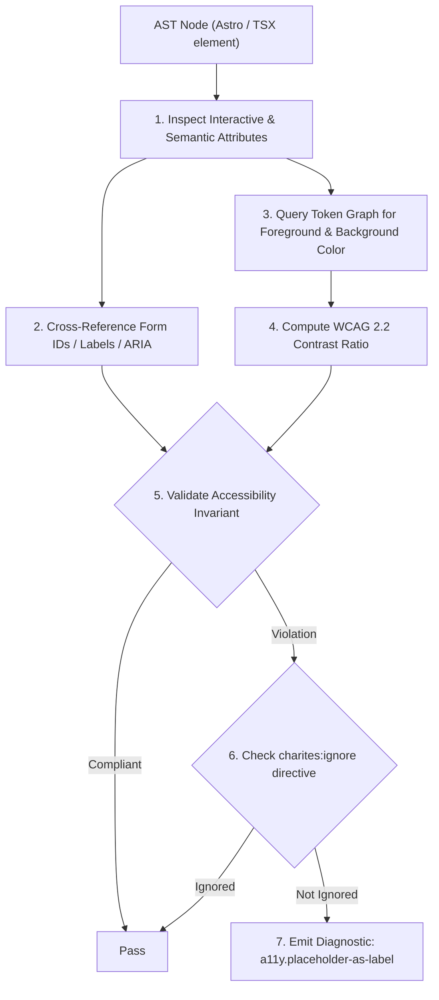
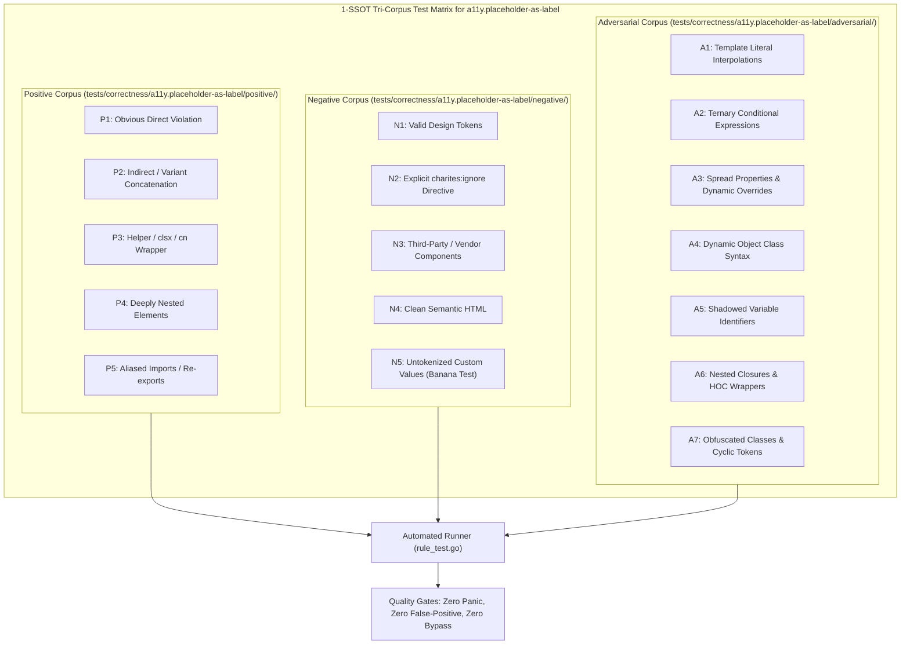

# a11y.placeholder-as-label

> **Rule ID:** `a11y.placeholder-as-label`
> **Severity:** `ERROR`
> **Category:** `a11y`
> **Target Standards:** WCAG 2.2 Success Criterion 3.3.2 (Labels or Instructions - Level A), WCAG 2.2 Success Criterion 1.3.1 (Info and Relationships - Level A), Nielsen Norman Group (Placeholders in Form Fields Are Harmful)

---

## 1. Overview & Core Invariant

Flags form inputs relying solely on placeholder attributes without a persistent label or accessible name (WCAG 3.3.2)

### Core Invariant:
> **"Form text inputs (<input>, <select>, <textarea>) declaring a 'placeholder' must provide a persistent label (<label>, <label htmlFor>, aria-label, or aria-labelledby)."**

---
## 2. Technical Grounding & Engine Realities

Placeholder text is intended solely as an example of expected input format (e.g. 'e.g. user@example.com'), never as a replacement for a field label.

When developers omit <label> and rely exclusively on placeholder:
1. Vanishing Context: The moment a user types even one character, the placeholder vanishes. Users cannot review or verify what the field originally asked for.
2. Cognitive and Memory Strain: Users with memory impairments, cognitive disabilities, or mobile users distracted by notifications lose track of field meaning.
3. Screen Reader Gaps: Assistive technologies handle unlabelled placeholders inconsistently, frequently omitting them in forms-mode navigation.

Charites verifies that any input with a placeholder has an associated <label> or direct accessible name attribute.

---
## 3. Vulnerability & Risk Taxonomy

| Risk Vector | Severity | Impact |
| :--- | :---: | :--- |
| **Vanishing Form Context** | HIGH | Users lose track of input requirements after typing begins, increasing submission errors. |
| **WCAG 3.3.2 Non-Compliance** | HIGH | Flagged as a major Level A accessibility violation in public and enterprise audits. |

---
## 4. Non-Compliant Code Patterns (Bad Examples)
### TSX (Input relying solely on placeholder without label or aria-label):
```tsx
<input type="email" placeholder="Masukkan email Anda" className="border px-3 py-2" />
```
### ASTRO (Textarea with placeholder but no associated label):
```astro
<textarea placeholder="Ketik pesan Anda di sini" class="border p-2"></textarea>
```

---
## 5. Compliant Implementation Patterns (Good Examples)
### TSX (Persistent label associated with input ID plus descriptive placeholder):
```tsx
<label htmlFor="user-email">Email</label><input id="user-email" type="email" placeholder="nama@domain.com" className="border px-3 py-2" />
```
### ASTRO (Enclosing label wrapping input and descriptive prompt):
```astro
<label class="flex flex-col">Pesan <textarea placeholder="Ketik pesan..." class="border p-2"></textarea></label>
```

---

## 6. Detection & Verification Pipeline (How The Rule Evaluates Code)
This `a11y` rule evaluates template markup and cross-references resolved design tokens for accessibility:



### Step-by-Step Evaluation:
1. **AST Traversal:** Inspects semantic elements, form controls, images, and landmark containers.
2. **Structural & Attribute Invariant Check:** Verifies accessible names, heading hierarchies, label/input bindings, and positive tabindex avoidance.
3. **Token-Aware Contrast Verification:** If analyzing color classes, queries `token.Context` to resolve foreground and background values, calculating relative luminance ratios.
4. **Directive Suppression Check:** Inspects preceding comments for `charites:ignore a11y.placeholder-as-label`.
5. **Diagnostic Emission:** Emits WCAG-grounded diagnostics for non-compliant patterns.

---

## 7. Verification & Test Harness (How The Test Works: 1-SSOT Tri-Corpus)

This rule is rigorously tested and validated across the canonical **1-SSOT Tri-Corpus** in `tests/correctness/a11y.placeholder-as-label/`:



- **Positive Fixtures (P1-P5):** Verified to trigger diagnostics at exact lines and column spans.
- **Negative Fixtures (N1-N5):** Verified to produce zero diagnostics on valid tokens and legitimate exemptions.
- **Adversarial Fixtures (A1-A7):** Verified to prevent evasion across dynamic expressions, string interpolations, and cyclic references.

---

## 8. How to Suppress (Ignore Directives)

If this pattern is required for an intentional exception, suppress the diagnostic using the canonical Charites Rule ID:

```astro
<!-- charites:ignore a11y.placeholder-as-label intentional exception -->
```

```tsx
// charites:ignore a11y.placeholder-as-label intentional exception
```

---

## 9. Configuration Reference (`charites.yaml`)

```yaml
rules:
  a11y.placeholder-as-label:
    severity: error # error | warn | info | off
```

