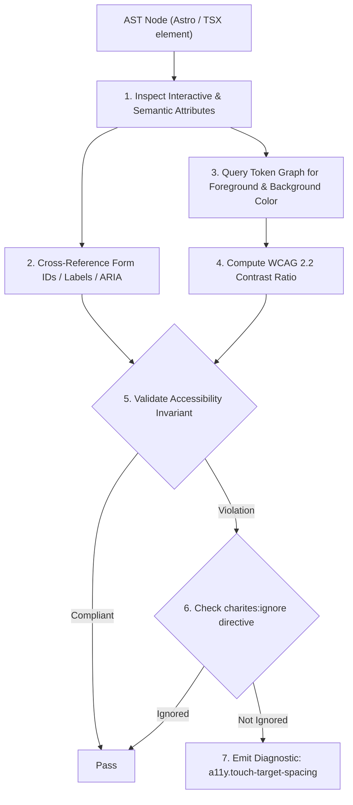
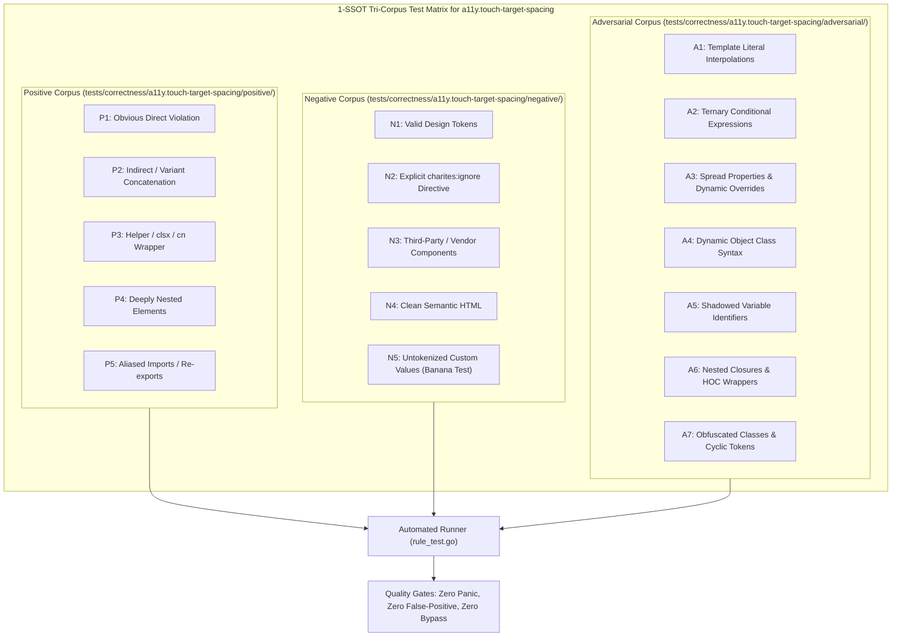

# a11y.touch-target-spacing

> **Rule ID:** `a11y.touch-target-spacing`
> **Severity:** `WARN`
> **Category:** `a11y`
> **Target Standards:** WCAG 2.2 Success Criterion 2.5.8 (Target Size & Spacing), Apple Human Interface Guidelines (Hit Target Separation)

---

## 1. Overview & Core Invariant

Enforces at least 8px spacing between adjacent interactive elements to prevent miss-taps (WCAG 2.5.8)

### Core Invariant:
> **"Adjacent interactive elements within flex/grid containers must provide at least 8px physical spacing (e.g. gap-2) to avoid accidental miss-taps."**

---
## 2. Technical Grounding & Engine Realities

When interactive controls (such as Delete and Cancel buttons) are placed adjacent to each other with `gap-0`, `gap-1` (4px), or no spacing at all, users frequently suffer from miss-taps:

1. Destructive Activation: A user aiming for 'Cancel' inadvertently triggers 'Delete'.
2. Touch Jitter: Natural hand tremor or unstable mobile contexts (walking, transit) compound target activation errors.

Charites enforces a minimum 8px boundary (Tailwind `gap-2` or equivalent) across sibling interactive controls.

---
## 3. Vulnerability & Risk Taxonomy

| Risk Vector | Severity | Impact |
| :--- | :---: | :--- |
| **Accidental Destructive Actions** | HIGH | Users trigger irreversible data loss due to cramped button spacing. |

---
## 4. Non-Compliant Code Patterns (Bad Examples)
### TSX (Zero gap between action buttons in a flex row):
```tsx
<div className="flex gap-0"><button className="bg-destructive text-white">Hapus</button><button>Batal</button></div>
```
### ASTRO (Cramped 4px gap between icon buttons):
```astro
<div class="flex gap-1"><button aria-label="Edit"><EditIcon /></button><button aria-label="Delete"><TrashIcon /></button></div>
```

---
## 5. Compliant Implementation Patterns (Good Examples)
### TSX (Proper 12px separation between destructive and neutral actions):
```tsx
<div className="flex gap-3"><button>Batal</button><button className="bg-destructive text-white">Hapus</button></div>
```
### ASTRO (Standard 8px spacing between toolbar buttons):
```astro
<div class="flex gap-2"><button aria-label="Edit"><EditIcon /></button><button aria-label="Delete"><TrashIcon /></button></div>
```

---

## 6. Detection & Verification Pipeline (How The Rule Evaluates Code)
This `a11y` rule evaluates template markup and cross-references resolved design tokens for accessibility:



### Step-by-Step Evaluation:
1. **AST Traversal:** Inspects semantic elements, form controls, images, and landmark containers.
2. **Structural & Attribute Invariant Check:** Verifies accessible names, heading hierarchies, label/input bindings, and positive tabindex avoidance.
3. **Token-Aware Contrast Verification:** If analyzing color classes, queries `token.Context` to resolve foreground and background values, calculating relative luminance ratios.
4. **Directive Suppression Check:** Inspects preceding comments for `charites:ignore a11y.touch-target-spacing`.
5. **Diagnostic Emission:** Emits WCAG-grounded diagnostics for non-compliant patterns.

---

## 7. Verification & Test Harness (How The Test Works: 1-SSOT Tri-Corpus)

This rule is rigorously tested and validated across the canonical **1-SSOT Tri-Corpus** in `tests/correctness/a11y.touch-target-spacing/`:



- **Positive Fixtures (P1-P5):** Verified to trigger diagnostics at exact lines and column spans.
- **Negative Fixtures (N1-N5):** Verified to produce zero diagnostics on valid tokens and legitimate exemptions.
- **Adversarial Fixtures (A1-A7):** Verified to prevent evasion across dynamic expressions, string interpolations, and cyclic references.

---

## 8. How to Suppress (Ignore Directives)

If this pattern is required for an intentional exception, suppress the diagnostic using the canonical Charites Rule ID:

```astro
<!-- charites:ignore a11y.touch-target-spacing intentional exception -->
```

```tsx
// charites:ignore a11y.touch-target-spacing intentional exception
```

---

## 9. Configuration Reference (`charites.yaml`)

```yaml
rules:
  a11y.touch-target-spacing:
    severity: warn # error | warn | info | off
```

