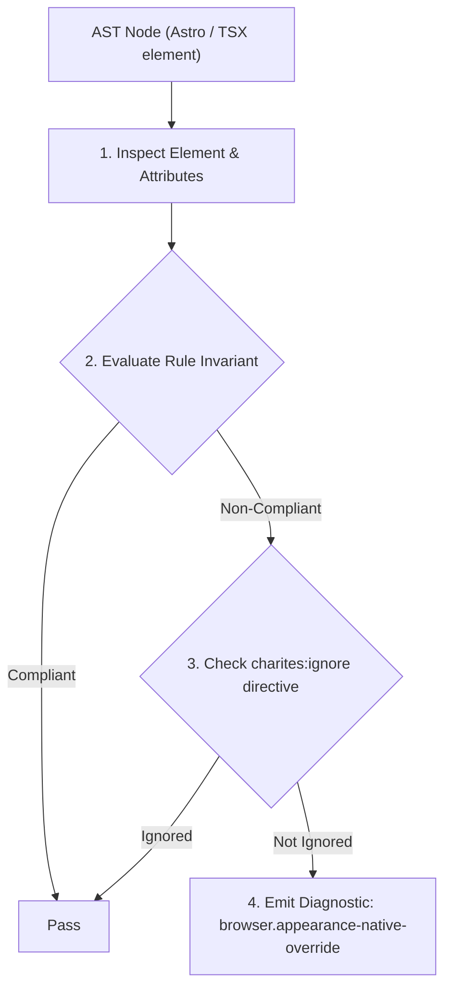
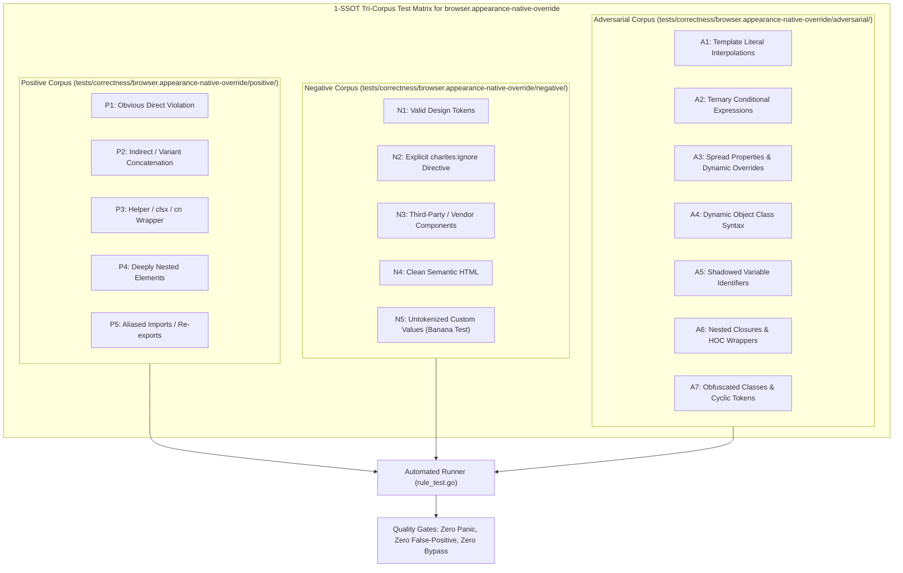

# browser.appearance-native-override

> **Rule ID:** `browser.appearance-native-override`
> **Severity:** `WARN`
> **Category:** `browser`
> **Target Standards:** W3C CSS Basic User Interface Module Level 4 (appearance: none), HTML Living Standard Section 4.10.5 (Form Controls & Native Rendering), WebKit Form Control Styling Compatibility Guidelines

---

## 1. Overview & Core Invariant

Enforces explicit appearance-none on form controls with custom styling to prevent WebKit/Safari native UI clashes

### Core Invariant:
> **"Native form controls (<select>, <input type="checkbox|radio|range|date|time|datetime-local">) with custom styling classes must explicitly declare 'appearance-none' to prevent WebKit/Safari OS widget collisions."**

---
## 2. Technical Grounding & Engine Realities

Blink (Chrome/Edge) and Gecko (Firefox) automatically strip most native platform widget decorations when custom border, background, or border-radius properties are defined on form controls.

In contrast, WebKit (Safari macOS and iOS) retains native glossy gradients, 3D rounded bezels, and OS-level indicator graphics unless 'appearance: none' (-webkit-appearance: none) is explicitly specified.

When developers test only in desktop Chrome, a custom-styled <select> appears sleek and modern. However, on iOS Safari, the custom border and background clash with native pickers and glossy overlays.

Charites enforces explicit 'appearance-none' on all custom-styled native form controls, ensuring visual cross-engine parity.

---
## 3. Vulnerability & Risk Taxonomy

| Risk Vector | Severity | Impact |
| :--- | :---: | :--- |
| **WebKit Bezel Collision** | MEDIUM | Severe visual inconsistency on Safari iOS where native OS glossy gradients render on top of Tailwind theme styling. |
| **Dropdown Arrow Misalignment** | LOW | Unaligned custom dropdown arrows and clipped options inside custom-sized containers. |

---
## 4. Non-Compliant Code Patterns (Bad Examples)
### TSX (Custom styled select without appearance-none (causes glossy bezel clash on iOS Safari)):
```tsx
<select className="h-11 px-3.5 py-2.5 bg-background border border-input rounded-xl text-sm font-medium">
  <option value="1">Layanan Surat</option>
  <option value="2">Layanan Kependudukan</option>
</select>
```

---
## 5. Compliant Implementation Patterns (Good Examples)
### TSX (Select with appearance-none resetting native WebKit styling cleanly):
```tsx
<select className="appearance-none h-11 px-3.5 py-2.5 bg-background border border-input rounded-xl text-sm font-medium">
  <option value="1">Layanan Surat</option>
  <option value="2">Layanan Kependudukan</option>
</select>
```

---

## 6. Detection & Verification Pipeline (How The Rule Evaluates Code)
This rule evaluates source code through the standard AST inspection pipeline:



### Step-by-Step Evaluation:
1. **AST Traversal:** Visits normalized `ir.Node` structures during AST streaming.
2. **Invariant Check:** Compares node attributes against rule invariants.
3. **Directive Suppression Check:** Honors inline `charites:ignore browser.appearance-native-override` directives.
4. **Diagnostic Emission:** Emits compiler-grade diagnostic on invariant violation.

---

## 7. Verification & Test Harness (How The Test Works: 1-SSOT Tri-Corpus)

This rule is rigorously tested and validated across the canonical **1-SSOT Tri-Corpus** in `tests/correctness/browser.appearance-native-override/`:



- **Positive Fixtures (P1-P5):** Verified to trigger diagnostics at exact lines and column spans.
- **Negative Fixtures (N1-N5):** Verified to produce zero diagnostics on valid tokens and legitimate exemptions.
- **Adversarial Fixtures (A1-A7):** Verified to prevent evasion across dynamic expressions, string interpolations, and cyclic references.

---

## 8. How to Suppress (Ignore Directives)

If this pattern is required for an intentional exception, suppress the diagnostic using the canonical Charites Rule ID:

```astro
<!-- charites:ignore browser.appearance-native-override intentional exception -->
```

```tsx
// charites:ignore browser.appearance-native-override intentional exception
```

---

## 9. Configuration Reference (`charites.yaml`)

```yaml
rules:
  browser.appearance-native-override:
    severity: warn # error | warn | info | off
```

