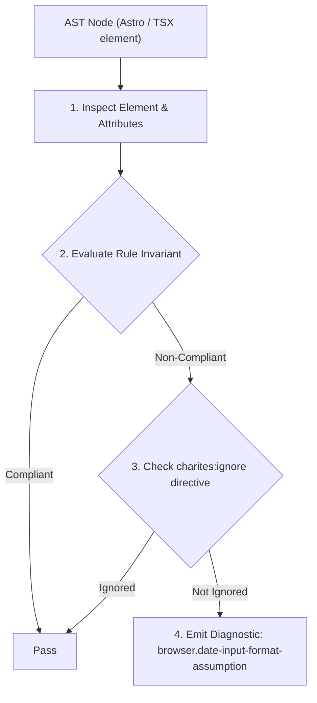
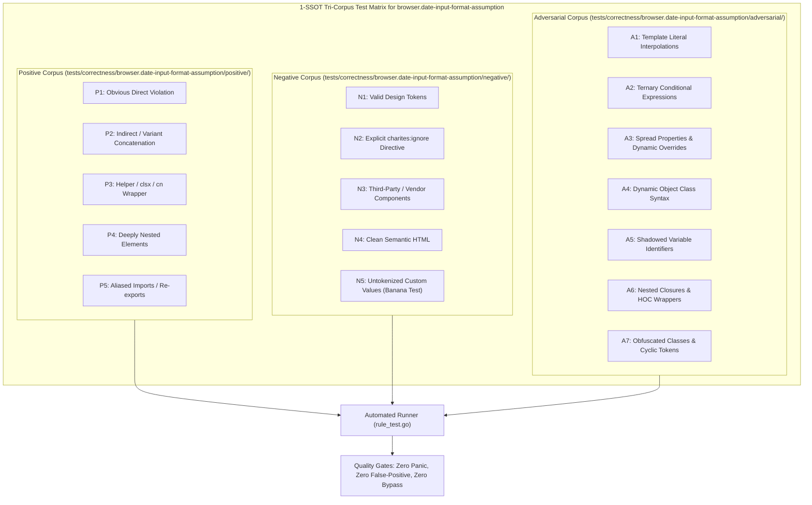

# browser.date-input-format-assumption

> **Rule ID:** `browser.date-input-format-assumption`
> **Severity:** `ERROR`
> **Category:** `browser`
> **Target Standards:** HTML Living Standard Section 4.10.5.1.7 (Date State - type=date), W3C RFC 3339 / ISO 8601 Normative Date Representation (YYYY-MM-DD)

---

## 1. Overview & Core Invariant

Prohibits localized string splitting assumptions on HTML5 date input values in favor of normative ISO 8601 parsing

### Core Invariant:
> **"Native <input type="date"> values are guaranteed by W3C specification to be serialized strictly as ISO 8601 (YYYY-MM-DD). Code must not split values by localized delimiters ('/' or '.')."**

---
## 2. Technical Grounding & Engine Realities

While the browser UI may render localized date pickers according to OS settings (e.g., DD/MM/YYYY in Indonesia/UK, MM/DD/YYYY in US), the programmatic 'element.value' is ALWAYS serialized in ISO 8601 format ('YYYY-MM-DD').

Splitting by '/' causes catastrophic silent failures because the delimiter never exists in 'element.value'.

---
## 3. Vulnerability & Risk Taxonomy

| Risk Vector | Severity | Impact |
| :--- | :---: | :--- |
| **Silent Date Parsing Failure** | HIGH | Splitting ISO 8601 date string by '/' returns an array of length 1, corrupting day, month, and year data sent to APIs. |
| **Cross-Locale Form Submission Corruption** | HIGH | User birth dates, appointment bookings, or legal document dates are stored as NaN, undefined, or incorrect epochs. |

---
## 4. Non-Compliant Code Patterns (Bad Examples)
### TSX (Splitting native date input value by '/' based on UI display assumption):
```tsx
<input
  type="date"
  onChange={(e) => {
    // BUG: e.target.value is '2026-09-06'. Splitting by '/' fails!
    const [day, month, year] = e.target.value.split('/');
    saveDate(day, month, year);
  }}
/>
```

---
## 5. Compliant Implementation Patterns (Good Examples)
### TSX (Splitting native date input by normative ISO 8601 dash delimiter or using valueAsDate):
```tsx
<input
  type="date"
  onChange={(e) => {
    // Correct: ISO 8601 format YYYY-MM-DD
    const [year, month, day] = e.target.value.split('-');
    saveDate(day, month, year);
  }}
/>
```

---

## 6. Detection & Verification Pipeline (How The Rule Evaluates Code)
This rule evaluates source code through the standard AST inspection pipeline:



### Step-by-Step Evaluation:
1. **AST Traversal:** Visits normalized `ir.Node` structures during AST streaming.
2. **Invariant Check:** Compares node attributes against rule invariants.
3. **Directive Suppression Check:** Honors inline `charites:ignore browser.date-input-format-assumption` directives.
4. **Diagnostic Emission:** Emits compiler-grade diagnostic on invariant violation.

---

## 7. Verification & Test Harness (How The Test Works: 1-SSOT Tri-Corpus)

This rule is rigorously tested and validated across the canonical **1-SSOT Tri-Corpus** in `tests/correctness/browser.date-input-format-assumption/`:



- **Positive Fixtures (P1-P5):** Verified to trigger diagnostics at exact lines and column spans.
- **Negative Fixtures (N1-N5):** Verified to produce zero diagnostics on valid tokens and legitimate exemptions.
- **Adversarial Fixtures (A1-A7):** Verified to prevent evasion across dynamic expressions, string interpolations, and cyclic references.

---

## 8. How to Suppress (Ignore Directives)

If this pattern is required for an intentional exception, suppress the diagnostic using the canonical Charites Rule ID:

```astro
<!-- charites:ignore browser.date-input-format-assumption intentional exception -->
```

```tsx
// charites:ignore browser.date-input-format-assumption intentional exception
```

---

## 9. Configuration Reference (`charites.yaml`)

```yaml
rules:
  browser.date-input-format-assumption:
    severity: error # error | warn | info | off
```

