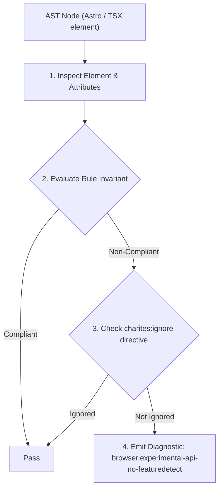
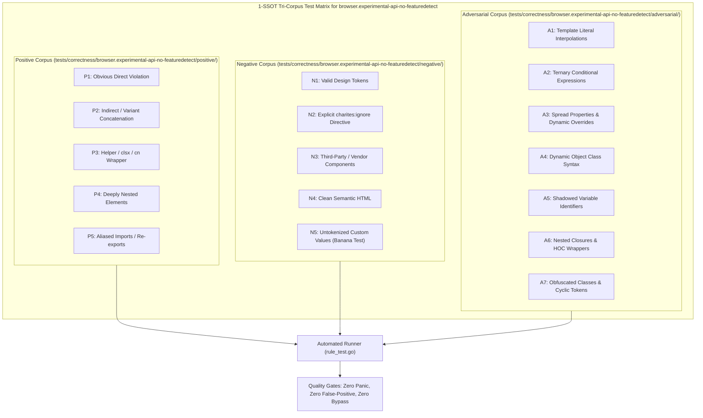

# browser.experimental-api-no-featuredetect

> **Rule ID:** `browser.experimental-api-no-featuredetect`
> **Severity:** `ERROR`
> **Category:** `browser`
> **Target Standards:** WICG Web Share API Specification (navigator.share), WICG File System Access API (showOpenFilePicker), W3C CSS View Transitions Module Level 1 (startViewTransition), ECMA-262 Feature Detection & Defensive JavaScript Guidelines

---

## 1. Overview & Core Invariant

Detects invocation of experimental Web APIs without runtime feature detection guards

### Core Invariant:
> **"Experimental or non-universal Web APIs must be guarded with runtime capability checks ('prop' in obj, if (obj.prop), optional chaining, or try/catch) before invocation."**

---
## 2. Technical Grounding & Engine Realities

Modern Web APIs are adopted unevenly across browser vendors. For instance, 'showOpenFilePicker' is exclusive to Chromium and crashes instantly on Firefox and Safari.

'navigator.share' throws an uncaught TypeError on desktop Firefox or non-secure contexts.

Directly calling these APIs without feature guards results in severe runtime exceptions that crash SPAs.

---
## 3. Vulnerability & Risk Taxonomy

| Risk Vector | Severity | Impact |
| :--- | :---: | :--- |
| **Runtime Exception Crash** | HIGH | Uncaught TypeError: undefined is not a function immediately terminates JavaScript execution in non-supporting browsers. |
| **Broken Core User Action** | HIGH | Primary user actions like document sharing or file importing fail completely without informative fallback UX. |

---
## 4. Non-Compliant Code Patterns (Bad Examples)
### TSX (Direct invocation of navigator.share without runtime feature guard (crashes on desktop Firefox)):
```tsx
<button onClick={() => {
  navigator.share({ title: "Surat", url: window.location.href });
}}>
  Bagikan
</button>
```

---
## 5. Compliant Implementation Patterns (Good Examples)
### TSX (Defensive feature detection with fallback to clipboard copy):
```tsx
<button onClick={async () => {
  if (typeof navigator !== "undefined" && navigator.share) {
    await navigator.share({ title: "Surat", url: window.location.href });
  } else {
    await navigator.clipboard?.writeText(window.location.href);
  }
}}>
  Bagikan
</button>
```

---

## 6. Detection & Verification Pipeline (How The Rule Evaluates Code)
This rule evaluates source code through the standard AST inspection pipeline:



### Step-by-Step Evaluation:
1. **AST Traversal:** Visits normalized `ir.Node` structures during AST streaming.
2. **Invariant Check:** Compares node attributes against rule invariants.
3. **Directive Suppression Check:** Honors inline `charites:ignore browser.experimental-api-no-featuredetect` directives.
4. **Diagnostic Emission:** Emits compiler-grade diagnostic on invariant violation.

---

## 7. Verification & Test Harness (How The Test Works: 1-SSOT Tri-Corpus)

This rule is rigorously tested and validated across the canonical **1-SSOT Tri-Corpus** in `tests/correctness/browser.experimental-api-no-featuredetect/`:



- **Positive Fixtures (P1-P5):** Verified to trigger diagnostics at exact lines and column spans.
- **Negative Fixtures (N1-N5):** Verified to produce zero diagnostics on valid tokens and legitimate exemptions.
- **Adversarial Fixtures (A1-A7):** Verified to prevent evasion across dynamic expressions, string interpolations, and cyclic references.

---

## 8. How to Suppress (Ignore Directives)

If this pattern is required for an intentional exception, suppress the diagnostic using the canonical Charites Rule ID:

```astro
<!-- charites:ignore browser.experimental-api-no-featuredetect intentional exception -->
```

```tsx
// charites:ignore browser.experimental-api-no-featuredetect intentional exception
```

---

## 9. Configuration Reference (`charites.yaml`)

```yaml
rules:
  browser.experimental-api-no-featuredetect:
    severity: error # error | warn | info | off
```

