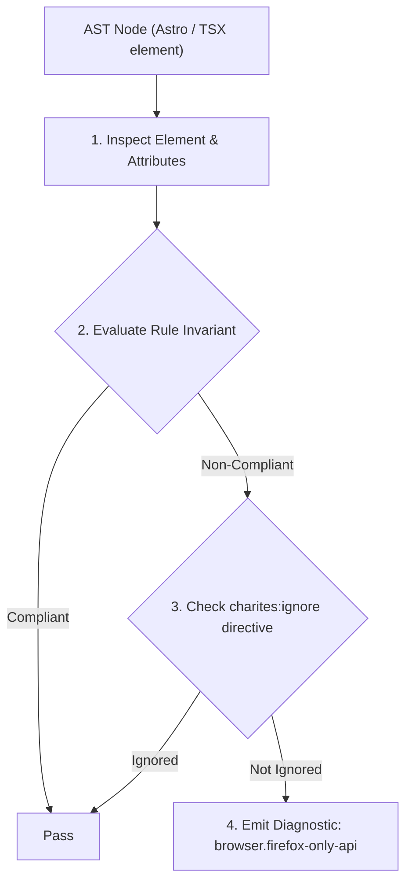
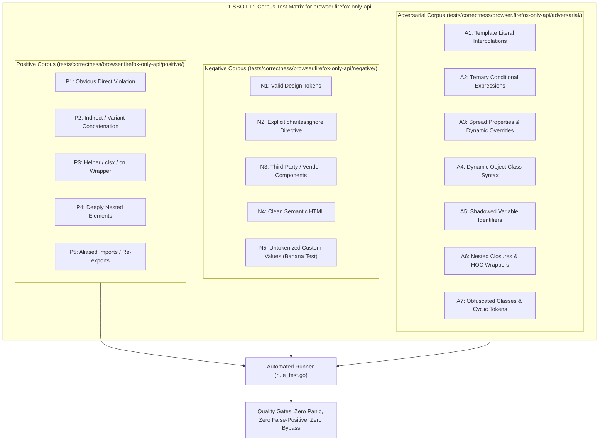

# browser.firefox-only-api

> **Rule ID:** `browser.firefox-only-api`
> **Severity:** `WARN`
> **Category:** `browser`
> **Target Standards:** W3C Fullscreen API Specification, W3C DOM Standards (Gecko Extension Deprecations), MDN Web Docs (Gecko-Specific DOM Interfaces)

---

## 1. Overview & Core Invariant

Flags usage of legacy Gecko/Firefox-exclusive DOM extensions and APIs without standard W3C equivalents

### Core Invariant:
> **"Gecko-prefixed DOM methods and proprietary APIs ('mozRequestFullScreen', 'InstallTrigger', etc.) must provide standard W3C equivalents for Blink and WebKit."**

---
## 2. Technical Grounding & Engine Realities

Mozilla Firefox historically exposed vendor-prefixed APIs such as 'mozRequestFullScreen' and browser-specific globals like 'InstallTrigger'.

Calling these directly without standard W3C methods causes instant crashes or undefined behavior in Blink (Chrome/Edge) and WebKit (Safari).

---
## 3. Vulnerability & Risk Taxonomy

| Risk Vector | Severity | Impact |
| :--- | :---: | :--- |
| **Crash in Chrome and Safari** | MEDIUM | Invoking 'element.mozRequestFullScreen()' throws 'TypeError: element.mozRequestFullScreen is not a function' in all non-Gecko browsers. |
| **Obsolete Browser Sniffing** | LOW | Relying on 'InstallTrigger' to detect Firefox is deprecated and breaks as Firefox modernizes its engine. |

---
## 4. Non-Compliant Code Patterns (Bad Examples)
### JAVASCRIPT (Direct invocation of mozRequestFullScreen without standard check):
```javascript
function enterFullscreen(element) {
  element.mozRequestFullScreen();
}
```
### JAVASCRIPT (Direct access to Gecko-specific inner screen property):
```javascript
const screenX = window.mozInnerScreenX;
```

---
## 5. Compliant Implementation Patterns (Good Examples)
### JAVASCRIPT (Prioritizing standard W3C fullscreen method):
```javascript
function enterFullscreen(element) {
  if (element.requestFullscreen) {
    element.requestFullscreen();
  } else if (element.mozRequestFullScreen) {
    element.mozRequestFullScreen();
  }
}
```
### JAVASCRIPT (Standard fullscreenElement fallback chain):
```javascript
const fsElement = document.fullscreenElement || document.mozFullScreenElement;
```

---

## 6. Detection & Verification Pipeline (How The Rule Evaluates Code)
This rule evaluates source code through the standard AST inspection pipeline:



### Step-by-Step Evaluation:
1. **AST Traversal:** Visits normalized `ir.Node` structures during AST streaming.
2. **Invariant Check:** Compares node attributes against rule invariants.
3. **Directive Suppression Check:** Honors inline `charites:ignore browser.firefox-only-api` directives.
4. **Diagnostic Emission:** Emits compiler-grade diagnostic on invariant violation.

---

## 7. Verification & Test Harness (How The Test Works: 1-SSOT Tri-Corpus)

This rule is rigorously tested and validated across the canonical **1-SSOT Tri-Corpus** in `tests/correctness/browser.firefox-only-api/`:



- **Positive Fixtures (P1-P5):** Verified to trigger diagnostics at exact lines and column spans.
- **Negative Fixtures (N1-N5):** Verified to produce zero diagnostics on valid tokens and legitimate exemptions.
- **Adversarial Fixtures (A1-A7):** Verified to prevent evasion across dynamic expressions, string interpolations, and cyclic references.

---

## 8. How to Suppress (Ignore Directives)

If this pattern is required for an intentional exception, suppress the diagnostic using the canonical Charites Rule ID:

```astro
<!-- charites:ignore browser.firefox-only-api intentional exception -->
```

```tsx
// charites:ignore browser.firefox-only-api intentional exception
```

---

## 9. Configuration Reference (`charites.yaml`)

```yaml
rules:
  browser.firefox-only-api:
    severity: warn # error | warn | info | off
```

