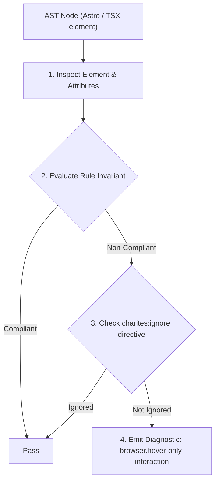
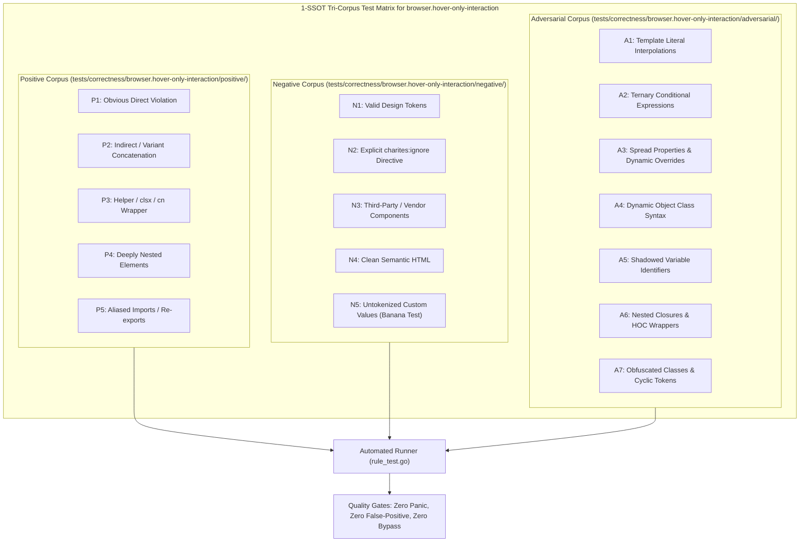

# browser.hover-only-interaction

> **Rule ID:** `browser.hover-only-interaction`
> **Severity:** `ERROR`
> **Category:** `browser`
> **Target Standards:** W3C Web Content Accessibility Guidelines (WCAG) 2.2 SC 2.1.1 (Keyboard), WICG / WHATWG Touch Events & Pointer Events Level 3 (Touch vs Hover Ergonomics), Apple Human Interface Guidelines for iOS Touch Interactions

---

## 1. Overview & Core Invariant

Ensures interactive actions and state reveals have keyboard and touch counterparts instead of relying solely on hover

### Core Invariant:
> **"Interactive controls and revealed elements must not rely exclusively on ':hover' or 'group-hover:' without keyboard/touch counterparts ('focus-visible:', 'group-focus-within:')."**

---
## 2. Technical Grounding & Engine Realities

Touchscreen devices (the majority of web traffic on Safari iOS and Chrome Android) have no physical cursor and cannot perform genuine mouse hover.

When critical action buttons (e.g. delete, edit, copy) are hidden by default with 'opacity-0' and only revealed via 'group-hover:opacity-100':
1. Total Mobile Inaccessibility: Touchscreen users cannot see or activate the controls because hovering does not exist on mobile.
2. iOS Sticky Hover Bug: Tapping an element on Safari iOS triggers an inconsistent 'sticky hover' state, requiring multiple confusing taps.
3. Keyboard Navigation Failure: Users navigating with the 'Tab' key cannot discover or focus hidden controls unless focus-within or focus-visible is bound.

Charites enforces that any hover-revealed element provides accessible keyboard and touch parity.

---
## 3. Vulnerability & Risk Taxonomy

| Risk Vector | Severity | Impact |
| :--- | :---: | :--- |
| **Mobile Touch Exclusion** | HIGH | Critical action controls are completely invisible and unreachable on smartphones and tablets. |
| **Keyboard Accessibility Barrier** | MEDIUM | Fails WCAG 2.2 Level A keyboard navigation audits when hidden controls cannot be focused with the Tab key. |

---
## 4. Non-Compliant Code Patterns (Bad Examples)
### TSX (Delete button hidden by default and only revealed on group-hover (invisible on touchscreens)):
```tsx
<div className="group flex items-center justify-between p-3 border rounded-xl">
  <span>Berkas_KTP.pdf</span>
  <button
    type="button"
    onClick={handleDelete}
    className="opacity-0 group-hover:opacity-100 text-destructive text-sm"
  >
    Hapus
  </button>
</div>
```

---
## 5. Compliant Implementation Patterns (Good Examples)
### TSX (Button accessible via hover, keyboard Tab navigation, and touch focus):
```tsx
<div className="group flex items-center justify-between p-3 border rounded-xl">
  <span>Berkas_KTP.pdf</span>
  <button
    type="button"
    onClick={handleDelete}
    className="opacity-0 group-hover:opacity-100 group-focus-within:opacity-100 focus-visible:opacity-100 text-destructive text-sm"
  >
    Hapus
  </button>
</div>
```

---

## 6. Detection & Verification Pipeline (How The Rule Evaluates Code)
This rule evaluates source code through the standard AST inspection pipeline:



### Step-by-Step Evaluation:
1. **AST Traversal:** Visits normalized `ir.Node` structures during AST streaming.
2. **Invariant Check:** Compares node attributes against rule invariants.
3. **Directive Suppression Check:** Honors inline `charites:ignore browser.hover-only-interaction` directives.
4. **Diagnostic Emission:** Emits compiler-grade diagnostic on invariant violation.

---

## 7. Verification & Test Harness (How The Test Works: 1-SSOT Tri-Corpus)

This rule is rigorously tested and validated across the canonical **1-SSOT Tri-Corpus** in `tests/correctness/browser.hover-only-interaction/`:



- **Positive Fixtures (P1-P5):** Verified to trigger diagnostics at exact lines and column spans.
- **Negative Fixtures (N1-N5):** Verified to produce zero diagnostics on valid tokens and legitimate exemptions.
- **Adversarial Fixtures (A1-A7):** Verified to prevent evasion across dynamic expressions, string interpolations, and cyclic references.

---

## 8. How to Suppress (Ignore Directives)

If this pattern is required for an intentional exception, suppress the diagnostic using the canonical Charites Rule ID:

```astro
<!-- charites:ignore browser.hover-only-interaction intentional exception -->
```

```tsx
// charites:ignore browser.hover-only-interaction intentional exception
```

---

## 9. Configuration Reference (`charites.yaml`)

```yaml
rules:
  browser.hover-only-interaction:
    severity: error # error | warn | info | off
```

