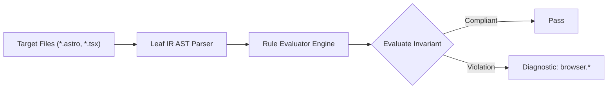

# Browser Rules (`browser`)

The `browser` category contains static analysis rules for code quality, architectural constraints, and design system governance.

---

## Category Rule Index

| Rule ID | Severity | Summary | Full Specification | Status |
| :--- | :---: | :--- | :--- | :---: |
| `browser.appearance-native-override` | `WARN` | Enforces explicit appearance-none on form controls with custom styling to prevent WebKit/Safari native UI clashes | [`browser.appearance-native-override`](browser.appearance-native-override) | `enabled` |
| `browser.hover-only-interaction` | `ERROR` | Ensures interactive actions and state reveals have keyboard and touch counterparts instead of relying solely on hover | [`browser.hover-only-interaction`](browser.hover-only-interaction) | `enabled` |
| `browser.obsolete-vendor-prefix` | `WARN` | Detects obsolete CSS vendor prefixes and incomplete -webkit-line-clamp multi-line truncation triads | [`browser.obsolete-vendor-prefix`](browser.obsolete-vendor-prefix) | `enabled` |
| `browser.scrollbar-vendor-incomplete` | `WARN` | Enforces bidirectional cross-engine scrollbar styling pairing between WebKit pseudo-elements and W3C standard properties | [`browser.scrollbar-vendor-incomplete`](browser.scrollbar-vendor-incomplete) | `enabled` |

---
## How the Browser Analysis Pipeline Works

The `browser` engine applies static analysis checks against component source code:

### Pipeline Flow:
1. **AST Node Traversal:** Scans target template files into normalized intermediate representation.
2. **Invariant Assertion:** Validates structural and semantic invariants.
3. **Diagnostic Reporting:** Emits structured diagnostics for non-compliant patterns.

---

## How Browser Tests Work (Verification Harness)

All rules in `browser` are verified using the canonical 1-SSOT Tri-Corpus (`tests/correctness/browser.*/`) encompassing Positive (P1-P5), Negative (N1-N5), and Adversarial (A1-A7) fixture matrices.
