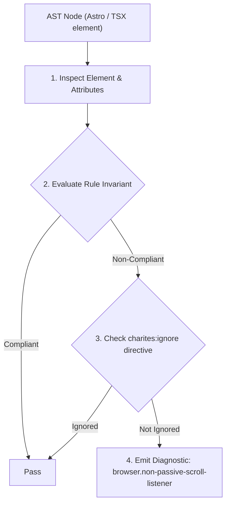
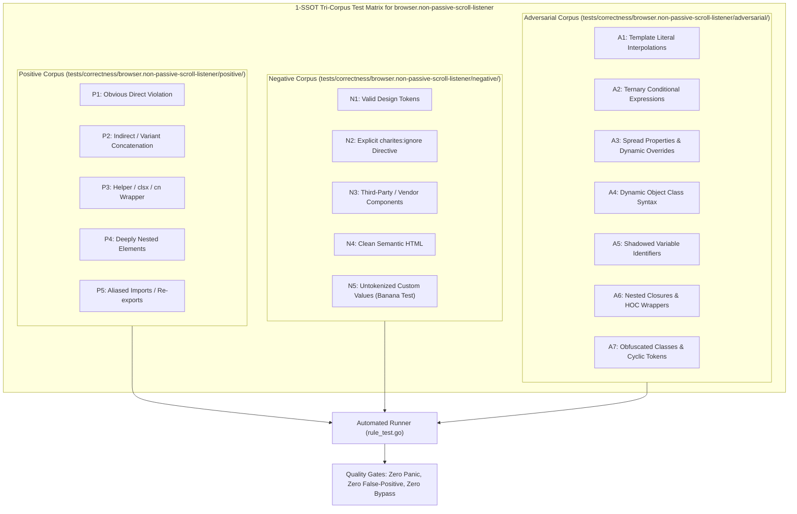

# browser.non-passive-scroll-listener

> **Rule ID:** `browser.non-passive-scroll-listener`
> **Severity:** `WARN`
> **Category:** `browser`
> **Target Standards:** W3C DOM Level 4 Events Specification (Passive Event Listeners), Chromium & WebKit Compositor Scrolling Pipeline Guidelines, Google Lighthouse Best Practices (Does not use passive listeners)

---

## 1. Overview & Core Invariant

Enforces { passive: true } option on touch and wheel event listeners to prevent main thread scroll blocking

### Core Invariant:
> **"Event listeners for 'touchstart', 'touchmove', 'wheel', or 'mousewheel' must declare '{ passive: true }' to ensure non-blocking compositor scrolling."**

---
## 2. Technical Grounding & Engine Realities

Browsers execute smooth scrolling on a dedicated compositor thread. Without '{ passive: true }', the compositor must block and wait for JavaScript execution on the main thread to see if 'preventDefault()' is called.

This introduces severe touch response latency and frame rate drops (scroll jank) on mobile devices.

---
## 3. Vulnerability & Risk Taxonomy

| Risk Vector | Severity | Impact |
| :--- | :---: | :--- |
| **Mobile Scroll Jank & Latency** | MEDIUM | Users experience jerky, lagging scrolling and delayed touch gestures on Safari iOS and Android Chrome. |
| **Lighthouse Performance Penalty** | LOW | Fails Lighthouse 'Does not use passive listeners to improve scrolling performance' audit. |

---
## 4. Non-Compliant Code Patterns (Bad Examples)
### JAVASCRIPT (Adding touchmove listener without passive: true option):
```javascript
window.addEventListener("touchmove", (e) => {
  trackTouchPosition(e);
});
```

---
## 5. Compliant Implementation Patterns (Good Examples)
### JAVASCRIPT (Specifying { passive: true } to unblock the compositor thread):
```javascript
window.addEventListener("touchmove", (e) => {
  trackTouchPosition(e);
}, { passive: true });
```

---

## 6. Detection & Verification Pipeline (How The Rule Evaluates Code)
This rule evaluates source code through the standard AST inspection pipeline:



### Step-by-Step Evaluation:
1. **AST Traversal:** Visits normalized `ir.Node` structures during AST streaming.
2. **Invariant Check:** Compares node attributes against rule invariants.
3. **Directive Suppression Check:** Honors inline `charites:ignore browser.non-passive-scroll-listener` directives.
4. **Diagnostic Emission:** Emits compiler-grade diagnostic on invariant violation.

---

## 7. Verification & Test Harness (How The Test Works: 1-SSOT Tri-Corpus)

This rule is rigorously tested and validated across the canonical **1-SSOT Tri-Corpus** in `tests/correctness/browser.non-passive-scroll-listener/`:



- **Positive Fixtures (P1-P5):** Verified to trigger diagnostics at exact lines and column spans.
- **Negative Fixtures (N1-N5):** Verified to produce zero diagnostics on valid tokens and legitimate exemptions.
- **Adversarial Fixtures (A1-A7):** Verified to prevent evasion across dynamic expressions, string interpolations, and cyclic references.

---

## 8. How to Suppress (Ignore Directives)

If this pattern is required for an intentional exception, suppress the diagnostic using the canonical Charites Rule ID:

```astro
<!-- charites:ignore browser.non-passive-scroll-listener intentional exception -->
```

```tsx
// charites:ignore browser.non-passive-scroll-listener intentional exception
```

---

## 9. Configuration Reference (`charites.yaml`)

```yaml
rules:
  browser.non-passive-scroll-listener:
    severity: warn # error | warn | info | off
```

