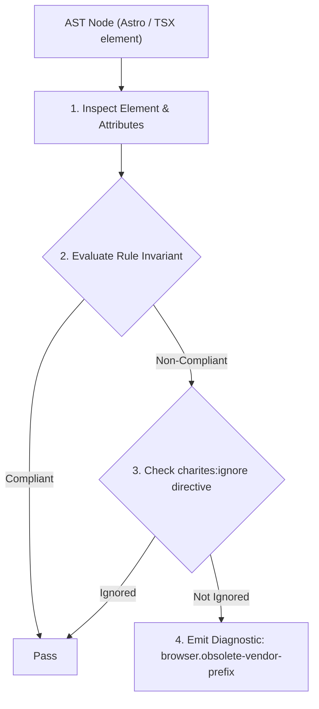
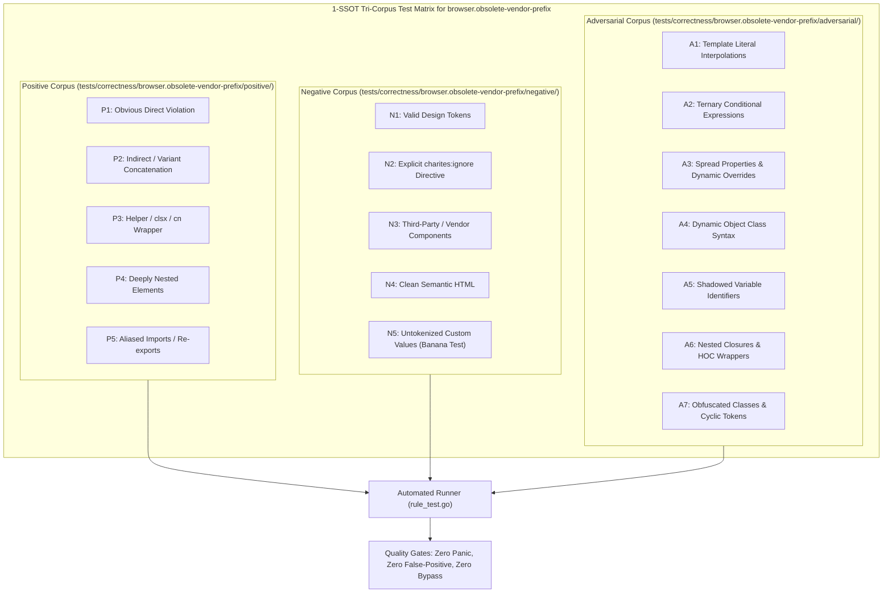

# browser.obsolete-vendor-prefix

> **Rule ID:** `browser.obsolete-vendor-prefix`
> **Severity:** `WARN`
> **Category:** `browser`
> **Target Standards:** W3C CSS Overflow Module Level 3 (line-clamp & WebKit Triad), W3C CSS Cascading and Inheritance Level 5 (Standard Property Baselines), MDN Obsolete and Deprecated Vendor Prefix Specifications

---

## 1. Overview & Core Invariant

Detects obsolete CSS vendor prefixes and incomplete -webkit-line-clamp multi-line truncation triads

### Core Invariant:
> **"Obsolete vendor prefixes should be replaced with W3C standards, and '-webkit-line-clamp' multi-line truncation must include the complete mandatory triad ('display: -webkit-box', '-webkit-box-orient: vertical', and 'overflow: hidden')."**

---
## 2. Technical Grounding & Engine Realities

Modern browser engines have supported standard properties like border-radius, box-shadow, and box-sizing without vendor prefixes for over a decade. Continuing to write dead prefixes (-moz-border-radius, -webkit-box-shadow) pollutes styles and degrades maintainability.

Furthermore, multi-line paragraph truncation using '-webkit-line-clamp' strictly requires a 3-part companion triad:
1. display: -webkit-box;
2. -webkit-box-orient: vertical;
3. overflow: hidden;

When developers only specify '-webkit-line-clamp: 2' in inline styles (e.g. style={{ WebkitLineClamp: 2 }}) without the triad, text truncation silently fails across all browser engines, causing text to overflow un-truncated.

Charites detects dead vendor prefixes and incomplete line-clamp triads, recommending clean Tailwind 'line-clamp-*' utilities.

---
## 3. Vulnerability & Risk Taxonomy

| Risk Vector | Severity | Impact |
| :--- | :---: | :--- |
| **Silent Text Truncation Failure** | MEDIUM | Multi-line paragraph truncation fails silently, overflowing cards and destroying dashboard layout consistency. |
| **Dead Vendor Prefix Clutter** | LOW | Dead vendor prefixes clutter CSS output and trigger linter compatibility warnings. |

---
## 4. Non-Compliant Code Patterns (Bad Examples)
### TSX (Incomplete line-clamp in inline style (fails to truncate silently in all browsers)):
```tsx
<p style={{ WebkitLineClamp: 2, overflow: "hidden" }} className="text-sm text-muted-foreground">
  Pengumuman pelayanan administrasi desa...
</p>
```

---
## 5. Compliant Implementation Patterns (Good Examples)
### TSX (Using Tailwind line-clamp-2 which automatically compiles the complete cross-browser triad):
```tsx
<p className="line-clamp-2 text-sm text-muted-foreground">
  Pengumuman pelayanan administrasi desa...
</p>
```

---

## 6. Detection & Verification Pipeline (How The Rule Evaluates Code)
This rule evaluates source code through the standard AST inspection pipeline:



### Step-by-Step Evaluation:
1. **AST Traversal:** Visits normalized `ir.Node` structures during AST streaming.
2. **Invariant Check:** Compares node attributes against rule invariants.
3. **Directive Suppression Check:** Honors inline `charites:ignore browser.obsolete-vendor-prefix` directives.
4. **Diagnostic Emission:** Emits compiler-grade diagnostic on invariant violation.

---

## 7. Verification & Test Harness (How The Test Works: 1-SSOT Tri-Corpus)

This rule is rigorously tested and validated across the canonical **1-SSOT Tri-Corpus** in `tests/correctness/browser.obsolete-vendor-prefix/`:



- **Positive Fixtures (P1-P5):** Verified to trigger diagnostics at exact lines and column spans.
- **Negative Fixtures (N1-N5):** Verified to produce zero diagnostics on valid tokens and legitimate exemptions.
- **Adversarial Fixtures (A1-A7):** Verified to prevent evasion across dynamic expressions, string interpolations, and cyclic references.

---

## 8. How to Suppress (Ignore Directives)

If this pattern is required for an intentional exception, suppress the diagnostic using the canonical Charites Rule ID:

```astro
<!-- charites:ignore browser.obsolete-vendor-prefix intentional exception -->
```

```tsx
// charites:ignore browser.obsolete-vendor-prefix intentional exception
```

---

## 9. Configuration Reference (`charites.yaml`)

```yaml
rules:
  browser.obsolete-vendor-prefix:
    severity: warn # error | warn | info | off
```

