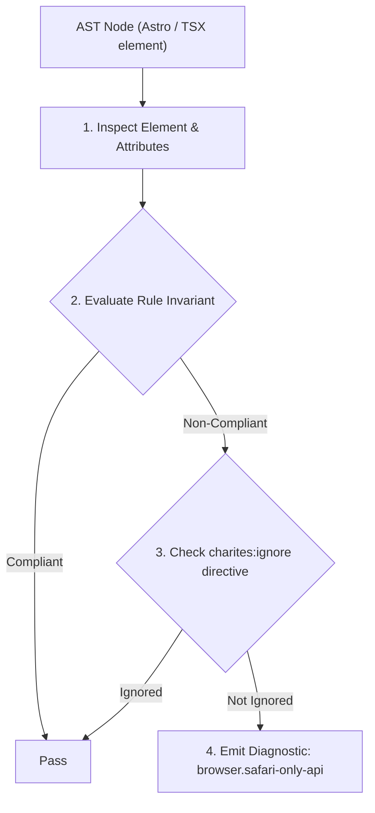
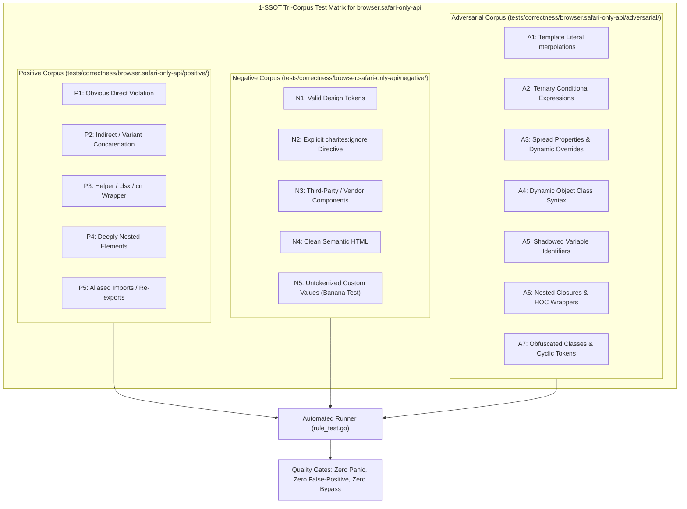

# browser.safari-only-api

> **Rule ID:** `browser.safari-only-api`
> **Severity:** `WARN`
> **Category:** `browser`
> **Target Standards:** W3C Web App Manifest (display-mode: standalone), W3C Pointer Events Level 3, Apple Pay on the Web Guidelines (Feature Detection Requirements)

---

## 1. Overview & Core Invariant

Flags unguarded Apple WebKit/Safari-proprietary APIs without universal web platform fallbacks

### Core Invariant:
> **"Direct invocation of Apple Safari-exclusive APIs ('navigator.standalone', 'ApplePaySession', iOS gesture events) must provide W3C standard fallbacks for Android and desktop platforms."**

---
## 2. Technical Grounding & Engine Realities

Apple WebKit includes proprietary features designed exclusively for iOS/macOS Safari.

Calling 'navigator.standalone' directly will always return undefined on Android Chrome, while calling 'ApplePaySession.canMakePayments()' without checking 'window.ApplePaySession' throws ReferenceError crashes.

---
## 3. Vulnerability & Risk Taxonomy

| Risk Vector | Severity | Impact |
| :--- | :---: | :--- |
| **Crash on Non-Apple Platforms** | MEDIUM | Calling 'ApplePaySession.canMakePayments()' on Android Chrome, Windows Edge, or Linux Firefox throws 'ReferenceError: ApplePaySession is not defined'. |
| **Broken PWA Detection on Android** | MEDIUM | Using 'navigator.standalone' fails to detect installed PWAs on Android, where 'display-mode: standalone' is the universal standard. |

---
## 4. Non-Compliant Code Patterns (Bad Examples)
### JAVASCRIPT (Direct invocation of ApplePaySession without availability check):
```javascript
if (ApplePaySession.canMakePayments()) {
  showApplePayButton();
}
```
### JAVASCRIPT (Relying solely on iOS-proprietary navigator.standalone):
```javascript
const isAppMode = navigator.standalone;
```

---
## 5. Compliant Implementation Patterns (Good Examples)
### JAVASCRIPT (Defensive feature guard before ApplePaySession invocation):
```javascript
if (typeof window !== "undefined" && window.ApplePaySession && window.ApplePaySession.canMakePayments()) {
  showApplePayButton();
}
```
### JAVASCRIPT (Standard W3C display-mode with legacy iOS fallback):
```javascript
const isAppMode = (typeof window !== "undefined" && window.matchMedia("(display-mode: standalone)").matches) ||
  (typeof navigator !== "undefined" && Boolean(navigator.standalone));
```

---

## 6. Detection & Verification Pipeline (How The Rule Evaluates Code)
This rule evaluates source code through the standard AST inspection pipeline:



### Step-by-Step Evaluation:
1. **AST Traversal:** Visits normalized `ir.Node` structures during AST streaming.
2. **Invariant Check:** Compares node attributes against rule invariants.
3. **Directive Suppression Check:** Honors inline `charites:ignore browser.safari-only-api` directives.
4. **Diagnostic Emission:** Emits compiler-grade diagnostic on invariant violation.

---

## 7. Verification & Test Harness (How The Test Works: 1-SSOT Tri-Corpus)

This rule is rigorously tested and validated across the canonical **1-SSOT Tri-Corpus** in `tests/correctness/browser.safari-only-api/`:



- **Positive Fixtures (P1-P5):** Verified to trigger diagnostics at exact lines and column spans.
- **Negative Fixtures (N1-N5):** Verified to produce zero diagnostics on valid tokens and legitimate exemptions.
- **Adversarial Fixtures (A1-A7):** Verified to prevent evasion across dynamic expressions, string interpolations, and cyclic references.

---

## 8. How to Suppress (Ignore Directives)

If this pattern is required for an intentional exception, suppress the diagnostic using the canonical Charites Rule ID:

```astro
<!-- charites:ignore browser.safari-only-api intentional exception -->
```

```tsx
// charites:ignore browser.safari-only-api intentional exception
```

---

## 9. Configuration Reference (`charites.yaml`)

```yaml
rules:
  browser.safari-only-api:
    severity: warn # error | warn | info | off
```

