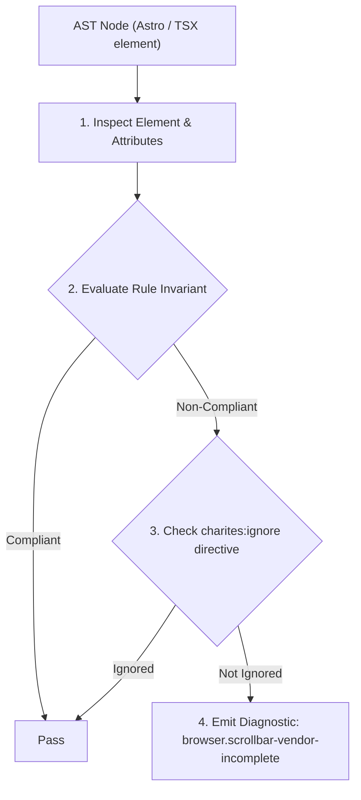
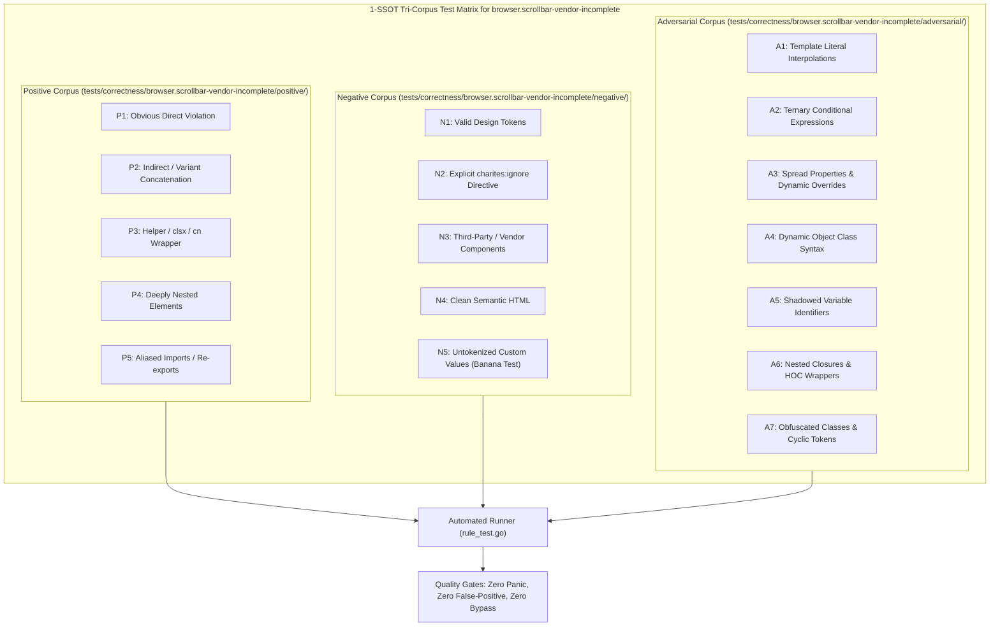

# browser.scrollbar-vendor-incomplete

> **Rule ID:** `browser.scrollbar-vendor-incomplete`
> **Severity:** `WARN`
> **Category:** `browser`
> **Target Standards:** W3C CSS Scrollbars Styling Module Level 1 (scrollbar-width, scrollbar-color), WebKit Proprietary Scrollbar Styling Documentation, MDN Browser Compatibility Matrix for Scrollbar Customization

---

## 1. Overview & Core Invariant

Enforces bidirectional cross-engine scrollbar styling pairing between WebKit pseudo-elements and W3C standard properties

### Core Invariant:
> **"Scrollbar styling declarations must be bidirectional: declaring '::-webkit-scrollbar*' requires declaring W3C standard 'scrollbar-width' / 'scrollbar-color', and vice-versa."**

---
## 2. Technical Grounding & Engine Realities

Historically, custom scrollbars were styled using WebKit pseudo-elements (::-webkit-scrollbar, ::-webkit-scrollbar-thumb, ::-webkit-scrollbar-track) in Chromium and Safari.

However, Gecko (Firefox) strictly enforces the W3C standard (scrollbar-width and scrollbar-color) and deliberately ignores ::-webkit-scrollbar.

When developers only write ::-webkit-scrollbar, the scrollbar appears customized in Chrome and Safari, but renders as an unstyled thick grey default scrollbar in Firefox, causing severe visual discordance on dark themes.

Charites enforces bidirectional cross-engine pairing, guaranteeing scrollbars render gracefully across Chrome, Firefox, and Safari.

---
## 3. Vulnerability & Risk Taxonomy

| Risk Vector | Severity | Impact |
| :--- | :---: | :--- |
| **Firefox Visual Degradation** | MEDIUM | Scrollbars appear as bright grey system widgets in Firefox on dark-mode web applications. |
| **Layout Shift / Text Clipping** | LOW | Layout shift on Firefox when expecting a 6px thin scrollbar but getting a 17px default desktop scrollbar. |

---
## 4. Non-Compliant Code Patterns (Bad Examples)
### CSS (Declaring only WebKit pseudo-elements (leaves Firefox with unstyled default scrollbar)):
```css
.custom-scroll::-webkit-scrollbar {
  width: 6px;
}
.custom-scroll::-webkit-scrollbar-thumb {
  background: var(--muted-foreground);
  border-radius: 9999px;
}
```

---
## 5. Compliant Implementation Patterns (Good Examples)
### CSS (Declaring both W3C standard properties and WebKit pseudo-elements):
```css
.custom-scroll {
  scrollbar-width: thin;
  scrollbar-color: var(--muted-foreground) transparent;
}
.custom-scroll::-webkit-scrollbar {
  width: 6px;
}
.custom-scroll::-webkit-scrollbar-thumb {
  background: var(--muted-foreground);
  border-radius: 9999px;
}
```

---

## 6. Detection & Verification Pipeline (How The Rule Evaluates Code)
This rule evaluates source code through the standard AST inspection pipeline:



### Step-by-Step Evaluation:
1. **AST Traversal:** Visits normalized `ir.Node` structures during AST streaming.
2. **Invariant Check:** Compares node attributes against rule invariants.
3. **Directive Suppression Check:** Honors inline `charites:ignore browser.scrollbar-vendor-incomplete` directives.
4. **Diagnostic Emission:** Emits compiler-grade diagnostic on invariant violation.

---

## 7. Verification & Test Harness (How The Test Works: 1-SSOT Tri-Corpus)

This rule is rigorously tested and validated across the canonical **1-SSOT Tri-Corpus** in `tests/correctness/browser.scrollbar-vendor-incomplete/`:



- **Positive Fixtures (P1-P5):** Verified to trigger diagnostics at exact lines and column spans.
- **Negative Fixtures (N1-N5):** Verified to produce zero diagnostics on valid tokens and legitimate exemptions.
- **Adversarial Fixtures (A1-A7):** Verified to prevent evasion across dynamic expressions, string interpolations, and cyclic references.

---

## 8. How to Suppress (Ignore Directives)

If this pattern is required for an intentional exception, suppress the diagnostic using the canonical Charites Rule ID:

```astro
<!-- charites:ignore browser.scrollbar-vendor-incomplete intentional exception -->
```

```tsx
// charites:ignore browser.scrollbar-vendor-incomplete intentional exception
```

---

## 9. Configuration Reference (`charites.yaml`)

```yaml
rules:
  browser.scrollbar-vendor-incomplete:
    severity: warn # error | warn | info | off
```

