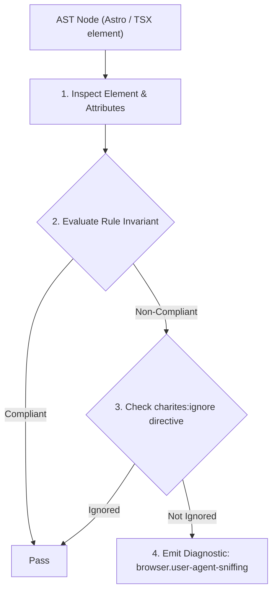
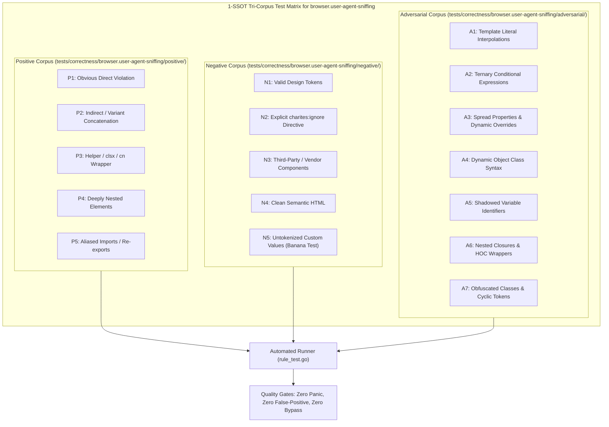

# browser.user-agent-sniffing

> **Rule ID:** `browser.user-agent-sniffing`
> **Severity:** `WARN`
> **Category:** `browser`
> **Target Standards:** W3C HTML Design Principles (Avoid Browser Sniffing), Chromium Client Hints & User-Agent Reduction Guidelines, MDN Web Docs (Browser Detection Using the User Agent - Best Practices)

---

## 1. Overview & Core Invariant

Flags conditional branching based on navigator.userAgent string sniffing and enforces W3C capability/feature detection

### Core Invariant:
> **"Application logic and responsive branching must not rely on substring or regex matching of 'navigator.userAgent'. Use W3C capability detection instead."**

---
## 2. Technical Grounding & Engine Realities

User-Agent strings are historically fragile, frequently spoofed, and currently frozen across major browsers (Chrome, Safari, Edge).

For example, Chrome contains 'Safari' and 'WebKit', Edge contains 'Chrome', and iPadOS reports as macOS 'Macintosh'. Branching on User-Agent strings leads to silent feature failures and broken responsive layouts on newer devices.

---
## 3. Vulnerability & Risk Taxonomy

| Risk Vector | Severity | Impact |
| :--- | :---: | :--- |
| **Frozen & Spoofed UA Strings** | MEDIUM | Browsers freeze version numbers or disguise platform tokens, causing browser sniffing logic to misclassify modern mobile devices as desktop or vice versa. |
| **Cross-Browser Engine Breakage** | MEDIUM | Alternative browsers (Brave, Vivaldi, Arc, Firefox Focus) or tablets (iPadOS) receive crippled mobile views or desktop-only controls that cannot be touched. |

---
## 4. Non-Compliant Code Patterns (Bad Examples)
### JAVASCRIPT (Branching layout or feature based on navigator.userAgent regex):
```javascript
if (/android|iphone|ipad/i.test(navigator.userAgent)) {
  initMobileLayout();
}
```
### TYPESCRIPT (Checking browser brand via userAgent.includes):
```typescript
if (navigator.userAgent.includes("Chrome")) {
  enableChromeFeature();
}
```

---
## 5. Compliant Implementation Patterns (Good Examples)
### JAVASCRIPT (Using W3C CSS Media Queries for pointer capability detection):
```javascript
if (window.matchMedia("(pointer: coarse)").matches) {
  initMobileLayout();
}
```
### TYPESCRIPT (Using feature detection instead of browser sniffing):
```typescript
if ("visualViewport" in window) {
  enableViewportFeature();
}
```
### TYPESCRIPT (Telemetry logging is allowed and not flagged):
```typescript
logger.sendMetrics({
  userAgent: navigator.userAgent,
  timestamp: Date.now(),
});
```

---

## 6. Detection & Verification Pipeline (How The Rule Evaluates Code)
This rule evaluates source code through the standard AST inspection pipeline:



### Step-by-Step Evaluation:
1. **AST Traversal:** Visits normalized `ir.Node` structures during AST streaming.
2. **Invariant Check:** Compares node attributes against rule invariants.
3. **Directive Suppression Check:** Honors inline `charites:ignore browser.user-agent-sniffing` directives.
4. **Diagnostic Emission:** Emits compiler-grade diagnostic on invariant violation.

---

## 7. Verification & Test Harness (How The Test Works: 1-SSOT Tri-Corpus)

This rule is rigorously tested and validated across the canonical **1-SSOT Tri-Corpus** in `tests/correctness/browser.user-agent-sniffing/`:



- **Positive Fixtures (P1-P5):** Verified to trigger diagnostics at exact lines and column spans.
- **Negative Fixtures (N1-N5):** Verified to produce zero diagnostics on valid tokens and legitimate exemptions.
- **Adversarial Fixtures (A1-A7):** Verified to prevent evasion across dynamic expressions, string interpolations, and cyclic references.

---

## 8. How to Suppress (Ignore Directives)

If this pattern is required for an intentional exception, suppress the diagnostic using the canonical Charites Rule ID:

```astro
<!-- charites:ignore browser.user-agent-sniffing intentional exception -->
```

```tsx
// charites:ignore browser.user-agent-sniffing intentional exception
```

---

## 9. Configuration Reference (`charites.yaml`)

```yaml
rules:
  browser.user-agent-sniffing:
    severity: warn # error | warn | info | off
```

