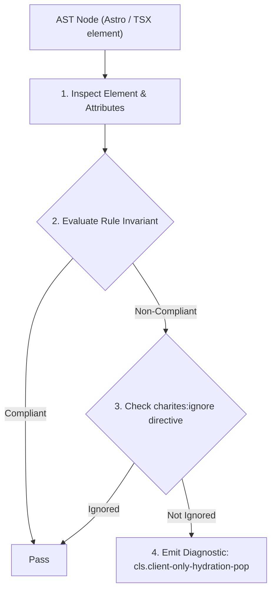
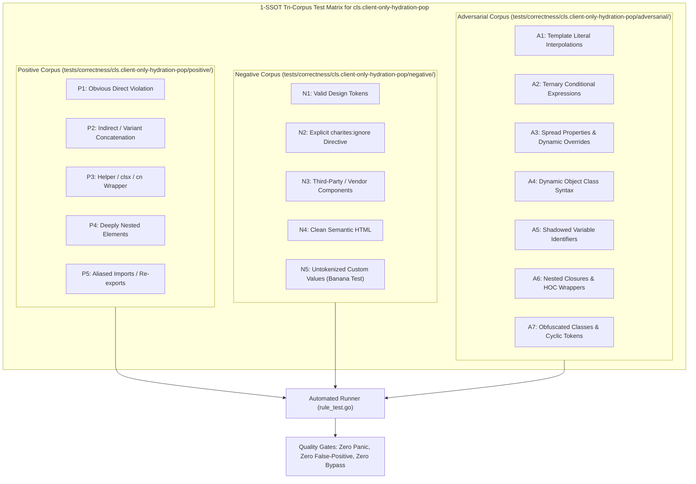

# cls.client-only-hydration-pop

> **Rule ID:** `cls.client-only-hydration-pop`
> **Severity:** `WARN`
> **Category:** `cls`
> **Target Standards:** Astro Islands Architecture (client:only directives & fallback slots), W3C Core Web Vitals (Cumulative Layout Shift Prevention), Progressive Enhancement & Skeleton Shell Invariants

---

## 1. Overview & Core Invariant

Astro client:only island lacks a slot='fallback' shell or reserved min-height container, causing hydration layout shift

### Core Invariant:
> **"Astro components utilizing 'client:only' must define an official fallback shell (<div slot='fallback'>) or be enclosed within a container with reserved min-height."**

---
## 2. Technical Grounding & Engine Realities

In Astro's island architecture, the 'client:only' directive explicitly opts out of server-side rendering (SSR), omitting initial HTML markup for the component during build time.

Without a server-rendered placeholder or designated fallback shell, the browser initially renders an empty 0-height space. When the client-side JavaScript bundle finishes downloading, parsing, and executing, the rendered component abruptly expands and pushes all subsequent document content downward.

Providing a dedicated fallback shell via '<div slot="fallback" class="min-h-[...]">...</div>' ensures that the space is permanently reserved in initial server HTML, completely neutralizing Cumulative Layout Shift upon client hydration.

---
## 3. Vulnerability & Risk Taxonomy

| Risk Vector | Severity | Impact |
| :--- | :---: | :--- |
| **Post-Hydration Content Displacement** | HIGH | Delayed hydration of client-only islands causes sudden vertical document jumping when interactive components finish booting. |
| **Blank Hole Flash** | MEDIUM | Users experience an empty white space where interactive widgets or charts belong prior to JavaScript execution. |

---
## 4. Non-Compliant Code Patterns (Bad Examples)
### ASTRO (client:only island without fallback slot or reserved height):
```astro
<main class="space-y-4">
  <h1>Dashboard</h1>
  <AnalyticsChart client:only="react" />
  <p>Live stats</p>
</main>
```

---
## 5. Compliant Implementation Patterns (Good Examples)
### ASTRO (client:only island with dedicated fallback slot shell):
```astro
<main class="space-y-4">
  <h1>Dashboard</h1>
  <AnalyticsChart client:only="react">
    <div slot="fallback" class="w-full min-h-[350px] bg-muted/20 animate-pulse rounded-lg flex items-center justify-center">
      <span>Memuat grafik...</span>
    </div>
  </AnalyticsChart>
  <p>Live stats</p>
</main>
```

---

## 6. Detection & Verification Pipeline (How The Rule Evaluates Code)
This rule evaluates source code through the standard AST inspection pipeline:



### Step-by-Step Evaluation:
1. **AST Traversal:** Visits normalized `ir.Node` structures during AST streaming.
2. **Invariant Check:** Compares node attributes against rule invariants.
3. **Directive Suppression Check:** Honors inline `charites:ignore cls.client-only-hydration-pop` directives.
4. **Diagnostic Emission:** Emits compiler-grade diagnostic on invariant violation.

---

## 7. Verification & Test Harness (How The Test Works: 1-SSOT Tri-Corpus)

This rule is rigorously tested and validated across the canonical **1-SSOT Tri-Corpus** in `tests/correctness/cls.client-only-hydration-pop/`:



- **Positive Fixtures (P1-P5):** Verified to trigger diagnostics at exact lines and column spans.
- **Negative Fixtures (N1-N5):** Verified to produce zero diagnostics on valid tokens and legitimate exemptions.
- **Adversarial Fixtures (A1-A7):** Verified to prevent evasion across dynamic expressions, string interpolations, and cyclic references.

---

## 8. How to Suppress (Ignore Directives)

If this pattern is required for an intentional exception, suppress the diagnostic using the canonical Charites Rule ID:

```astro
<!-- charites:ignore cls.client-only-hydration-pop intentional exception -->
```

```tsx
// charites:ignore cls.client-only-hydration-pop intentional exception
```

---

## 9. Configuration Reference (`charites.yaml`)

```yaml
rules:
  cls.client-only-hydration-pop:
    severity: warn # error | warn | info | off
```

