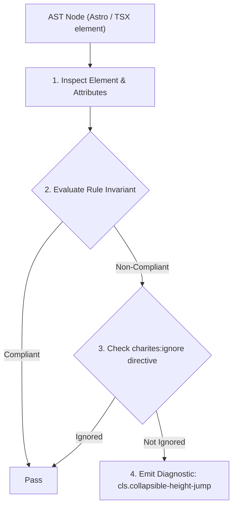
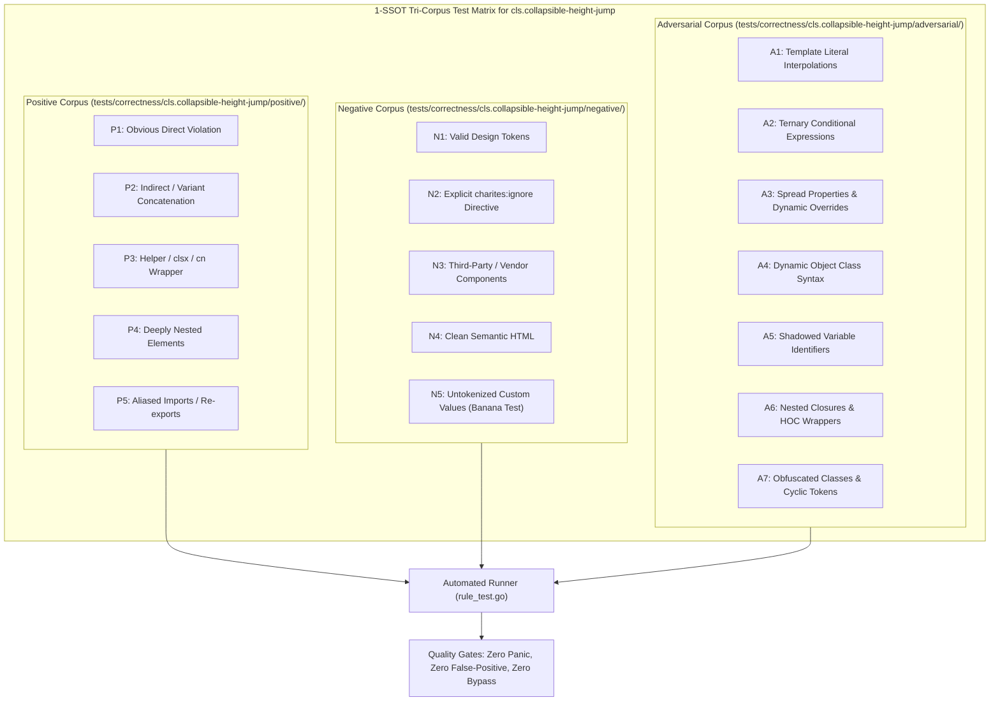

# cls.collapsible-height-jump

> **Rule ID:** `cls.collapsible-height-jump`
> **Severity:** `WARN`
> **Category:** `cls`
> **Target Standards:** CSS Grid Module Level 3 (grid-template-rows interpolation), Google Core Web Vitals (Interactive Animation CLS Invariants), Modern Zero-Shift Accordion Architectural Standards

---

## 1. Overview & Core Invariant

Collapsible accordion or drawer animates arbitrary max-height bounds instead of zero-shift CSS Grid

### Core Invariant:
> **"Collapsible content drawers and accordions must avoid animating arbitrary max-height bounds and instead adopt zero-shift CSS Grid (grid-template-rows: 0fr -> 1fr)."**

---
## 2. Technical Grounding & Engine Realities

A common legacy technique for animating collapsible elements involves transitioning 'max-height' from 0 to an arbitrarily large value (such as 'max-h-[1000px]').

Because CSS transitions interpolate over the declared boundary rather than actual content height, the animation duration becomes severely distorted: closing appears delayed and snapping occurs at the end of the transition, forcing layout reflow on surrounding elements.

The modern zero-shift solution utilizes CSS Grid: '<div class="grid transition-[grid-template-rows] duration-300 grid-rows-[0fr]"><div class="overflow-hidden">...</div></div>'. This allows CSS to smoothly interpolate intrinsic content height from 0fr to 1fr without any duration distortion or layout jumps.

---
## 3. Vulnerability & Risk Taxonomy

| Risk Vector | Severity | Impact |
| :--- | :---: | :--- |
| **Duration Distortion & Layout Snapping** | MEDIUM | Collapsing animations finish before the transition duration elapses, causing abrupt layout snaps and visual hitching. |
| **Continuous Main-Thread Reflow During Accordion Expansion** | MEDIUM | Transitioning max-height triggers continuous layout passes across all frames during accordion interactions. |

---
## 4. Non-Compliant Code Patterns (Bad Examples)
### TSX (Accordion drawer animating arbitrary max-height bounds):
```tsx
<div className="transition-all duration-300 overflow-hidden max-h-[1000px]">
  <AccordionBody />
</div>
```

---
## 5. Compliant Implementation Patterns (Good Examples)
### TSX (Modern zero-shift CSS Grid accordion interpolation):
```tsx
<div className="grid transition-[grid-template-rows] duration-300 grid-rows-[1fr]">
  <div className="overflow-hidden">
    <AccordionBody />
  </div>
</div>
```

---

## 6. Detection & Verification Pipeline (How The Rule Evaluates Code)
This rule evaluates source code through the standard AST inspection pipeline:



### Step-by-Step Evaluation:
1. **AST Traversal:** Visits normalized `ir.Node` structures during AST streaming.
2. **Invariant Check:** Compares node attributes against rule invariants.
3. **Directive Suppression Check:** Honors inline `charites:ignore cls.collapsible-height-jump` directives.
4. **Diagnostic Emission:** Emits compiler-grade diagnostic on invariant violation.

---

## 7. Verification & Test Harness (How The Test Works: 1-SSOT Tri-Corpus)

This rule is rigorously tested and validated across the canonical **1-SSOT Tri-Corpus** in `tests/correctness/cls.collapsible-height-jump/`:



- **Positive Fixtures (P1-P5):** Verified to trigger diagnostics at exact lines and column spans.
- **Negative Fixtures (N1-N5):** Verified to produce zero diagnostics on valid tokens and legitimate exemptions.
- **Adversarial Fixtures (A1-A7):** Verified to prevent evasion across dynamic expressions, string interpolations, and cyclic references.

---

## 8. How to Suppress (Ignore Directives)

If this pattern is required for an intentional exception, suppress the diagnostic using the canonical Charites Rule ID:

```astro
<!-- charites:ignore cls.collapsible-height-jump intentional exception -->
```

```tsx
// charites:ignore cls.collapsible-height-jump intentional exception
```

---

## 9. Configuration Reference (`charites.yaml`)

```yaml
rules:
  cls.collapsible-height-jump:
    severity: warn # error | warn | info | off
```

