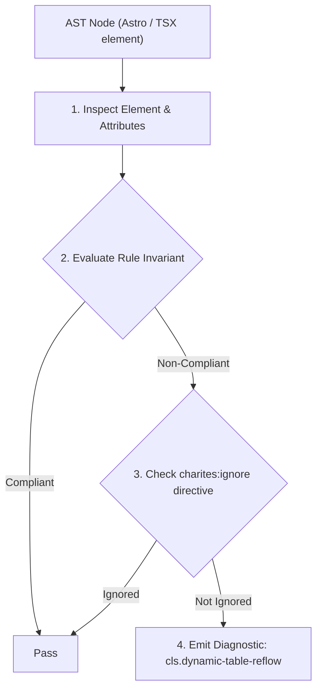
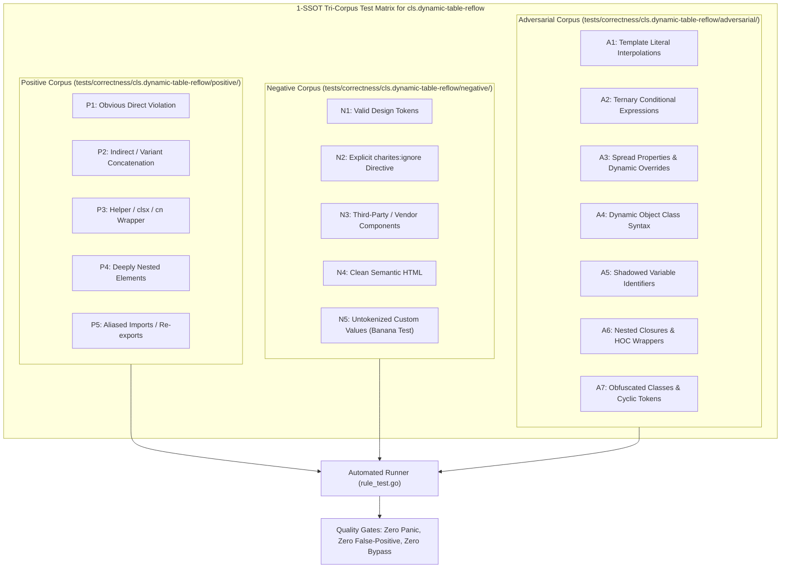

# cls.dynamic-table-reflow

> **Rule ID:** `cls.dynamic-table-reflow`
> **Severity:** `WARN`
> **Category:** `cls`
> **Target Standards:** W3C HTML Living Standard (Table Rendering & Column Sizing), CSS Table Module Level 3 (table-layout: fixed), Google Core Web Vitals (CLS Prevention in Dynamic Data Tables)

---

## 1. Overview & Core Invariant

Dynamic <table> lacks a statically inferable column sizing strategy, risking continuous column reflow

### Core Invariant:
> **"Dynamic data <table> elements must declare a statically inferable column sizing strategy via 'table-fixed', a <colgroup> block, or explicit width on all header cells."**

---
## 2. Technical Grounding & Engine Realities

By default, HTML tables operate under 'table-layout: auto', where column widths are continuously recalculated based on the widest cell content across all loaded rows.

When tables render dynamic data (e.g. streaming responses, paginated arrays, or WebSocket feeds), incoming rows with varying text lengths force the browser to recalculate and shift every column boundary on each render pass.

Using 'table-fixed' (CSS 'table-layout: fixed') or declaring explicit column widths via '<colgroup><col className="w-1/3" />...</colgroup>' ensures the browser determines column boundaries immediately from the first row or colgroup specification, eliminating table reflow entirely.

---
## 3. Vulnerability & Risk Taxonomy

| Risk Vector | Severity | Impact |
| :--- | :---: | :--- |
| **Continuous Column Boundary Snapping** | MEDIUM | As dynamic data streams or updates, table column borders snap horizontally, producing high cumulative layout shift. |
| **Delayed Initial Table Paint** | LOW | Under table-layout: auto, browser rendering of table rows is deferred until content lengths across all cells are computed. |

---
## 4. Non-Compliant Code Patterns (Bad Examples)
### TSX (Dynamic table rendering data items without column sizing strategy):
```tsx
<table className="w-full">
  <tbody>
    {items.map(it => (
      <tr key={it.id}>
        <td>{it.name}</td>
        <td>{it.price}</td>
      </tr>
    ))}
  </tbody>
</table>
```

---
## 5. Compliant Implementation Patterns (Good Examples)
### TSX (Dynamic table locked with Tailwind table-fixed class):
```tsx
<table className="w-full table-fixed">
  <tbody>
    {items.map(it => (
      <tr key={it.id}>
        <td>{it.name}</td>
        <td>{it.price}</td>
      </tr>
    ))}
  </tbody>
</table>
```
### TSX (Dynamic table with explicit colgroup definition):
```tsx
<table className="w-full">
  <colgroup>
    <col className="w-3/4" />
    <col className="w-1/4" />
  </colgroup>
  <tbody>
    {items.map(it => (
      <tr key={it.id}>
        <td>{it.name}</td>
        <td>{it.price}</td>
      </tr>
    ))}
  </tbody>
</table>
```

---

## 6. Detection & Verification Pipeline (How The Rule Evaluates Code)
This rule evaluates source code through the standard AST inspection pipeline:



### Step-by-Step Evaluation:
1. **AST Traversal:** Visits normalized `ir.Node` structures during AST streaming.
2. **Invariant Check:** Compares node attributes against rule invariants.
3. **Directive Suppression Check:** Honors inline `charites:ignore cls.dynamic-table-reflow` directives.
4. **Diagnostic Emission:** Emits compiler-grade diagnostic on invariant violation.

---

## 7. Verification & Test Harness (How The Test Works: 1-SSOT Tri-Corpus)

This rule is rigorously tested and validated across the canonical **1-SSOT Tri-Corpus** in `tests/correctness/cls.dynamic-table-reflow/`:



- **Positive Fixtures (P1-P5):** Verified to trigger diagnostics at exact lines and column spans.
- **Negative Fixtures (N1-N5):** Verified to produce zero diagnostics on valid tokens and legitimate exemptions.
- **Adversarial Fixtures (A1-A7):** Verified to prevent evasion across dynamic expressions, string interpolations, and cyclic references.

---

## 8. How to Suppress (Ignore Directives)

If this pattern is required for an intentional exception, suppress the diagnostic using the canonical Charites Rule ID:

```astro
<!-- charites:ignore cls.dynamic-table-reflow intentional exception -->
```

```tsx
// charites:ignore cls.dynamic-table-reflow intentional exception
```

---

## 9. Configuration Reference (`charites.yaml`)

```yaml
rules:
  cls.dynamic-table-reflow:
    severity: warn # error | warn | info | off
```

