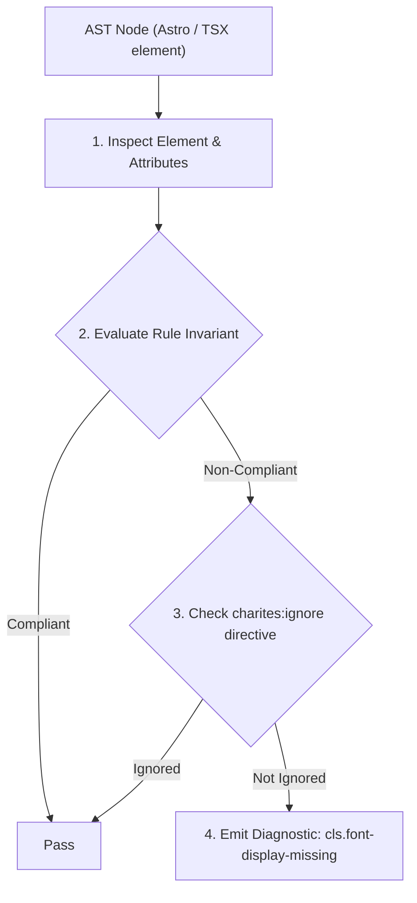
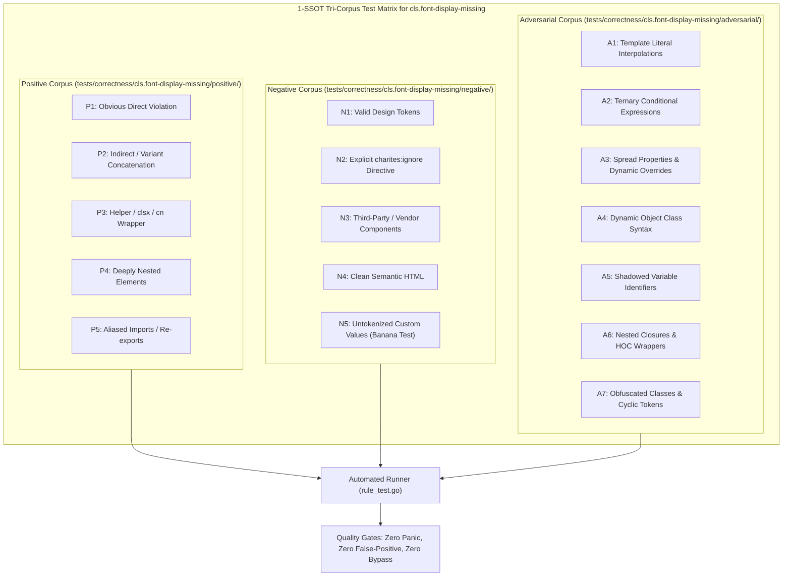

# cls.font-display-missing

> **Rule ID:** `cls.font-display-missing`
> **Severity:** `ERROR`
> **Category:** `cls`
> **Target Standards:** W3C CSS Fonts Module Level 4 (@font-face font-display descriptor), Google Core Web Vitals Guidelines (Cumulative Layout Shift & FOUT/FOIT), Web.dev Font Best Practices

---

## 1. Overview & Core Invariant

Requires font-display descriptor on custom @font-face declarations to prevent FOIT reflow

### Core Invariant:
> **"All custom @font-face declarations must declare an explicit, valid 'font-display' descriptor ('swap', 'optional', or 'fallback') to ensure continuous text visibility and prevent layout reflow."**

---
## 2. Technical Grounding & Engine Realities

When a browser encounters a custom @font-face without a 'font-display' descriptor, it defaults to 'font-display: auto' (often identical to 'block').

Under the 'block' period, the browser hides text completely (Flash of Invisible Text / FOIT) for up to 3 seconds while waiting for the web font file. Once the font arrives, the browser suddenly swaps the font and recalculates line wrapping, triggering Cumulative Layout Shift (CLS).

Using 'font-display: swap' renders system fallback fonts immediately and swaps gracefully when the font finishes loading, ensuring accessibility and predictable rendering.

---
## 3. Vulnerability & Risk Taxonomy

| Risk Vector | Severity | Impact |
| :--- | :---: | :--- |
| **Flash of Invisible Text (FOIT)** | HIGH | Users stare at blank spaces on slow networks while waiting for fonts to load. |
| **Cumulative Layout Shift (CLS)** | HIGH | Late font swaps cause text wrapping reflow that pushes subsequent content down. |

---
## 4. Non-Compliant Code Patterns (Bad Examples)
### ASTRO (Custom @font-face rule missing font-display descriptor):
```astro
<style>
  @font-face {
    font-family: 'GeistSans';
    src: url('/fonts/geist.woff2') format('woff2');
  }
</style>
```

---
## 5. Compliant Implementation Patterns (Good Examples)
### ASTRO (Custom @font-face declaring font-display: swap):
```astro
<style>
  @font-face {
    font-family: 'GeistSans';
    src: url('/fonts/geist.woff2') format('woff2');
    font-display: swap;
  }
</style>
```

---

## 6. Detection & Verification Pipeline (How The Rule Evaluates Code)
This rule evaluates source code through the standard AST inspection pipeline:



### Step-by-Step Evaluation:
1. **AST Traversal:** Visits normalized `ir.Node` structures during AST streaming.
2. **Invariant Check:** Compares node attributes against rule invariants.
3. **Directive Suppression Check:** Honors inline `charites:ignore cls.font-display-missing` directives.
4. **Diagnostic Emission:** Emits compiler-grade diagnostic on invariant violation.

---

## 7. Verification & Test Harness (How The Test Works: 1-SSOT Tri-Corpus)

This rule is rigorously tested and validated across the canonical **1-SSOT Tri-Corpus** in `tests/correctness/cls.font-display-missing/`:



- **Positive Fixtures (P1-P5):** Verified to trigger diagnostics at exact lines and column spans.
- **Negative Fixtures (N1-N5):** Verified to produce zero diagnostics on valid tokens and legitimate exemptions.
- **Adversarial Fixtures (A1-A7):** Verified to prevent evasion across dynamic expressions, string interpolations, and cyclic references.

---

## 8. How to Suppress (Ignore Directives)

If this pattern is required for an intentional exception, suppress the diagnostic using the canonical Charites Rule ID:

```astro
<!-- charites:ignore cls.font-display-missing intentional exception -->
```

```tsx
// charites:ignore cls.font-display-missing intentional exception
```

---

## 9. Configuration Reference (`charites.yaml`)

```yaml
rules:
  cls.font-display-missing:
    severity: error # error | warn | info | off
```

