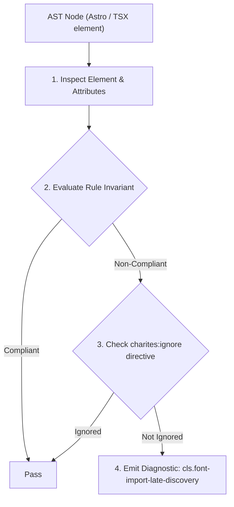
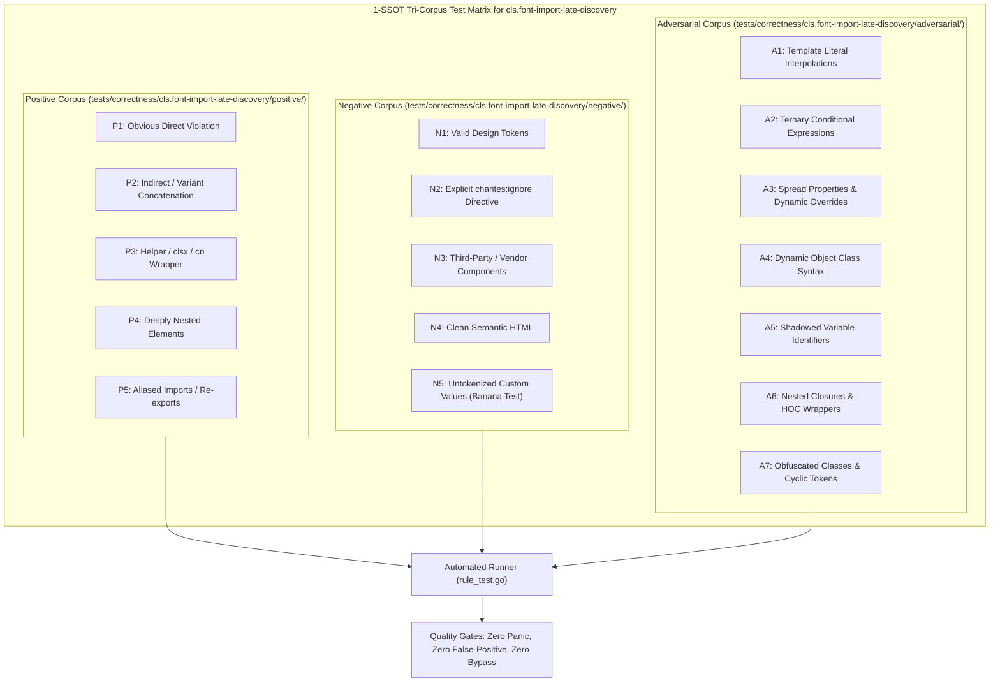

# cls.font-import-late-discovery

> **Rule ID:** `cls.font-import-late-discovery`
> **Severity:** `WARN`
> **Category:** `cls`
> **Target Standards:** W3C Cumulative Layout Shift (CLS) Metric Specification, Google Core Web Vitals Guidelines (Render-Blocking Resources & Critical Path), Tailwind CSS v4 Import Specifications

---

## 1. Overview & Core Invariant

Warns when CSS @import is used for external font loading, delaying discovery and risking layout shift

### Core Invariant:
> **"External web fonts must be discovered and preconnected in HTML/Astro <head> rather than imported via cascading CSS @import directives, while whitelisting Tailwind CSS and local stylesheets."**

---
## 2. Technical Grounding & Engine Realities

Placing @import rules referencing external fonts (such as Google Fonts or Typekit) inside CSS creates a cascading waterfall of render-blocking requests.

The browser must download the HTML, parse the stylesheet, discover the nested @import, download the font CSS, and only then start downloading the binary font file. This profound delay forces long periods of fallback rendering and dramatic late layout shifts.

Declaring '<link rel="preconnect">' alongside '<link rel="stylesheet">' in the HTML layout starts DNS preconnection and font loading at the earliest possible phase of page load.

---
## 3. Vulnerability & Risk Taxonomy

| Risk Vector | Severity | Impact |
| :--- | :---: | :--- |
| **Cascading Network Waterfall** | HIGH | Nested font CSS imports delay font delivery by several hundred milliseconds on mobile networks. |
| **Severe Late Layout Shift** | MEDIUM | Delayed font swapping abruptly reorganizes the text geometry long after initial paint. |

---
## 4. Non-Compliant Code Patterns (Bad Examples)
### ASTRO (Late discovery font import inside style block):
```astro
<style>
  @import url('https://fonts.googleapis.com/css2?family=Inter:wght@400;700&display=swap');
</style>
```

---
## 5. Compliant Implementation Patterns (Good Examples)
### ASTRO (Fonts loaded via preconnect and stylesheet link in head):
```astro
<head>
  <link rel="preconnect" href="https://fonts.googleapis.com" />
  <link rel="preconnect" href="https://fonts.gstatic.com" crossorigin />
  <link rel="stylesheet" href="https://fonts.googleapis.com/css2?family=Inter:wght@400;700&display=swap" />
</head>
```
### ASTRO (Whitelisted Tailwind CSS and local file imports):
```astro
<style>
  @import "tailwindcss";
  @import "./local-tokens.css";
</style>
```

---

## 6. Detection & Verification Pipeline (How The Rule Evaluates Code)
This rule evaluates source code through the standard AST inspection pipeline:



### Step-by-Step Evaluation:
1. **AST Traversal:** Visits normalized `ir.Node` structures during AST streaming.
2. **Invariant Check:** Compares node attributes against rule invariants.
3. **Directive Suppression Check:** Honors inline `charites:ignore cls.font-import-late-discovery` directives.
4. **Diagnostic Emission:** Emits compiler-grade diagnostic on invariant violation.

---

## 7. Verification & Test Harness (How The Test Works: 1-SSOT Tri-Corpus)

This rule is rigorously tested and validated across the canonical **1-SSOT Tri-Corpus** in `tests/correctness/cls.font-import-late-discovery/`:



- **Positive Fixtures (P1-P5):** Verified to trigger diagnostics at exact lines and column spans.
- **Negative Fixtures (N1-N5):** Verified to produce zero diagnostics on valid tokens and legitimate exemptions.
- **Adversarial Fixtures (A1-A7):** Verified to prevent evasion across dynamic expressions, string interpolations, and cyclic references.

---

## 8. How to Suppress (Ignore Directives)

If this pattern is required for an intentional exception, suppress the diagnostic using the canonical Charites Rule ID:

```astro
<!-- charites:ignore cls.font-import-late-discovery intentional exception -->
```

```tsx
// charites:ignore cls.font-import-late-discovery intentional exception
```

---

## 9. Configuration Reference (`charites.yaml`)

```yaml
rules:
  cls.font-import-late-discovery:
    severity: warn # error | warn | info | off
```

