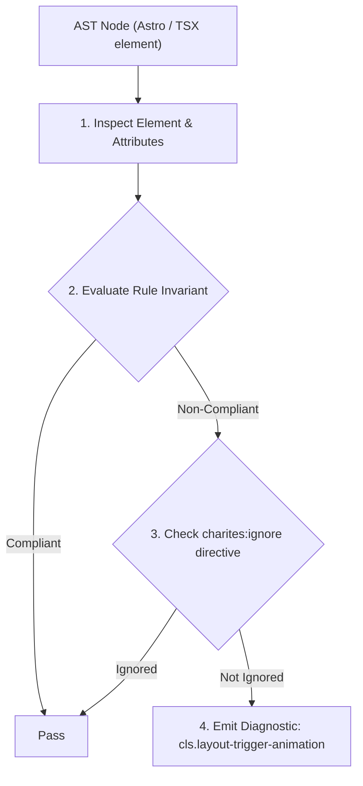
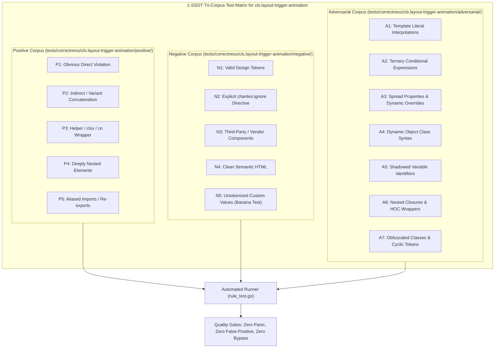

# cls.layout-trigger-animation

> **Rule ID:** `cls.layout-trigger-animation`
> **Severity:** `WARN`
> **Category:** `cls`
> **Target Standards:** W3C CSS Animations Level 1 (@keyframes declaration blocks), Google Core Web Vitals (CLS Compositor Thread Guidelines), High Performance Mobile Web (GPU Compositing vs CPU Reflow)

---

## 1. Overview & Core Invariant

CSS @keyframes animation mutates layout-triggering geometry properties instead of GPU-composited transforms

### Core Invariant:
> **"CSS @keyframes animations must mutate GPU-composited layer properties ('transform', 'opacity') rather than layout-triggering geometry properties ('top', 'left', 'width', 'height', 'margin', 'padding')."**

---
## 2. Technical Grounding & Engine Realities

When CSS keyframes animate geometry properties (such as top, left, width, height, margin, or padding), the browser is forced to execute full layout recalculations (reflow) and repaint stages on the main CPU thread for every animation frame (typically 60-120 times per second).

This continuous geometry invalidation directly triggers Cumulative Layout Shift (CLS) for neighboring elements and causes noticeable frame jank (dropped frames) on mobile and low-power hardware.

Modern browser rendering pipelines offload 'transform' and 'opacity' mutations directly to the GPU compositor thread, executing smooth, 60fps animations that never invalidate document geometry or cause layout shifts.

---
## 3. Vulnerability & Risk Taxonomy

| Risk Vector | Severity | Impact |
| :--- | :---: | :--- |
| **Continuous CPU Layout Reflow** | HIGH | Animating geometry properties causes browser recalculation of surrounding elements on every frame, generating Cumulative Layout Shift. |
| **Rendering Pipeline Jank & Dropped Frames** | MEDIUM | High CPU load from continuous layout reflow stalls main thread execution, resulting in choppy animations and poor touch responsiveness. |

---
## 4. Non-Compliant Code Patterns (Bad Examples)
### CSS (Keyframe animation mutating positional and margin geometry properties):
```css
@keyframes slideIn {
  from { top: -20px; margin-top: 10px; }
  to { top: 0; margin-top: 0; }
}
```

---
## 5. Compliant Implementation Patterns (Good Examples)
### CSS (GPU-composited keyframe animation using transform and opacity):
```css
@keyframes slideIn {
  from { transform: translateY(-20px); opacity: 0; }
  to { transform: translateY(0); opacity: 1; }
}
```

---

## 6. Detection & Verification Pipeline (How The Rule Evaluates Code)
This rule evaluates source code through the standard AST inspection pipeline:



### Step-by-Step Evaluation:
1. **AST Traversal:** Visits normalized `ir.Node` structures during AST streaming.
2. **Invariant Check:** Compares node attributes against rule invariants.
3. **Directive Suppression Check:** Honors inline `charites:ignore cls.layout-trigger-animation` directives.
4. **Diagnostic Emission:** Emits compiler-grade diagnostic on invariant violation.

---

## 7. Verification & Test Harness (How The Test Works: 1-SSOT Tri-Corpus)

This rule is rigorously tested and validated across the canonical **1-SSOT Tri-Corpus** in `tests/correctness/cls.layout-trigger-animation/`:



- **Positive Fixtures (P1-P5):** Verified to trigger diagnostics at exact lines and column spans.
- **Negative Fixtures (N1-N5):** Verified to produce zero diagnostics on valid tokens and legitimate exemptions.
- **Adversarial Fixtures (A1-A7):** Verified to prevent evasion across dynamic expressions, string interpolations, and cyclic references.

---

## 8. How to Suppress (Ignore Directives)

If this pattern is required for an intentional exception, suppress the diagnostic using the canonical Charites Rule ID:

```astro
<!-- charites:ignore cls.layout-trigger-animation intentional exception -->
```

```tsx
// charites:ignore cls.layout-trigger-animation intentional exception
```

---

## 9. Configuration Reference (`charites.yaml`)

```yaml
rules:
  cls.layout-trigger-animation:
    severity: warn # error | warn | info | off
```

