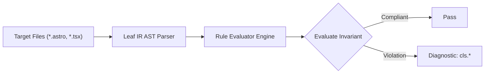

# Cls Rules (`cls`)

The `cls` category contains static analysis rules for code quality, architectural constraints, and design system governance.

---

## Category Rule Index

| Rule ID | Severity | Summary | Full Specification | Status |
| :--- | :---: | :--- | :--- | :---: |
| `cls.client-only-hydration-pop` | `WARN` | Astro client:only island lacks a slot='fallback' shell or reserved min-height container, causing hydration layout shift | [`cls.client-only-hydration-pop`](cls.client-only-hydration-pop) | `enabled` |
| `cls.collapsible-height-jump` | `WARN` | Collapsible accordion or drawer animates arbitrary max-height bounds instead of zero-shift CSS Grid | [`cls.collapsible-height-jump`](cls.collapsible-height-jump) | `enabled` |
| `cls.dynamic-content-without-reserved-space` | `WARN` | Dynamic widget or banner injected in document flow lacks reserved vertical dimensions (min-h/h), risking content reflow | [`cls.dynamic-content-without-reserved-space`](cls.dynamic-content-without-reserved-space) | `enabled` |
| `cls.dynamic-table-reflow` | `WARN` | Dynamic <table> lacks a statically inferable column sizing strategy, risking continuous column reflow | [`cls.dynamic-table-reflow`](cls.dynamic-table-reflow) | `enabled` |
| `cls.font-display-missing` | `ERROR` | Requires font-display descriptor on custom @font-face declarations to prevent FOIT reflow | [`cls.font-display-missing`](cls.font-display-missing) | `enabled` |
| `cls.font-import-late-discovery` | `WARN` | Warns when CSS @import is used for external font loading, delaying discovery and risking layout shift | [`cls.font-import-late-discovery`](cls.font-import-late-discovery) | `enabled` |
| `cls.layout-trigger-animation` | `WARN` | CSS @keyframes animation mutates layout-triggering geometry properties instead of GPU-composited transforms | [`cls.layout-trigger-animation`](cls.layout-trigger-animation) | `enabled` |
| `cls.layout-trigger-transition` | `WARN` | CSS transition targets layout-triggering geometry properties instead of GPU-composited transforms | [`cls.layout-trigger-transition`](cls.layout-trigger-transition) | `enabled` |
| `cls.text-icon-late-reflow` | `INFO` | Requires locked bounding dimensions on text-ligature icon elements to prevent text reflow | [`cls.text-icon-late-reflow`](cls.text-icon-late-reflow) | `enabled` |
| `cls.unadjusted-font-metric` | `INFO` | Recommends font metric overrides on fallback font declarations to reduce swap CLS | [`cls.unadjusted-font-metric`](cls.unadjusted-font-metric) | `enabled` |
| `cls.unconstrained-carousel` | `WARN` | Warns when carousel or slider containers lack bounded height or slide aspect-ratio constraints | [`cls.unconstrained-carousel`](cls.unconstrained-carousel) | `enabled` |
| `cls.unreserved-ad-container` | `WARN` | Warns when dynamic ad containers lack reserved vertical dimensions or initial skeleton placeholders | [`cls.unreserved-ad-container`](cls.unreserved-ad-container) | `enabled` |
| `cls.unreserved-fixed-header` | `WARN` | Fixed or sticky header lacks layout space compensation (pt/mt) on subsequent in-flow content or spacer block | [`cls.unreserved-fixed-header`](cls.unreserved-fixed-header) | `enabled` |
| `cls.unsized-embed-frame` | `WARN` | Warns when embedded media frames lack explicit dimensions or an aspect-ratio container wrapper | [`cls.unsized-embed-frame`](cls.unsized-embed-frame) | `enabled` |
| `cls.unsized-image` | `WARN` | Warns when image elements lack explicit dimensions, aspect-ratio, or Tailwind box sizing | [`cls.unsized-image`](cls.unsized-image) | `enabled` |
| `cls.unstable-scrollbar-gutter` | `INFO` | Root document scroller declares overflow-y: auto without scrollbar-gutter: stable, risking horizontal layout shifts | [`cls.unstable-scrollbar-gutter`](cls.unstable-scrollbar-gutter) | `enabled` |

---
## How the Cls Analysis Pipeline Works

The `cls` engine applies static analysis checks against component source code:

### Pipeline Flow:
1. **AST Node Traversal:** Scans target template files into normalized intermediate representation.
2. **Invariant Assertion:** Validates structural and semantic invariants.
3. **Diagnostic Reporting:** Emits structured diagnostics for non-compliant patterns.

---

## How Cls Tests Work (Verification Harness)

All rules in `cls` are verified using the canonical 1-SSOT Tri-Corpus (`tests/correctness/cls.*/`) encompassing Positive (P1-P5), Negative (N1-N5), and Adversarial (A1-A7) fixture matrices.
