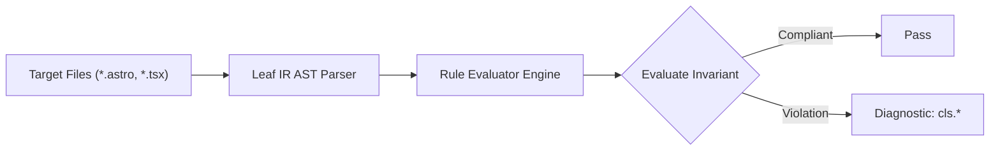

# Cls Rules (`cls`)

The `cls` category contains static analysis rules for code quality, architectural constraints, and design system governance.

---

## Category Rule Index

| Rule ID | Severity | Summary | Full Specification | Status |
| :--- | :---: | :--- | :--- | :---: |
| `cls.unconstrained-carousel` | `WARN` | Warns when carousel or slider containers lack bounded height or slide aspect-ratio constraints | [`cls.unconstrained-carousel`](cls.unconstrained-carousel) | `enabled` |
| `cls.unreserved-ad-container` | `WARN` | Warns when dynamic ad containers lack reserved vertical dimensions or initial skeleton placeholders | [`cls.unreserved-ad-container`](cls.unreserved-ad-container) | `enabled` |
| `cls.unsized-embed-frame` | `WARN` | Warns when embedded media frames lack explicit dimensions or an aspect-ratio container wrapper | [`cls.unsized-embed-frame`](cls.unsized-embed-frame) | `enabled` |
| `cls.unsized-image` | `WARN` | Warns when image elements lack explicit dimensions, aspect-ratio, or Tailwind box sizing | [`cls.unsized-image`](cls.unsized-image) | `enabled` |

---
## How the Cls Analysis Pipeline Works

The `cls` engine applies static analysis checks against component source code:

### Pipeline Flow:
1. **AST Node Traversal:** Scans target template files into normalized intermediate representation.
2. **Invariant Assertion:** Validates structural and semantic invariants.
3. **Diagnostic Reporting:** Emits structured diagnostics for non-compliant patterns.

---

## How Cls Tests Work (Verification Harness)

All rules in `cls` are verified using the canonical 1-SSOT Tri-Corpus (`tests/correctness/cls.*/`) encompassing Positive (P1-P5), Negative (N1-N5), and Adversarial (A1-A7) fixture matrices.
