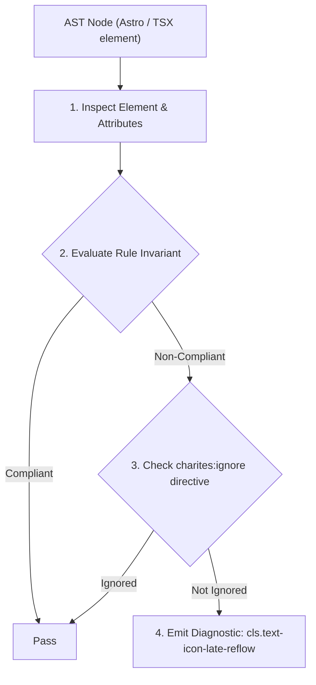
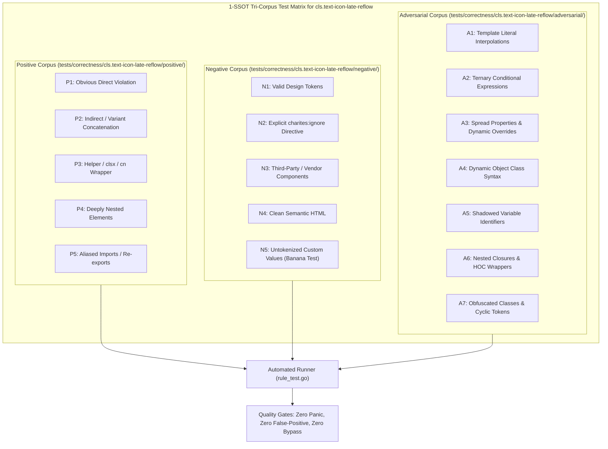

# cls.text-icon-late-reflow

> **Rule ID:** `cls.text-icon-late-reflow`
> **Severity:** `INFO`
> **Category:** `cls`
> **Target Standards:** W3C Cumulative Layout Shift (CLS) Metric Specification, Google Material Icons & Material Symbols Integration Guide

---

## 1. Overview & Core Invariant

Requires locked bounding dimensions on text-ligature icon elements to prevent text reflow

### Core Invariant:
> **"Text-ligature icon elements must lock their bounding box via 'inline-block' (or block/flex), explicit width/height (or 'size-*'), and 'overflow-hidden' to prevent raw word ligature text from expanding the layout before the icon font is loaded."**

---
## 2. Technical Grounding & Engine Realities

Icon fonts like Material Icons or Material Symbols render icons by substituting raw text strings (such as 'shopping_cart', 'account_circle', or 'arrow_back') with icon glyphs via OpenType ligatures.

Before the web font finishes downloading, the browser displays the fallback word text ('shopping_cart') at full length (spanning 80-120px).

When the web font suddenly loads, the word shrinks into a 24x24px glyph, causing surrounding navigation bars, buttons, and text to collapse backward and triggering Cumulative Layout Shift (CLS).

Locking the container dimensions to 'inline-block size-6 overflow-hidden' ensures the element occupies exactly 24x24px regardless of font loading state.

---
## 3. Vulnerability & Risk Taxonomy

| Risk Vector | Severity | Impact |
| :--- | :---: | :--- |
| **Button and Header Layout Contraction** | MEDIUM | Long ligature strings expand buttons initially, then contract suddenly when font arrives. |
| **Cumulative Layout Shift (CLS)** | LOW | Shifts around interactive icons trigger layout recalculations in headers and toolbars. |

---
## 4. Non-Compliant Code Patterns (Bad Examples)
### TSX (Material icon with raw text ligature without locked box dimensions):
```tsx
<button className="flex items-center gap-2">
  <span className="material-icons">shopping_cart</span> Beli
</button>
```

---
## 5. Compliant Implementation Patterns (Good Examples)
### TSX (Locked icon bounding box with inline-block, size-6, and overflow-hidden):
```tsx
<button className="flex items-center gap-2">
  <span className="material-icons inline-block size-6 overflow-hidden">shopping_cart</span> Beli
</button>
```

---

## 6. Detection & Verification Pipeline (How The Rule Evaluates Code)
This rule evaluates source code through the standard AST inspection pipeline:



### Step-by-Step Evaluation:
1. **AST Traversal:** Visits normalized `ir.Node` structures during AST streaming.
2. **Invariant Check:** Compares node attributes against rule invariants.
3. **Directive Suppression Check:** Honors inline `charites:ignore cls.text-icon-late-reflow` directives.
4. **Diagnostic Emission:** Emits compiler-grade diagnostic on invariant violation.

---

## 7. Verification & Test Harness (How The Test Works: 1-SSOT Tri-Corpus)

This rule is rigorously tested and validated across the canonical **1-SSOT Tri-Corpus** in `tests/correctness/cls.text-icon-late-reflow/`:



- **Positive Fixtures (P1-P5):** Verified to trigger diagnostics at exact lines and column spans.
- **Negative Fixtures (N1-N5):** Verified to produce zero diagnostics on valid tokens and legitimate exemptions.
- **Adversarial Fixtures (A1-A7):** Verified to prevent evasion across dynamic expressions, string interpolations, and cyclic references.

---

## 8. How to Suppress (Ignore Directives)

If this pattern is required for an intentional exception, suppress the diagnostic using the canonical Charites Rule ID:

```astro
<!-- charites:ignore cls.text-icon-late-reflow intentional exception -->
```

```tsx
// charites:ignore cls.text-icon-late-reflow intentional exception
```

---

## 9. Configuration Reference (`charites.yaml`)

```yaml
rules:
  cls.text-icon-late-reflow:
    severity: info # error | warn | info | off
```

