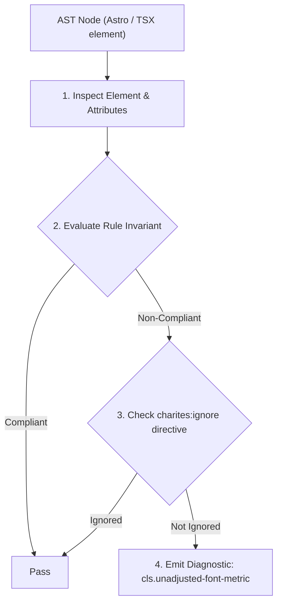
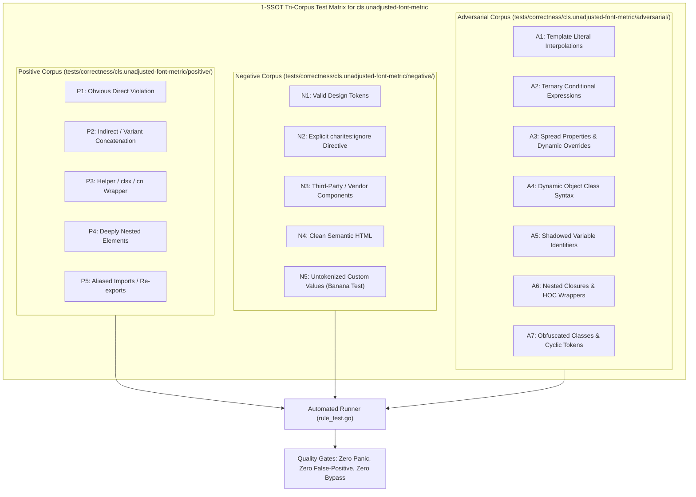

# cls.unadjusted-font-metric

> **Rule ID:** `cls.unadjusted-font-metric`
> **Severity:** `INFO`
> **Category:** `cls`
> **Target Standards:** W3C CSS Fonts Module Level 4 (size-adjust, ascent-override, descent-override), Google Chrome Font Metric Override Guidelines

---

## 1. Overview & Core Invariant

Recommends font metric overrides on fallback font declarations to reduce swap CLS

### Core Invariant:
> **"Local fallback @font-face declarations (using 'src: local(...)') should specify metric adjustment descriptors ('size-adjust', 'ascent-override', or 'descent-override') to align bounding boxes with the principal web font."**

---
## 2. Technical Grounding & Engine Realities

When a web font downloads and replaces a system fallback font, variations in glyph x-height, ascent, and descent alter the computed bounding boxes of every text line.

This disparity causes sudden vertical expansion or contraction of paragraphs and headers, contributing to Cumulative Layout Shift.

By declaring 'size-adjust', 'ascent-override', and 'descent-override' on the fallback @font-face, developers can calibrate the system font's metrics to match the web font, creating a near zero-shift swap.

---
## 3. Vulnerability & Risk Taxonomy

| Risk Vector | Severity | Impact |
| :--- | :---: | :--- |
| **Font Swap Layout Jitter** | LOW | Paragraphs and navigation bars visibly shift lines when the web font swaps in. |

---
## 4. Non-Compliant Code Patterns (Bad Examples)
### ASTRO (Local fallback font-face without metric override descriptors):
```astro
<style>
  @font-face {
    font-family: 'InterFallback';
    src: local('Arial');
  }
</style>
```

---
## 5. Compliant Implementation Patterns (Good Examples)
### ASTRO (Local fallback font-face with size-adjust and ascent-override):
```astro
<style>
  @font-face {
    font-family: 'InterFallback';
    src: local('Arial');
    ascent-override: 90%;
    descent-override: 22%;
    size-adjust: 107%;
  }
</style>
```

---

## 6. Detection & Verification Pipeline (How The Rule Evaluates Code)
This rule evaluates source code through the standard AST inspection pipeline:



### Step-by-Step Evaluation:
1. **AST Traversal:** Visits normalized `ir.Node` structures during AST streaming.
2. **Invariant Check:** Compares node attributes against rule invariants.
3. **Directive Suppression Check:** Honors inline `charites:ignore cls.unadjusted-font-metric` directives.
4. **Diagnostic Emission:** Emits compiler-grade diagnostic on invariant violation.

---

## 7. Verification & Test Harness (How The Test Works: 1-SSOT Tri-Corpus)

This rule is rigorously tested and validated across the canonical **1-SSOT Tri-Corpus** in `tests/correctness/cls.unadjusted-font-metric/`:



- **Positive Fixtures (P1-P5):** Verified to trigger diagnostics at exact lines and column spans.
- **Negative Fixtures (N1-N5):** Verified to produce zero diagnostics on valid tokens and legitimate exemptions.
- **Adversarial Fixtures (A1-A7):** Verified to prevent evasion across dynamic expressions, string interpolations, and cyclic references.

---

## 8. How to Suppress (Ignore Directives)

If this pattern is required for an intentional exception, suppress the diagnostic using the canonical Charites Rule ID:

```astro
<!-- charites:ignore cls.unadjusted-font-metric intentional exception -->
```

```tsx
// charites:ignore cls.unadjusted-font-metric intentional exception
```

---

## 9. Configuration Reference (`charites.yaml`)

```yaml
rules:
  cls.unadjusted-font-metric:
    severity: info # error | warn | info | off
```

