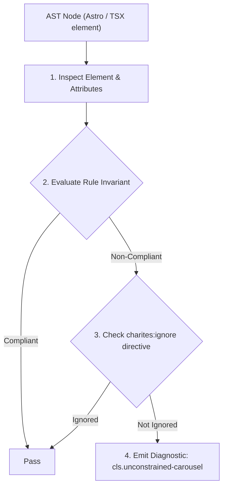
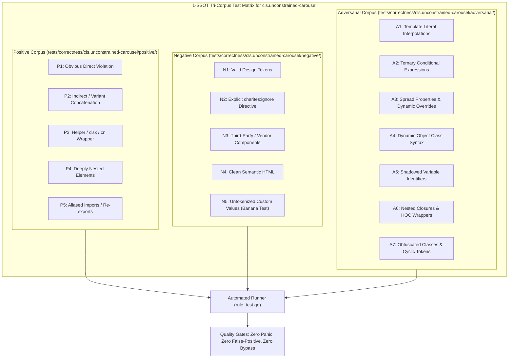

# cls.unconstrained-carousel

> **Rule ID:** `cls.unconstrained-carousel`
> **Severity:** `WARN`
> **Category:** `cls`
> **Target Standards:** W3C Cumulative Layout Shift (CLS) Metric Specification, W3C CSS Scroll Snap Module Level 1, W3C CSS Box Sizing Module Level 4 (aspect-ratio)

---

## 1. Overview & Core Invariant

Warns when carousel or slider containers lack bounded height or slide aspect-ratio constraints

### Core Invariant:
> **"Carousel and slider viewport tracks must constrain container height or bind slide items to fixed aspect ratios to prevent vertical reflow during slide transitions."**

---
## 2. Technical Grounding & Engine Realities

Horizontal scrolling tracks and carousels render dynamic collections of cards, banners, or images.

When the carousel track lacks an explicit height (e.g. 'h-64' or 'min-h-[300px]') and slides do not have locked aspect ratios, incoming slides with varying image proportions or dynamic text will force the entire container to expand or collapse vertically.

Fixing the container height or assigning 'aspect-video' / 'aspect-square' to slide items ensures layout stability throughout horizontal panning.

---
## 3. Vulnerability & Risk Taxonomy

| Risk Vector | Severity | Impact |
| :--- | :---: | :--- |
| **Vertical Container Height Jitter** | MEDIUM | Slide transitions with varying content heights push subsequent page content up and down. |
| **Cumulative Layout Shift (CLS)** | HIGH | Carousel height adjustments contribute cumulative shift points during user scrolling. |

---
## 4. Non-Compliant Code Patterns (Bad Examples)
### TSX (Horizontal snap container without container height or slide aspect-ratio):
```tsx
<div className="flex overflow-x-auto snap-x">
  {slides.map(s => )}
</div>
```

---
## 5. Compliant Implementation Patterns (Good Examples)
### TSX (Carousel container with explicit height constraint):
```tsx
<div className="flex overflow-x-auto snap-x h-64 md:h-96 w-full">
  {slides.map(s => (
    <div key={s.id} className="snap-center shrink-0 w-full h-full">
      
    </div>
  ))}
</div>
```
### TSX (Carousel slide items locked with aspect-video utility):
```tsx
<div className="flex overflow-x-auto snap-x w-full">
  {slides.map(s => (
    <div key={s.id} className="snap-center shrink-0 w-80 aspect-video">
      
    </div>
  ))}
</div>
```

---

## 6. Detection & Verification Pipeline (How The Rule Evaluates Code)
This rule evaluates source code through the standard AST inspection pipeline:



### Step-by-Step Evaluation:
1. **AST Traversal:** Visits normalized `ir.Node` structures during AST streaming.
2. **Invariant Check:** Compares node attributes against rule invariants.
3. **Directive Suppression Check:** Honors inline `charites:ignore cls.unconstrained-carousel` directives.
4. **Diagnostic Emission:** Emits compiler-grade diagnostic on invariant violation.

---

## 7. Verification & Test Harness (How The Test Works: 1-SSOT Tri-Corpus)

This rule is rigorously tested and validated across the canonical **1-SSOT Tri-Corpus** in `tests/correctness/cls.unconstrained-carousel/`:



- **Positive Fixtures (P1-P5):** Verified to trigger diagnostics at exact lines and column spans.
- **Negative Fixtures (N1-N5):** Verified to produce zero diagnostics on valid tokens and legitimate exemptions.
- **Adversarial Fixtures (A1-A7):** Verified to prevent evasion across dynamic expressions, string interpolations, and cyclic references.

---

## 8. How to Suppress (Ignore Directives)

If this pattern is required for an intentional exception, suppress the diagnostic using the canonical Charites Rule ID:

```astro
<!-- charites:ignore cls.unconstrained-carousel intentional exception -->
```

```tsx
// charites:ignore cls.unconstrained-carousel intentional exception
```

---

## 9. Configuration Reference (`charites.yaml`)

```yaml
rules:
  cls.unconstrained-carousel:
    severity: warn # error | warn | info | off
```

