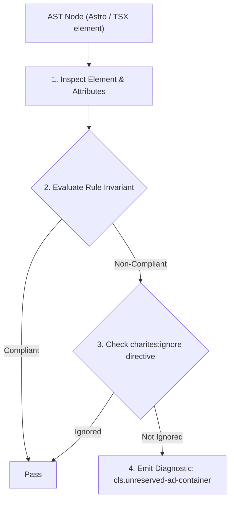
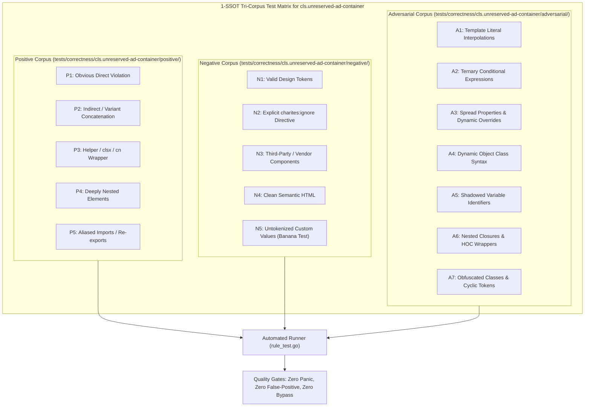

# cls.unreserved-ad-container

> **Rule ID:** `cls.unreserved-ad-container`
> **Severity:** `WARN`
> **Category:** `cls`
> **Target Standards:** W3C Cumulative Layout Shift (CLS) Metric Specification, Google Publisher Tag / AdSense CLS Best Practices, Interactive Advertising Bureau (IAB) Standard Ad Unit Specifications

---

## 1. Overview & Core Invariant

Warns when dynamic ad containers lack reserved vertical dimensions or initial skeleton placeholders

### Core Invariant:
> **"Dynamic ad slot containers must define a reserved bounding box (using 'min-h-*', 'h-*', or 'aspect-*') or contain an initial placeholder skeleton before third-party ad scripts inject payloads."**

---
## 2. Technical Grounding & Engine Realities

Ad tags and third-party advertising SDKs (such as Google AdSense, Google Publisher Tag, or Carbon Ads) execute client-side bidding and late script downloads.

When ad containers start with an empty 0px height in the normal document flow, the loaded advertisement abruptly expands the container, shoving the main article or page content downward. This sudden shift is one of the leading contributors to poor Core Web Vitals.

Declaring a minimum height corresponding to standard IAB ad dimensions (e.g. 'min-h-[90px]' for leaderboard banners or 'min-h-[250px]' for medium rectangles) reserves the necessary vertical space in advance.

---
## 3. Vulnerability & Risk Taxonomy

| Risk Vector | Severity | Impact |
| :--- | :---: | :--- |
| **Severe Downward Content Shift** | HIGH | Late ad injections jolt the reader's viewport position, frustrating users and ruining reading continuity. |
| **Core Web Vitals Penalty** | HIGH | Ad insertion shifts contribute heavily to high session CLS scores in Google Search Console / CrUX. |

---
## 4. Non-Compliant Code Patterns (Bad Examples)
### TSX (Ad container without reserved height or skeleton placeholder):
```tsx
<div id="ad-leaderboard" data-ad-slot="12345" className="w-full text-center" />
```
### ASTRO (AdBanner component without dimension constraints):
```astro
<AdBanner slotId="banner-top" class="my-4" />
```

---
## 5. Compliant Implementation Patterns (Good Examples)
### TSX (Ad container with reserved IAB leaderboard min-height):
```tsx
<div id="ad-leaderboard" data-ad-slot="12345" className="w-full min-h-[90px] md:min-h-[250px] bg-muted/20" />
```
### TSX (Ad slot containing an initial skeleton placeholder):
```tsx
<div id="ad-sidebar" data-ad-slot="67890" className="w-full">
  <Skeleton className="w-full h-[250px]" />
</div>
```

---

## 6. Detection & Verification Pipeline (How The Rule Evaluates Code)
This rule evaluates source code through the standard AST inspection pipeline:



### Step-by-Step Evaluation:
1. **AST Traversal:** Visits normalized `ir.Node` structures during AST streaming.
2. **Invariant Check:** Compares node attributes against rule invariants.
3. **Directive Suppression Check:** Honors inline `charites:ignore cls.unreserved-ad-container` directives.
4. **Diagnostic Emission:** Emits compiler-grade diagnostic on invariant violation.

---

## 7. Verification & Test Harness (How The Test Works: 1-SSOT Tri-Corpus)

This rule is rigorously tested and validated across the canonical **1-SSOT Tri-Corpus** in `tests/correctness/cls.unreserved-ad-container/`:



- **Positive Fixtures (P1-P5):** Verified to trigger diagnostics at exact lines and column spans.
- **Negative Fixtures (N1-N5):** Verified to produce zero diagnostics on valid tokens and legitimate exemptions.
- **Adversarial Fixtures (A1-A7):** Verified to prevent evasion across dynamic expressions, string interpolations, and cyclic references.

---

## 8. How to Suppress (Ignore Directives)

If this pattern is required for an intentional exception, suppress the diagnostic using the canonical Charites Rule ID:

```astro
<!-- charites:ignore cls.unreserved-ad-container intentional exception -->
```

```tsx
// charites:ignore cls.unreserved-ad-container intentional exception
```

---

## 9. Configuration Reference (`charites.yaml`)

```yaml
rules:
  cls.unreserved-ad-container:
    severity: warn # error | warn | info | off
```

