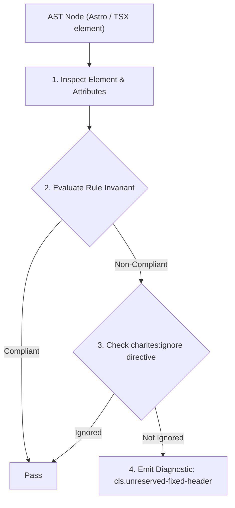
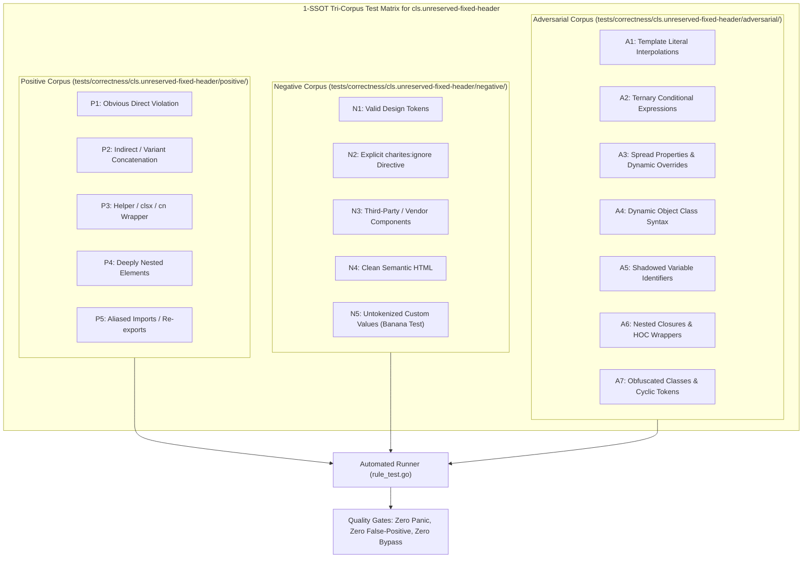

# cls.unreserved-fixed-header

> **Rule ID:** `cls.unreserved-fixed-header`
> **Severity:** `WARN`
> **Category:** `cls`
> **Target Standards:** W3C CSS Positioned Layout Module Level 3 (fixed & sticky positioning), Google Core Web Vitals (View-Overlap & Content Snapping Guidelines), Responsive Layout Architecture Invariants

---

## 1. Overview & Core Invariant

Fixed or sticky header lacks layout space compensation (pt/mt) on subsequent in-flow content or spacer block

### Core Invariant:
> **"Fixed or sticky header elements taking top position must provide corresponding layout space compensation on subsequent content (such as 'pt-*' or a spacer element)."**

---
## 2. Technical Grounding & Engine Realities

When a top navigation header is declared with 'position: fixed' or dynamically mounted as sticky, it is removed from the normal document flow.

If the subsequent sibling content (such as the main container '<main>') does not reserve equivalent top padding ('pt-16') or include an explicit spacer element, the top portion of the main document gets covered underneath the header.

Furthermore, when headers mount asynchronously or change position dynamically during hydration, uncompensated content below suddenly shifts down or up, producing Cumulative Layout Shift (CLS).

---
## 3. Vulnerability & Risk Taxonomy

| Risk Vector | Severity | Impact |
| :--- | :---: | :--- |
| **Obscured Top Page Content** | HIGH | Primary headings, hero banners, or breadcrumbs become invisible behind fixed header overlays. |
| **Hydration Content Jump** | MEDIUM | Subsequent in-flow content snaps vertically when dynamic headers mount or change positioning. |

---
## 4. Non-Compliant Code Patterns (Bad Examples)
### TSX (Fixed header without padding compensation on following main element):
```tsx
<header className="fixed top-0 left-0 w-full h-16 bg-background z-50">
  <Navbar />
</header>
<main>
  <h1>Selamat Datang</h1>
</main>
```

---
## 5. Compliant Implementation Patterns (Good Examples)
### TSX (Fixed header with matching top padding on main container):
```tsx
<header className="fixed top-0 left-0 w-full h-16 bg-background z-50">
  <Navbar />
</header>
<main className="pt-16">
  <h1>Selamat Datang</h1>
</main>
```

---

## 6. Detection & Verification Pipeline (How The Rule Evaluates Code)
This rule evaluates source code through the standard AST inspection pipeline:



### Step-by-Step Evaluation:
1. **AST Traversal:** Visits normalized `ir.Node` structures during AST streaming.
2. **Invariant Check:** Compares node attributes against rule invariants.
3. **Directive Suppression Check:** Honors inline `charites:ignore cls.unreserved-fixed-header` directives.
4. **Diagnostic Emission:** Emits compiler-grade diagnostic on invariant violation.

---

## 7. Verification & Test Harness (How The Test Works: 1-SSOT Tri-Corpus)

This rule is rigorously tested and validated across the canonical **1-SSOT Tri-Corpus** in `tests/correctness/cls.unreserved-fixed-header/`:



- **Positive Fixtures (P1-P5):** Verified to trigger diagnostics at exact lines and column spans.
- **Negative Fixtures (N1-N5):** Verified to produce zero diagnostics on valid tokens and legitimate exemptions.
- **Adversarial Fixtures (A1-A7):** Verified to prevent evasion across dynamic expressions, string interpolations, and cyclic references.

---

## 8. How to Suppress (Ignore Directives)

If this pattern is required for an intentional exception, suppress the diagnostic using the canonical Charites Rule ID:

```astro
<!-- charites:ignore cls.unreserved-fixed-header intentional exception -->
```

```tsx
// charites:ignore cls.unreserved-fixed-header intentional exception
```

---

## 9. Configuration Reference (`charites.yaml`)

```yaml
rules:
  cls.unreserved-fixed-header:
    severity: warn # error | warn | info | off
```

