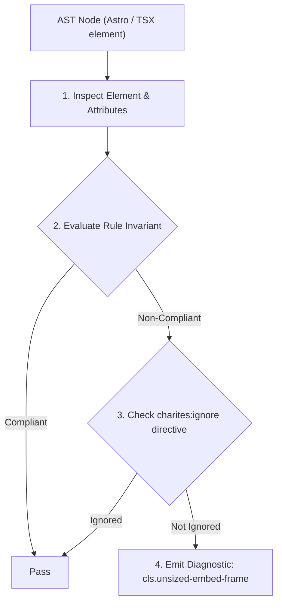
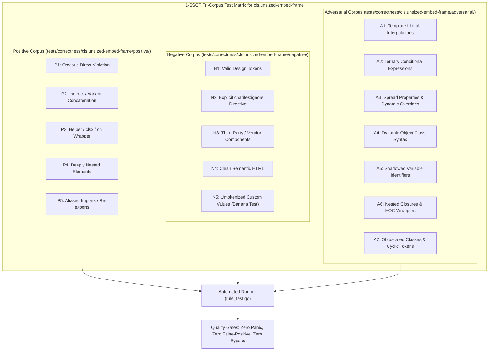

# cls.unsized-embed-frame

> **Rule ID:** `cls.unsized-embed-frame`
> **Severity:** `WARN`
> **Category:** `cls`
> **Target Standards:** W3C Cumulative Layout Shift (CLS) Metric Specification, HTML Living Standard (iframe and media embedding), W3C CSS Box Sizing Module Level 4 (aspect-ratio)

---

## 1. Overview & Core Invariant

Warns when embedded media frames lack explicit dimensions or an aspect-ratio container wrapper

### Core Invariant:
> **"Embedded media frames must define explicit width/height dimensions or be enclosed in an ancestor container with an aspect-ratio or bounded height reservation."**

---
## 2. Technical Grounding & Engine Realities

Third-party embedded frames (such as YouTube videos, Vimeo players, interactive maps, and external iframes) take significant time to establish network handshakes and negotiate player dimensions.

When an iframe is placed in the DOM without reserved box sizing, it renders at initial zero or default browser dimensions (typically 300x150px) before snapping to full player proportions, causing substantial layout shift.

Enclosing embedded frames inside a container with 'aspect-video' or providing explicit 'width' and 'height' attributes reserves the exact layout footprint in the rendering tree immediately.

---
## 3. Vulnerability & Risk Taxonomy

| Risk Vector | Severity | Impact |
| :--- | :---: | :--- |
| **Severe Layout Instability (CLS)** | HIGH | Late-loading iframes pop into the document flow, shifting subsequent content by hundreds of pixels. |
| **Broken Responsive Player Scaling** | MEDIUM | Embeds lacking proper aspect-ratio wrappers can overflow narrow mobile screens. |

---
## 4. Non-Compliant Code Patterns (Bad Examples)
### TSX (Iframe with fluid width but missing height or aspect-ratio wrapper):
```tsx
<iframe src="https://www.youtube.com/embed/xyz" title="Video Profil Desa" className="w-full" />
```

---
## 5. Compliant Implementation Patterns (Good Examples)
### TSX (Iframe wrapped in a container with aspect-video utility):
```tsx
<div className="w-full aspect-video">
  <iframe src="https://www.youtube.com/embed/xyz" title="Video Profil Desa" className="w-full h-full" />
</div>
```
### TSX (Video element with explicit width and height attributes):
```tsx
<video src="/promo.mp4" width={640} height={360} controls className="w-full h-auto" />
```

---

## 6. Detection & Verification Pipeline (How The Rule Evaluates Code)
This rule evaluates source code through the standard AST inspection pipeline:



### Step-by-Step Evaluation:
1. **AST Traversal:** Visits normalized `ir.Node` structures during AST streaming.
2. **Invariant Check:** Compares node attributes against rule invariants.
3. **Directive Suppression Check:** Honors inline `charites:ignore cls.unsized-embed-frame` directives.
4. **Diagnostic Emission:** Emits compiler-grade diagnostic on invariant violation.

---

## 7. Verification & Test Harness (How The Test Works: 1-SSOT Tri-Corpus)

This rule is rigorously tested and validated across the canonical **1-SSOT Tri-Corpus** in `tests/correctness/cls.unsized-embed-frame/`:



- **Positive Fixtures (P1-P5):** Verified to trigger diagnostics at exact lines and column spans.
- **Negative Fixtures (N1-N5):** Verified to produce zero diagnostics on valid tokens and legitimate exemptions.
- **Adversarial Fixtures (A1-A7):** Verified to prevent evasion across dynamic expressions, string interpolations, and cyclic references.

---

## 8. How to Suppress (Ignore Directives)

If this pattern is required for an intentional exception, suppress the diagnostic using the canonical Charites Rule ID:

```astro
<!-- charites:ignore cls.unsized-embed-frame intentional exception -->
```

```tsx
// charites:ignore cls.unsized-embed-frame intentional exception
```

---

## 9. Configuration Reference (`charites.yaml`)

```yaml
rules:
  cls.unsized-embed-frame:
    severity: warn # error | warn | info | off
```

