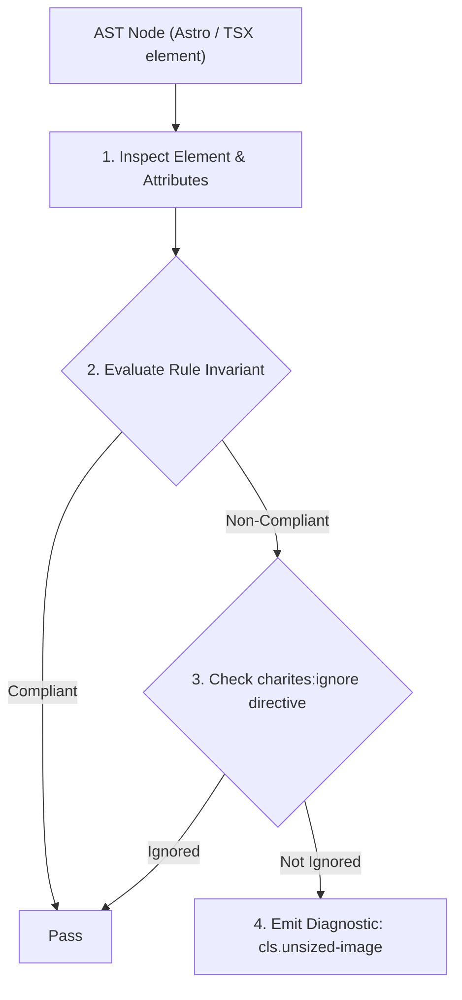
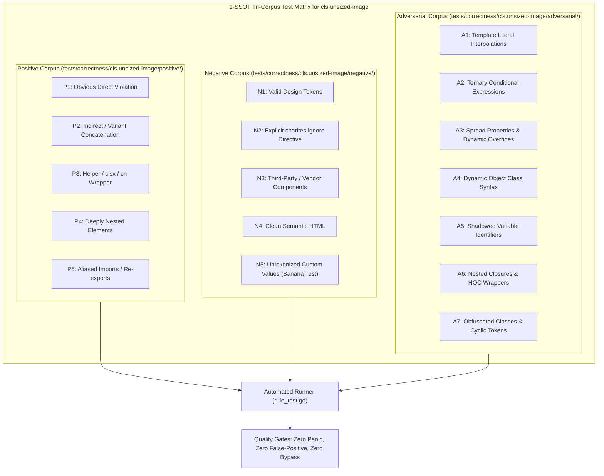

# cls.unsized-image

> **Rule ID:** `cls.unsized-image`
> **Severity:** `WARN`
> **Category:** `cls`
> **Target Standards:** W3C Cumulative Layout Shift (CLS) Metric Specification, Google Core Web Vitals Guidelines (Target CLS < 0.1), W3C CSS Box Sizing Module Level 4 (aspect-ratio), Astro Docs: Image Optimization (astro:assets)

---

## 1. Overview & Core Invariant

Warns when image elements lack explicit dimensions, aspect-ratio, or Tailwind box sizing

### Core Invariant:
> **"Image elements must establish a statically inferable reserved rendering box via explicit width/height attributes, CSS aspect-ratio, or Tailwind sizing utilities before the binary asset is downloaded."**

---
## 2. Technical Grounding & Engine Realities

When browsers parse an  tag without explicit dimensions or an aspect-ratio reservation, the layout engine initially allocates a 0x0 pixel box.

Once the remote image file is fetched and decoded, the browser performs a sudden reflow to accommodate the intrinsic image geometry, pushing surrounding content downward. This layout instability directly penalizes Cumulative Layout Shift (CLS) scores.

Specifying width and height attributes or utilizing Tailwind 'aspect-video' / 'aspect-square' allows modern browsers to compute the aspect ratio before network I/O completes, eliminating visual jank.

---
## 3. Vulnerability & Risk Taxonomy

| Risk Vector | Severity | Impact |
| :--- | :---: | :--- |
| **Cumulative Layout Shift (CLS)** | HIGH | Unsized images push subsequent content down upon load, degrading Core Web Vitals and SEO rankings. |
| **Accidental User Mis-clicks** | MEDIUM | Users attempting to tap links or buttons near loading images accidentally trigger shifted elements. |

---
## 4. Non-Compliant Code Patterns (Bad Examples)
### TSX (Image with fluid width but missing height or aspect-ratio reservation):
```tsx

```
### ASTRO (Standard img tag lacking width and height attributes):
```astro

```

---
## 5. Compliant Implementation Patterns (Good Examples)
### TSX (Image with explicit numeric width and height attributes):
```tsx

```
### TSX (Image with Tailwind v4 aspect-ratio utility):
```tsx

```
### TSX (Avatar image with explicit width and height sizing utilities):
```tsx

```

---

## 6. Detection & Verification Pipeline (How The Rule Evaluates Code)
This rule evaluates source code through the standard AST inspection pipeline:



### Step-by-Step Evaluation:
1. **AST Traversal:** Visits normalized `ir.Node` structures during AST streaming.
2. **Invariant Check:** Compares node attributes against rule invariants.
3. **Directive Suppression Check:** Honors inline `charites:ignore cls.unsized-image` directives.
4. **Diagnostic Emission:** Emits compiler-grade diagnostic on invariant violation.

---

## 7. Verification & Test Harness (How The Test Works: 1-SSOT Tri-Corpus)

This rule is rigorously tested and validated across the canonical **1-SSOT Tri-Corpus** in `tests/correctness/cls.unsized-image/`:



- **Positive Fixtures (P1-P5):** Verified to trigger diagnostics at exact lines and column spans.
- **Negative Fixtures (N1-N5):** Verified to produce zero diagnostics on valid tokens and legitimate exemptions.
- **Adversarial Fixtures (A1-A7):** Verified to prevent evasion across dynamic expressions, string interpolations, and cyclic references.

---

## 8. How to Suppress (Ignore Directives)

If this pattern is required for an intentional exception, suppress the diagnostic using the canonical Charites Rule ID:

```astro
<!-- charites:ignore cls.unsized-image intentional exception -->
```

```tsx
// charites:ignore cls.unsized-image intentional exception
```

---

## 9. Configuration Reference (`charites.yaml`)

```yaml
rules:
  cls.unsized-image:
    severity: warn # error | warn | info | off
```

