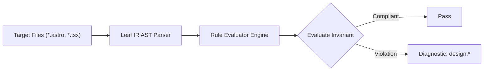

# Design Rules (`design`)

The `design` category contains static analysis rules for code quality, architectural constraints, and design system governance.

---

## Category Rule Index

| Rule ID | Severity | Summary | Full Specification | Status |
| :--- | :---: | :--- | :--- | :---: |
| `design.component-style-drift` | `WARN` | Clusters and flags design system style sprawl, rogue geometric outliers, and chromatic color drift per UI component | [`design.component-style-drift`](design.component-style-drift) | `enabled` |

---
## How the Design Analysis Pipeline Works

The `design` engine applies static analysis checks against component source code:

### Pipeline Flow:
1. **AST Node Traversal:** Scans target template files into normalized intermediate representation.
2. **Invariant Assertion:** Validates structural and semantic invariants.
3. **Diagnostic Reporting:** Emits structured diagnostics for non-compliant patterns.

---

## How Design Tests Work (Verification Harness)

All rules in `design` are verified using the canonical 1-SSOT Tri-Corpus (`tests/correctness/design.*/`) encompassing Positive (P1-P5), Negative (N1-N5), and Adversarial (A1-A7) fixture matrices.
