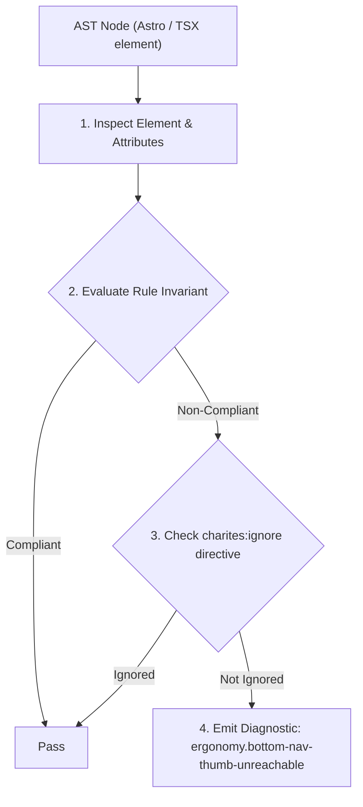
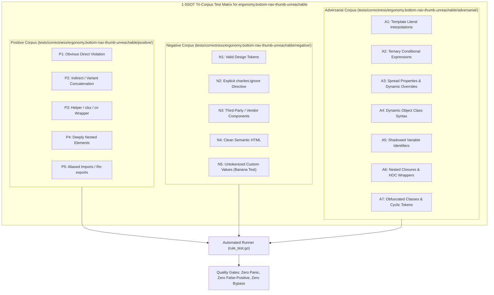

# ergonomy.bottom-nav-thumb-unreachable

> **Rule ID:** `ergonomy.bottom-nav-thumb-unreachable`
> **Severity:** `INFO`
> **Category:** `ergonomy`
> **Target Standards:** Steven Hoober (2017), Designing for Touch & Mobile Thumb Zone Research, Fitts's Law of Motor Movement Ergonomics on Tall Mobile Displays, Apple Human Interface Guidelines (Navigation Bars & Bottom Toolbars), Google Material Design 3 (Bottom App Bars & Floating Action Buttons)

---

## 1. Overview & Core Invariant

Warns when primary call-to-action (CTA) buttons are exclusively located in the top mobile header without reachable alternatives in the bottom thumb zone

### Core Invariant:
> **"Primary call-to-action controls (e.g. form submissions, checkout confirmations) must be reachable within the lower mobile thumb zone rather than positioned exclusively in top headers."**

---
## 2. Technical Grounding & Engine Realities

On modern mobile screens (6.1-inch to 6.7-inch+), the top one-third of the screen lies in the 'Hard to Reach' or 'Ow Zone' for one-handed thumb navigation (Steven Hoober's Thumb Zone research).

Placing the sole primary submission or action button exclusively in a top navigation header (<header> or 'top-0' container) forces users to awkwardly shift grip or use two hands.

Providing a primary CTA in the lower thumb zone (e.g., sticky bottom bar, bottom sheet, or natural form footer) satisfies Fitts's Law and optimizes one-handed mobile usability.

---
## 3. Vulnerability & Risk Taxonomy

| Risk Vector | Severity | Impact |
| :--- | :---: | :--- |
| **Thumb Strain and Awkward Grip Shifting** | LOW | Users on large smartphones experience physical discomfort or drop hazards when repeatedly reaching for top-corner primary actions. |
| **Decreased Form Completion Rates** | LOW | One-handed mobile users abandon multi-step forms due to friction reaching top submission buttons. |

---
## 4. Non-Compliant Code Patterns (Bad Examples)
### TSX (Primary submit button trapped in top sticky header without bottom alternative):
```tsx
<header className="sticky top-0 z-10 flex items-center justify-between p-4 bg-background border-b">
  <button type="button" aria-label="Kembali">
    <ArrowLeft className="w-6 h-6" />
  </button>
  <h1 className="font-semibold text-lg">Edit Profil Warga</h1>
  <button type="submit" className="h-10 px-4 bg-primary text-primary-foreground rounded-xl">
    Simpan
  </button>
</header>
```

---
## 5. Compliant Implementation Patterns (Good Examples)
### TSX (Primary CTA positioned in reachable bottom thumb zone):
```tsx
<header className="sticky top-0 z-10 flex items-center justify-between p-4 bg-background border-b">
  <button type="button" aria-label="Kembali">
    <ArrowLeft className="w-6 h-6" />
  </button>
  <h1 className="font-semibold text-lg">Edit Profil Warga</h1>
</header>
<main className="p-4 pb-24">
  <input name="nama" placeholder="Nama Lengkap" />
</main>
<footer className="fixed bottom-0 inset-x-0 p-4 bg-background border-t pb-[env(safe-area-inset-bottom)]">
  <button type="submit" className="w-full h-12 bg-primary text-primary-foreground rounded-xl font-semibold">
    Simpan Perubahan
  </button>
</footer>
```

---

## 6. Detection & Verification Pipeline (How The Rule Evaluates Code)
This rule evaluates source code through the standard AST inspection pipeline:



### Step-by-Step Evaluation:
1. **AST Traversal:** Visits normalized `ir.Node` structures during AST streaming.
2. **Invariant Check:** Compares node attributes against rule invariants.
3. **Directive Suppression Check:** Honors inline `charites:ignore ergonomy.bottom-nav-thumb-unreachable` directives.
4. **Diagnostic Emission:** Emits compiler-grade diagnostic on invariant violation.

---

## 7. Verification & Test Harness (How The Test Works: 1-SSOT Tri-Corpus)

This rule is rigorously tested and validated across the canonical **1-SSOT Tri-Corpus** in `tests/correctness/ergonomy.bottom-nav-thumb-unreachable/`:



- **Positive Fixtures (P1-P5):** Verified to trigger diagnostics at exact lines and column spans.
- **Negative Fixtures (N1-N5):** Verified to produce zero diagnostics on valid tokens and legitimate exemptions.
- **Adversarial Fixtures (A1-A7):** Verified to prevent evasion across dynamic expressions, string interpolations, and cyclic references.

---

## 8. How to Suppress (Ignore Directives)

If this pattern is required for an intentional exception, suppress the diagnostic using the canonical Charites Rule ID:

```astro
<!-- charites:ignore ergonomy.bottom-nav-thumb-unreachable intentional exception -->
```

```tsx
// charites:ignore ergonomy.bottom-nav-thumb-unreachable intentional exception
```

---

## 9. Configuration Reference (`charites.yaml`)

```yaml
rules:
  ergonomy.bottom-nav-thumb-unreachable:
    severity: info # error | warn | info | off
```

