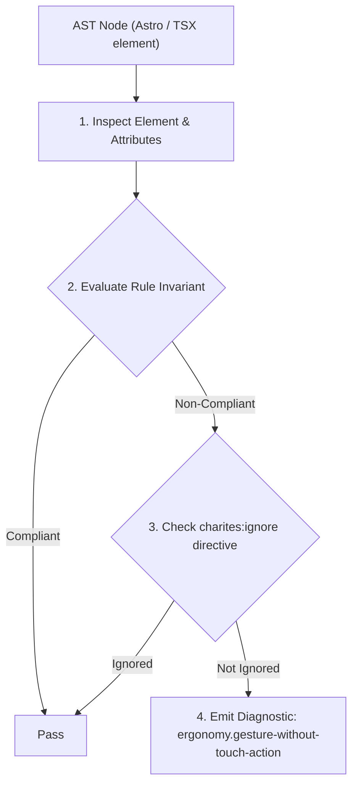
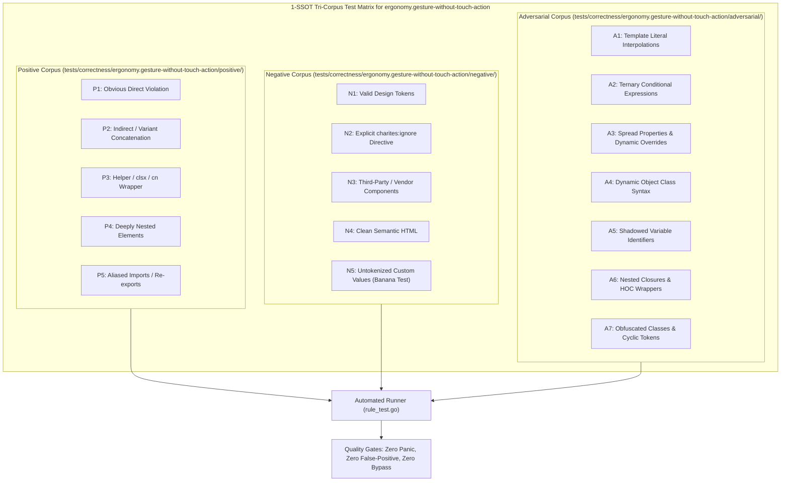

# ergonomy.gesture-without-touch-action

> **Rule ID:** `ergonomy.gesture-without-touch-action`
> **Severity:** `WARN`
> **Category:** `ergonomy`
> **Target Standards:** W3C Pointer Events Level 3 Section 5.2.8 (The touch-action CSS Property), Chromium & WebKit Compositor Gesture Isolation Architecture, Google Chrome Developers (Touch Action Best Practices)

---

## 1. Overview & Core Invariant

Enforces CSS touch-action declaration on elements with custom gesture swipe/drag event handlers

### Core Invariant:
> **"Elements attaching custom swipe or drag listeners ('onTouchMove', 'onPointerMove') must declare explicit CSS 'touch-action' ('touch-pan-y', 'touch-none') to prevent gesture cancellation by native scrolling."**

---
## 2. Technical Grounding & Engine Realities

When users drag or swipe an element, the browser mobile compositor thread must determine whether to handle native scrolling or yield control to JavaScript.

Without explicit CSS 'touch-action' (e.g. 'touch-pan-y' for horizontal sliders or 'touch-none' for drawing canvases), browser vertical scrolling immediately cancels the custom touch gesture mid-drag, causing abrupt freezing or unwanted page scrolling.

---
## 3. Vulnerability & Risk Taxonomy

| Risk Vector | Severity | Impact |
| :--- | :---: | :--- |
| **Abrupt Gesture Cancellation** | MEDIUM | Swipeable cards and carousels stutter or lock up mid-swipe when the mobile browser takes over scrolling. |
| **Accidental Page Scrolling** | MEDIUM | Users attempting to pan a map or slider accidentally scroll the entire page off-screen. |

---
## 4. Non-Compliant Code Patterns (Bad Examples)
### TSX (Horizontal swipeable container without touch-action):
```tsx
<div
  onTouchStart={handleStart}
  onTouchMove={handleMove}
  className="flex overflow-x-auto gap-4 p-4"
>
  <div className="w-64 h-40 bg-card rounded-2xl shrink-0">Kartu 1</div>
</div>
```

---
## 5. Compliant Implementation Patterns (Good Examples)
### TSX (Explicit touch-pan-y coordinates compositor axis smoothly):
```tsx
<div
  onTouchStart={handleStart}
  onTouchMove={handleMove}
  className="flex overflow-x-auto gap-4 p-4 touch-pan-y"
>
  <div className="w-64 h-40 bg-card rounded-2xl shrink-0">Kartu 1</div>
</div>
```

---

## 6. Detection & Verification Pipeline (How The Rule Evaluates Code)
This rule evaluates source code through the standard AST inspection pipeline:



### Step-by-Step Evaluation:
1. **AST Traversal:** Visits normalized `ir.Node` structures during AST streaming.
2. **Invariant Check:** Compares node attributes against rule invariants.
3. **Directive Suppression Check:** Honors inline `charites:ignore ergonomy.gesture-without-touch-action` directives.
4. **Diagnostic Emission:** Emits compiler-grade diagnostic on invariant violation.

---

## 7. Verification & Test Harness (How The Test Works: 1-SSOT Tri-Corpus)

This rule is rigorously tested and validated across the canonical **1-SSOT Tri-Corpus** in `tests/correctness/ergonomy.gesture-without-touch-action/`:



- **Positive Fixtures (P1-P5):** Verified to trigger diagnostics at exact lines and column spans.
- **Negative Fixtures (N1-N5):** Verified to produce zero diagnostics on valid tokens and legitimate exemptions.
- **Adversarial Fixtures (A1-A7):** Verified to prevent evasion across dynamic expressions, string interpolations, and cyclic references.

---

## 8. How to Suppress (Ignore Directives)

If this pattern is required for an intentional exception, suppress the diagnostic using the canonical Charites Rule ID:

```astro
<!-- charites:ignore ergonomy.gesture-without-touch-action intentional exception -->
```

```tsx
// charites:ignore ergonomy.gesture-without-touch-action intentional exception
```

---

## 9. Configuration Reference (`charites.yaml`)

```yaml
rules:
  ergonomy.gesture-without-touch-action:
    severity: warn # error | warn | info | off
```

