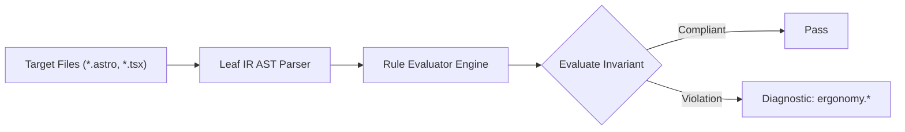

# Ergonomy Rules (`ergonomy`)

The `ergonomy` category contains static analysis rules for code quality, architectural constraints, and design system governance.

---

## Category Rule Index

| Rule ID | Severity | Summary | Full Specification | Status |
| :--- | :---: | :--- | :--- | :---: |
| `ergonomy.gesture-without-touch-action` | `WARN` | Enforces CSS touch-action declaration on elements with custom gesture swipe/drag event handlers | [`ergonomy.gesture-without-touch-action`](ergonomy.gesture-without-touch-action) | `enabled` |
| `ergonomy.missing-inputmode-keyboard` | `INFO` | Enforces contextual virtual keyboard inputmode and type attributes on mobile form inputs (Tesler's Law) | [`ergonomy.missing-inputmode-keyboard`](ergonomy.missing-inputmode-keyboard) | `enabled` |
| `ergonomy.tap-highlight-not-handled` | `INFO` | Flags clickable non-native custom elements lacking tactile tap feedback or tap-highlight management | [`ergonomy.tap-highlight-not-handled`](ergonomy.tap-highlight-not-handled) | `enabled` |

---
## How the Ergonomy Analysis Pipeline Works

The `ergonomy` engine applies static analysis checks against component source code:

### Pipeline Flow:
1. **AST Node Traversal:** Scans target template files into normalized intermediate representation.
2. **Invariant Assertion:** Validates structural and semantic invariants.
3. **Diagnostic Reporting:** Emits structured diagnostics for non-compliant patterns.

---

## How Ergonomy Tests Work (Verification Harness)

All rules in `ergonomy` are verified using the canonical 1-SSOT Tri-Corpus (`tests/correctness/ergonomy.*/`) encompassing Positive (P1-P5), Negative (N1-N5), and Adversarial (A1-A7) fixture matrices.
