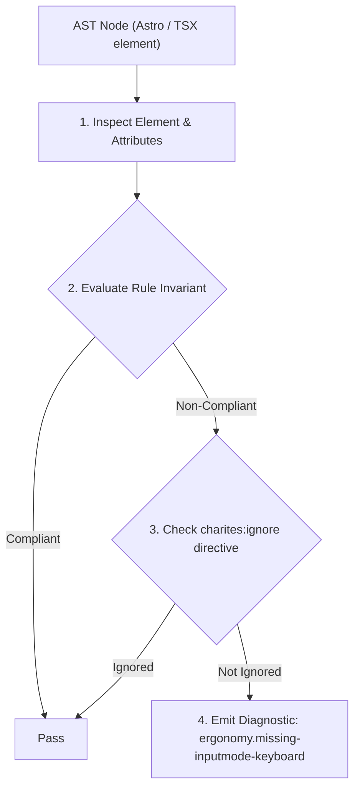
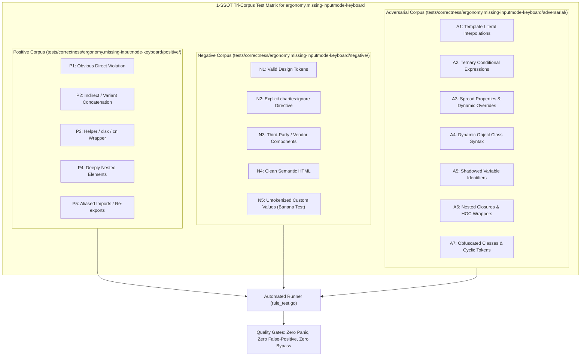

# ergonomy.missing-inputmode-keyboard

> **Rule ID:** `ergonomy.missing-inputmode-keyboard`
> **Severity:** `INFO`
> **Category:** `ergonomy`
> **Target Standards:** HTML Living Standard Section 4.10.5.3 (The inputmode attribute), Tesler's Law (Conservation of Complexity in Virtual Keyboards), Apple iOS & Android Mobile Virtual Keyboard Guidelines

---

## 1. Overview & Core Invariant

Enforces contextual virtual keyboard inputmode and type attributes on mobile form inputs (Tesler's Law)

### Core Invariant:
> **"Form text inputs collecting numeric, phone, or email values must declare contextual 'inputmode' or specialized 'type' attributes to directly open the optimized mobile virtual keypad."**

---
## 2. Technical Grounding & Engine Realities

On mobile devices, focusing an input without specialized type or inputmode opens the full standard QWERTY keyboard.

For numeric, telephone, or OTP fields, this forces the user to repeatedly toggle keyboard layers to find digits. According to Tesler's Law, complexity must be absorbed by software rather than offloaded to user manual effort. Declaring 'inputmode="numeric"' or 'type="tel"' instantly summons large, thumb-friendly numeric keypads.

---
## 3. Vulnerability & Risk Taxonomy

| Risk Vector | Severity | Impact |
| :--- | :---: | :--- |
| **Mobile Cognitive Friction** | LOW | Users are forced to manually switch keyboard layers on small touchscreens to enter digits or phone numbers. |
| **High Form Abandonment & Typing Errors** | LOW | Entering OTP or financial amounts on dense QWERTY keys leads to frequent miss-taps and delayed checkout flows. |

---
## 4. Non-Compliant Code Patterns (Bad Examples)
### TSX (Phone input missing type or inputMode):
```tsx
<input
  name="nomor_hp"
  placeholder="08123456789"
  className="h-11 px-3.5 py-2.5 border rounded-xl"
/>
```
### ASTRO (OTP field defaulting to QWERTY keyboard):
```astro
<input
  id="otp_code"
  placeholder="123456"
  class="h-11 px-3.5 py-2.5 border rounded-xl"
/>
```

---
## 5. Compliant Implementation Patterns (Good Examples)
### TSX (Explicit telephone keypad and autocomplete):
```tsx
<input
  name="nomor_hp"
  type="tel"
  inputMode="tel"
  autoComplete="tel"
  placeholder="08123456789"
  className="h-11 px-3.5 py-2.5 border rounded-xl"
/>
```
### ASTRO (Numeric keypad for OTP verification):
```astro
<input
  id="otp_code"
  type="text"
  inputmode="numeric"
  pattern="[0-9]*"
  placeholder="123456"
  class="h-11 px-3.5 py-2.5 border rounded-xl"
/>
```

---

## 6. Detection & Verification Pipeline (How The Rule Evaluates Code)
This rule evaluates source code through the standard AST inspection pipeline:



### Step-by-Step Evaluation:
1. **AST Traversal:** Visits normalized `ir.Node` structures during AST streaming.
2. **Invariant Check:** Compares node attributes against rule invariants.
3. **Directive Suppression Check:** Honors inline `charites:ignore ergonomy.missing-inputmode-keyboard` directives.
4. **Diagnostic Emission:** Emits compiler-grade diagnostic on invariant violation.

---

## 7. Verification & Test Harness (How The Test Works: 1-SSOT Tri-Corpus)

This rule is rigorously tested and validated across the canonical **1-SSOT Tri-Corpus** in `tests/correctness/ergonomy.missing-inputmode-keyboard/`:



- **Positive Fixtures (P1-P5):** Verified to trigger diagnostics at exact lines and column spans.
- **Negative Fixtures (N1-N5):** Verified to produce zero diagnostics on valid tokens and legitimate exemptions.
- **Adversarial Fixtures (A1-A7):** Verified to prevent evasion across dynamic expressions, string interpolations, and cyclic references.

---

## 8. How to Suppress (Ignore Directives)

If this pattern is required for an intentional exception, suppress the diagnostic using the canonical Charites Rule ID:

```astro
<!-- charites:ignore ergonomy.missing-inputmode-keyboard intentional exception -->
```

```tsx
// charites:ignore ergonomy.missing-inputmode-keyboard intentional exception
```

---

## 9. Configuration Reference (`charites.yaml`)

```yaml
rules:
  ergonomy.missing-inputmode-keyboard:
    severity: info # error | warn | info | off
```

