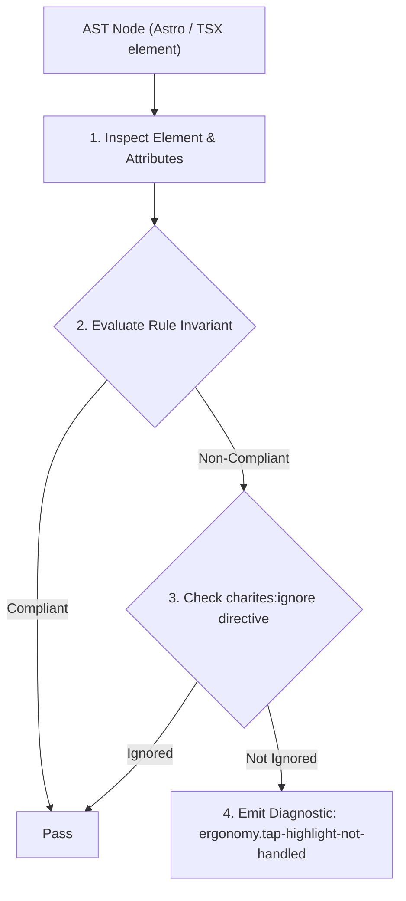
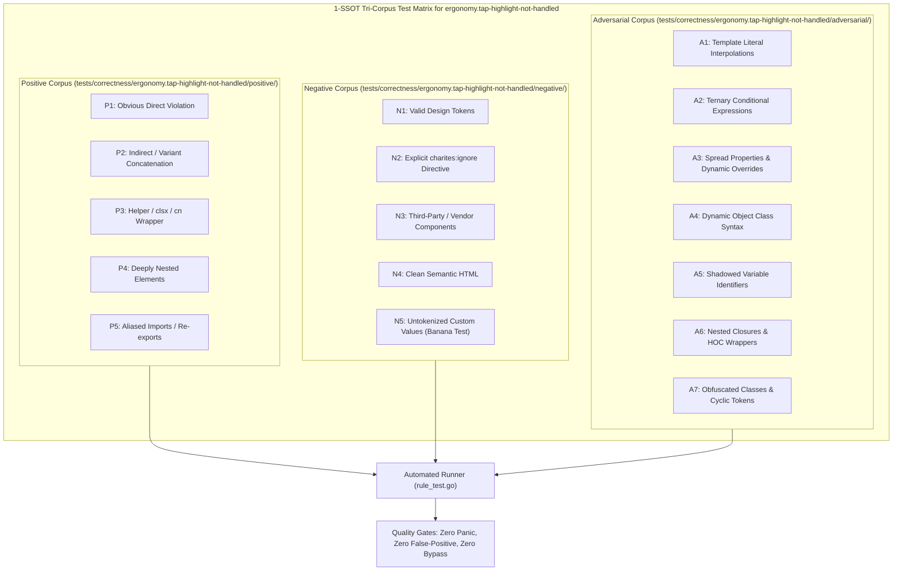

# ergonomy.tap-highlight-not-handled

> **Rule ID:** `ergonomy.tap-highlight-not-handled`
> **Severity:** `INFO`
> **Category:** `ergonomy`
> **Target Standards:** W3C Touch Events Community Group Guidelines, Chromium Android Tap Feedback UX Standards, Google Material Design (Tactile States & Surface Elevation)

---

## 1. Overview & Core Invariant

Flags clickable non-native custom elements lacking tactile tap feedback or tap-highlight management

### Core Invariant:
> **"Non-native clickable elements (<div onClick>, <span role="button">) must declare deliberate active feedback or suppress the default Android Chrome grey tap highlight box."**

---
## 2. Technical Grounding & Engine Realities

On Chromium Android, tapping an element without a native button role causes the browser to flash a rigid semi-transparent grey overlay box.

Without deliberate 'active:' micro-interactions (such as 'active:scale-[0.99]' or 'active:bg-muted') or setting '[-webkit-tap-highlight-color:transparent]', the application exhibits noticeable visual glitches and lacks native tactile responsiveness.

---
## 3. Vulnerability & Risk Taxonomy

| Risk Vector | Severity | Impact |
| :--- | :---: | :--- |
| **Visual Glitches on Android Chrome** | LOW | Rigid grey highlight rectangles flash abruptly over custom cards, badges, and list rows during touch. |
| **Poor Tactile Feedback** | LOW | Users cannot perceive if a touch tap registered, leading to repeated tapping and accidental duplicate submissions. |

---
## 4. Non-Compliant Code Patterns (Bad Examples)
### TSX (Non-native clickable div without active feedback):
```tsx
<div
  role="button"
  tabIndex={0}
  onClick={handleSelectCard}
  className="p-4 bg-card border rounded-2xl"
>
  <span>Pilihan Layanan</span>
</div>
```

---
## 5. Compliant Implementation Patterns (Good Examples)
### TSX (Deliberate active feedback with suppressed grey highlight):
```tsx
<div
  role="button"
  tabIndex={0}
  onClick={handleSelectCard}
  className="p-4 bg-card border rounded-2xl active:bg-muted/60 active:scale-[0.99] transition-transform [-webkit-tap-highlight-color:transparent]"
>
  <span>Pilihan Layanan</span>
</div>
```

---

## 6. Detection & Verification Pipeline (How The Rule Evaluates Code)
This rule evaluates source code through the standard AST inspection pipeline:



### Step-by-Step Evaluation:
1. **AST Traversal:** Visits normalized `ir.Node` structures during AST streaming.
2. **Invariant Check:** Compares node attributes against rule invariants.
3. **Directive Suppression Check:** Honors inline `charites:ignore ergonomy.tap-highlight-not-handled` directives.
4. **Diagnostic Emission:** Emits compiler-grade diagnostic on invariant violation.

---

## 7. Verification & Test Harness (How The Test Works: 1-SSOT Tri-Corpus)

This rule is rigorously tested and validated across the canonical **1-SSOT Tri-Corpus** in `tests/correctness/ergonomy.tap-highlight-not-handled/`:



- **Positive Fixtures (P1-P5):** Verified to trigger diagnostics at exact lines and column spans.
- **Negative Fixtures (N1-N5):** Verified to produce zero diagnostics on valid tokens and legitimate exemptions.
- **Adversarial Fixtures (A1-A7):** Verified to prevent evasion across dynamic expressions, string interpolations, and cyclic references.

---

## 8. How to Suppress (Ignore Directives)

If this pattern is required for an intentional exception, suppress the diagnostic using the canonical Charites Rule ID:

```astro
<!-- charites:ignore ergonomy.tap-highlight-not-handled intentional exception -->
```

```tsx
// charites:ignore ergonomy.tap-highlight-not-handled intentional exception
```

---

## 9. Configuration Reference (`charites.yaml`)

```yaml
rules:
  ergonomy.tap-highlight-not-handled:
    severity: info # error | warn | info | off
```

