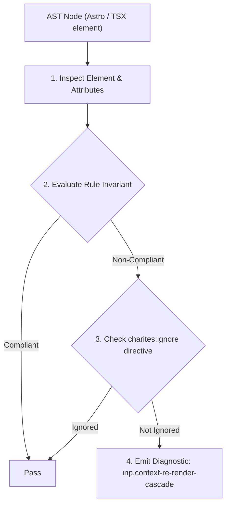
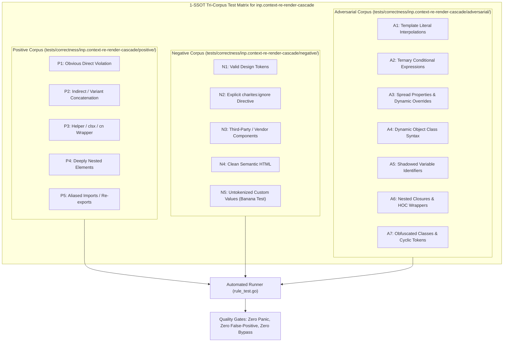

# inp.context-re-render-cascade

> **Rule ID:** `inp.context-re-render-cascade`
> **Severity:** `WARN`
> **Category:** `inp`
> **Target Standards:** React Context API Referential Equality Invariants, React Virtual DOM Reconciliation & Tree Pruning Standards, Google Chrome Core Web Vitals (Input to Next Paint Interaction Optimization)

---

## 1. Overview & Core Invariant

Passing an unmemoized inline object literal to Context.Provider value triggers cascading re-renders across all consumers

### Core Invariant:
> **"React Context Provider 'value' props must receive referentially stable references (via 'useMemo' or external constants) rather than freshly instantiated inline object literals."**

---
## 2. Technical Grounding & Engine Realities

React determines whether consumer components of a Context must re-render by performing a strict reference equality check ('Object.is(prevValue, nextValue)').

When an inline object literal ('value={{ user, token }}') is passed directly into a Provider, a completely new object in heap memory is allocated on *every single render* of the parent component.

Because the memory reference changes each time, React bypasses 'React.memo' optimizations in all descendant consumers, forcing the entire subtree to re-render simultaneously and causing severe interaction lag on user input.

---
## 3. Vulnerability & Risk Taxonomy

| Risk Vector | Severity | Impact |
| :--- | :---: | :--- |
| **Cascading Consumer Re-renders** | HIGH | Every component consuming the context is forced to re-render on any parent state change. |
| **Heap Allocation & GC Churn** | MEDIUM | Repeated object allocations in the render path trigger garbage collection pauses during rapid user interactions. |

---
## 4. Non-Compliant Code Patterns (Bad Examples)
### TSX (Fresh inline object allocated on every render triggers full consumer re-renders):
```tsx
<AuthContext.Provider value={{ user, isAuthenticated, login }}>
  {children}
</AuthContext.Provider>
```

---
## 5. Compliant Implementation Patterns (Good Examples)
### TSX (Context value wrapped in useMemo to preserve reference equality):
```tsx
const authValue = useMemo(() => ({ user, isAuthenticated, login }), [user, isAuthenticated]);
return (
  <AuthContext.Provider value={authValue}>
    {children}
  </AuthContext.Provider>
);
```

---

## 6. Detection & Verification Pipeline (How The Rule Evaluates Code)
This rule evaluates source code through the standard AST inspection pipeline:



### Step-by-Step Evaluation:
1. **AST Traversal:** Visits normalized `ir.Node` structures during AST streaming.
2. **Invariant Check:** Compares node attributes against rule invariants.
3. **Directive Suppression Check:** Honors inline `charites:ignore inp.context-re-render-cascade` directives.
4. **Diagnostic Emission:** Emits compiler-grade diagnostic on invariant violation.

---

## 7. Verification & Test Harness (How The Test Works: 1-SSOT Tri-Corpus)

This rule is rigorously tested and validated across the canonical **1-SSOT Tri-Corpus** in `tests/correctness/inp.context-re-render-cascade/`:



- **Positive Fixtures (P1-P5):** Verified to trigger diagnostics at exact lines and column spans.
- **Negative Fixtures (N1-N5):** Verified to produce zero diagnostics on valid tokens and legitimate exemptions.
- **Adversarial Fixtures (A1-A7):** Verified to prevent evasion across dynamic expressions, string interpolations, and cyclic references.

---

## 8. How to Suppress (Ignore Directives)

If this pattern is required for an intentional exception, suppress the diagnostic using the canonical Charites Rule ID:

```astro
<!-- charites:ignore inp.context-re-render-cascade intentional exception -->
```

```tsx
// charites:ignore inp.context-re-render-cascade intentional exception
```

---

## 9. Configuration Reference (`charites.yaml`)

```yaml
rules:
  inp.context-re-render-cascade:
    severity: warn # error | warn | info | off
```

