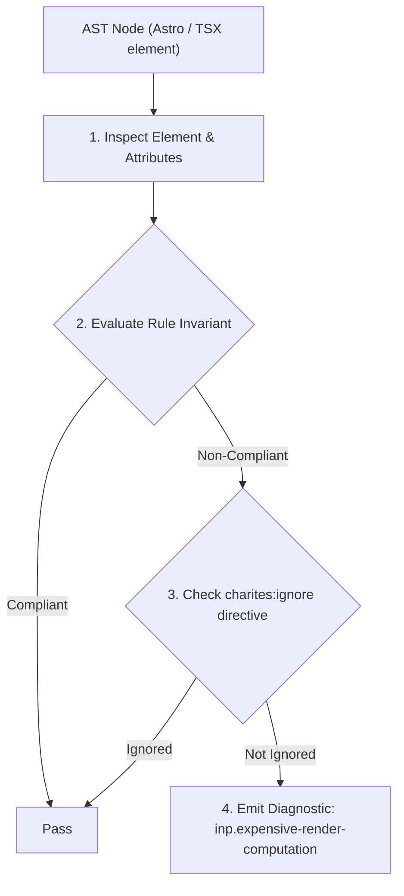
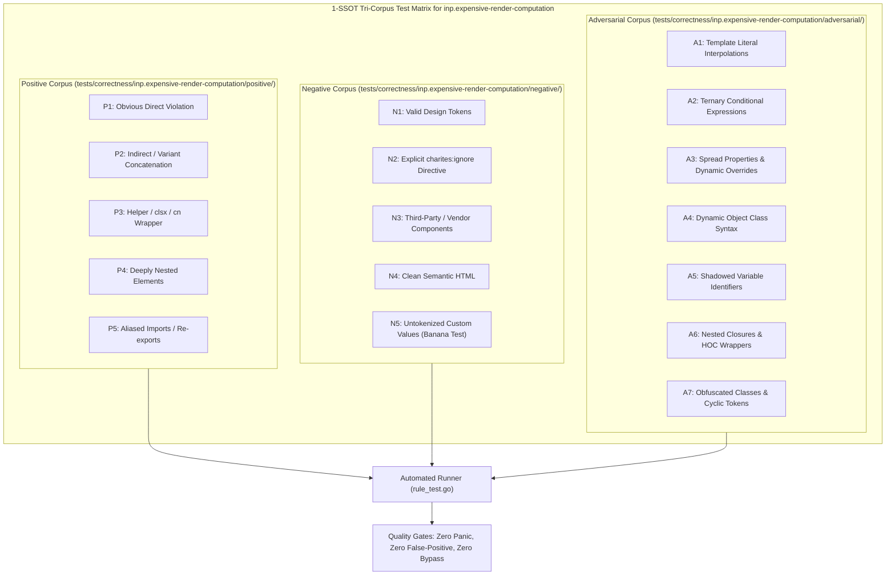

# inp.expensive-render-computation

> **Rule ID:** `inp.expensive-render-computation`
> **Severity:** `WARN`
> **Category:** `inp`
> **Target Standards:** React Render Phase Performance Optimization Principles, W3C Cooperative Scheduling & Frame Execution Invariants, Google Chrome Core Web Vitals (Input Processing Delay)

---

## 1. Overview & Core Invariant

Expensive data transformations (chained .filter() and .sort()) execute synchronously in the render path without useMemo

### Core Invariant:
> **"Heavy collection derivations involving sequential filtering and sorting in component render paths must be memoized using 'useMemo' to prevent recomputation on every user keystroke."**

---
## 2. Technical Grounding & Engine Realities

The body of a functional React component executes synchronously on every render cycle-including every keystroke inside controlled form fields or hover interactions.

When developers write heavy array transformations (such as 'users.filter(...).sort(...)') directly within the render body or inside JSX props without 'useMemo', the browser re-filters and re-sorts the entire collection on every single frame.

Wrapping the computation in 'useMemo(() => ..., [deps])' ensures the expensive algorithm only recalculates when source items or filter criteria change, eliminating hundreds of milliseconds of processing delay.

---
## 3. Vulnerability & Risk Taxonomy

| Risk Vector | Severity | Impact |
| :--- | :---: | :--- |
| **Keystroke Render Stutter** | HIGH | Synchronous collection sorting on every keystroke freezes input acknowledgment and breaches 200ms INP. |
| **Unnecessary Garbage Collection** | MEDIUM | Creating intermediate filtered and sorted array instances on every frame causes heavy GC pauses. |

---
## 4. Non-Compliant Code Patterns (Bad Examples)
### TSX (Unmemoized chained filter and sort running on every render):
```tsx
function UserList({ users, filterText }: Props) {
  const visibleUsers = users.filter(u => u.name.includes(filterText)).sort((a, b) => b.score - a.score);
  return <ul>{visibleUsers.map(u => <li key={u.id}>{u.name}</li>)}</ul>;
}
```

---
## 5. Compliant Implementation Patterns (Good Examples)
### TSX (Computation wrapped in useMemo to execute only when inputs change):
```tsx
function UserList({ users, filterText }: Props) {
  const visibleUsers = useMemo(() => {
    return users.filter(u => u.name.includes(filterText)).sort((a, b) => b.score - a.score);
  }, [users, filterText]);
  return <ul>{visibleUsers.map(u => <li key={u.id}>{u.name}</li>)}</ul>;
}
```

---

## 6. Detection & Verification Pipeline (How The Rule Evaluates Code)
This rule evaluates source code through the standard AST inspection pipeline:



### Step-by-Step Evaluation:
1. **AST Traversal:** Visits normalized `ir.Node` structures during AST streaming.
2. **Invariant Check:** Compares node attributes against rule invariants.
3. **Directive Suppression Check:** Honors inline `charites:ignore inp.expensive-render-computation` directives.
4. **Diagnostic Emission:** Emits compiler-grade diagnostic on invariant violation.

---

## 7. Verification & Test Harness (How The Test Works: 1-SSOT Tri-Corpus)

This rule is rigorously tested and validated across the canonical **1-SSOT Tri-Corpus** in `tests/correctness/inp.expensive-render-computation/`:



- **Positive Fixtures (P1-P5):** Verified to trigger diagnostics at exact lines and column spans.
- **Negative Fixtures (N1-N5):** Verified to produce zero diagnostics on valid tokens and legitimate exemptions.
- **Adversarial Fixtures (A1-A7):** Verified to prevent evasion across dynamic expressions, string interpolations, and cyclic references.

---

## 8. How to Suppress (Ignore Directives)

If this pattern is required for an intentional exception, suppress the diagnostic using the canonical Charites Rule ID:

```astro
<!-- charites:ignore inp.expensive-render-computation intentional exception -->
```

```tsx
// charites:ignore inp.expensive-render-computation intentional exception
```

---

## 9. Configuration Reference (`charites.yaml`)

```yaml
rules:
  inp.expensive-render-computation:
    severity: warn # error | warn | info | off
```

