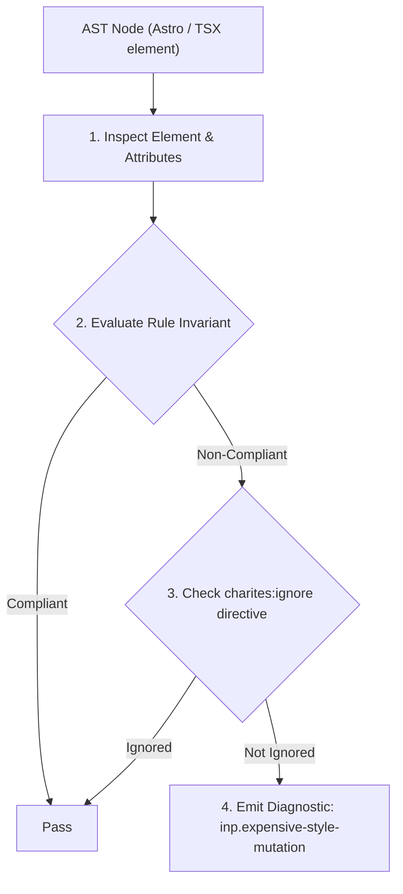
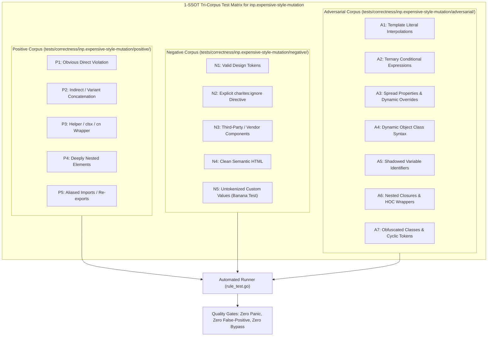

# inp.expensive-style-mutation

> **Rule ID:** `inp.expensive-style-mutation`
> **Severity:** `WARN`
> **Category:** `inp`
> **Target Standards:** Google Chrome Core Web Vitals (Interaction to Next Paint Presentation Delay), W3C CSS Compositing and Blending Level 2, Hardware-Accelerated CSS Transforms & Opacity Subsystem

---

## 1. Overview & Core Invariant

Continuous interaction handler imperatively mutates high-cost paint-sensitive style properties (boxShadow, filter, etc.)

### Core Invariant:
> **"Continuous interaction handlers (onPointerMove, onTouchMove, onScroll) must not imperatively mutate high-cost paint-sensitive CSS properties ('boxShadow', 'filter', 'backdropFilter', etc.); GPU-accelerated composited properties ('transform', 'opacity') should be used instead."**

---
## 2. Technical Grounding & Engine Realities

Properties such as 'box-shadow', 'filter', 'backdrop-filter', and 'background-image' require software or GPU rasterization passes every time their values change.

When mutated inside high-frequency continuous interaction handlers (e.g. 'onPointerMove', 'onTouchMove', or 'onScroll' which fire at 60Hz-120Hz), the browser is forced to discard rasterized layer caches and repaint damaged regions continuously.

This raster contention causes heavy frame drops and delays Presentation Delay. Replacing dynamic shadow or blur mutations with GPU-composited 'transform' or discrete CSS class toggles avoids CPU/GPU raster churn completely.

---
## 3. Vulnerability & Risk Taxonomy

| Risk Vector | Severity | Impact |
| :--- | :---: | :--- |
| **Continuous Paint Cache Invalidation** | HIGH | High-frequency pointer movements force continual repainting of heavy blur or shadow layers. |
| **Frame Drops & Touch Presentation Delay** | HIGH | Rasterizer stalls degrade input responsiveness and drop interaction frames down to 15-30 FPS on mobile. |

---
## 4. Non-Compliant Code Patterns (Bad Examples)
### TSX (Imperative box-shadow and blur mutation on every pointer move event):
```tsx
<div onPointerMove={(e) => {
  e.currentTarget.style.boxShadow = `0 ${e.clientY / 10}px 30px rgba(0,0,0,0.5)`;
  e.currentTarget.style.filter = `blur(${e.clientX / 50}px)`;
}}>
  Interactive Card
</div>
```

---
## 5. Compliant Implementation Patterns (Good Examples)
### TSX (GPU-accelerated transform without triggering rasterization cache invalidation):
```tsx
<div onPointerMove={(e) => {
  e.currentTarget.style.transform = `translateY(${e.clientY / 10}px)`;
}}>
  Interactive Card
</div>
```

---

## 6. Detection & Verification Pipeline (How The Rule Evaluates Code)
This rule evaluates source code through the standard AST inspection pipeline:



### Step-by-Step Evaluation:
1. **AST Traversal:** Visits normalized `ir.Node` structures during AST streaming.
2. **Invariant Check:** Compares node attributes against rule invariants.
3. **Directive Suppression Check:** Honors inline `charites:ignore inp.expensive-style-mutation` directives.
4. **Diagnostic Emission:** Emits compiler-grade diagnostic on invariant violation.

---

## 7. Verification & Test Harness (How The Test Works: 1-SSOT Tri-Corpus)

This rule is rigorously tested and validated across the canonical **1-SSOT Tri-Corpus** in `tests/correctness/inp.expensive-style-mutation/`:



- **Positive Fixtures (P1-P5):** Verified to trigger diagnostics at exact lines and column spans.
- **Negative Fixtures (N1-N5):** Verified to produce zero diagnostics on valid tokens and legitimate exemptions.
- **Adversarial Fixtures (A1-A7):** Verified to prevent evasion across dynamic expressions, string interpolations, and cyclic references.

---

## 8. How to Suppress (Ignore Directives)

If this pattern is required for an intentional exception, suppress the diagnostic using the canonical Charites Rule ID:

```astro
<!-- charites:ignore inp.expensive-style-mutation intentional exception -->
```

```tsx
// charites:ignore inp.expensive-style-mutation intentional exception
```

---

## 9. Configuration Reference (`charites.yaml`)

```yaml
rules:
  inp.expensive-style-mutation:
    severity: warn # error | warn | info | off
```

