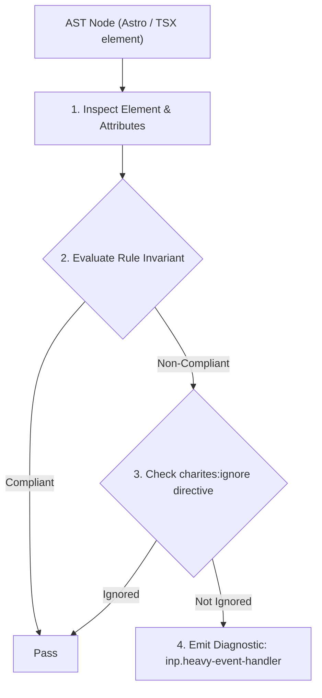
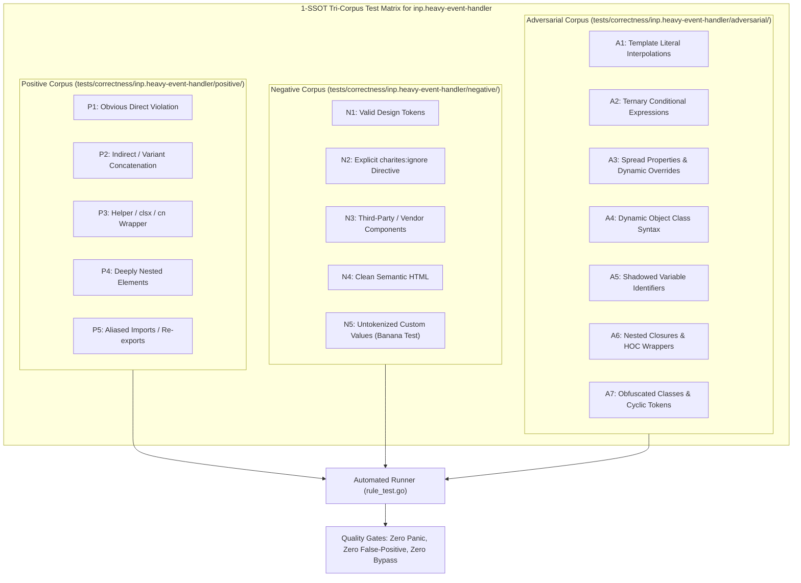

# inp.heavy-event-handler

> **Rule ID:** `inp.heavy-event-handler`
> **Severity:** `WARN`
> **Category:** `inp`
> **Target Standards:** W3C Web Performance Working Group (Interaction to Next Paint - INP), Google Chrome Core Web Vitals (Input Delay & Processing Duration), Browser Cooperative Scheduling Guidelines (scheduler.yield)

---

## 1. Overview & Core Invariant

Interactive event handler executes heavy synchronous operations (JSON.parse, Array.sort) without cooperative yields

### Core Invariant:
> **"Interactive event handlers must avoid heavy synchronous computations on the main thread, adopting cooperative task yielding or Web Worker offloading."**

---
## 2. Technical Grounding & Engine Realities

When users tap, click, or type, the browser expects the main thread to quickly acknowledge the interaction and schedule the next paint frame (ideally within 50ms, with INP target <= 200ms).

Executing heavy synchronous operations (such as large JSON parsing, array sorting, or complex synchronous data manipulation) directly inside event handler callbacks blocks the main thread during the crucial input processing phase.

This delays the presentation of visual feedback (e.g. active button states, loading spinners) and directly inflates the INP metric.

Breaking long tasks with 'await scheduler.yield?.()' or offloading computation to a dedicated Web Worker allows the browser to present visual feedback immediately before executing intensive processing.

---
## 3. Vulnerability & Risk Taxonomy

| Risk Vector | Severity | Impact |
| :--- | :---: | :--- |
| **Processing Phase Thread Saturation** | HIGH | Synchronous algorithms in click/key handlers block the main thread, exceeding the 200ms INP threshold. |
| **Frozen Visual Feedback** | MEDIUM | Buttons appear unresponsive or stuck because UI rendering is starved by long synchronous handler execution. |

---
## 4. Non-Compliant Code Patterns (Bad Examples)
### TSX (Synchronous heavy data parsing and sorting directly inside onClick handler):
```tsx
<button onClick={() => {
  const data = JSON.parse(hugePayload);
  const sorted = data.sort((a, b) => b.score - a.score);
  setResults(sorted);
}}>
  Urutkan Data
</button>
```

---
## 5. Compliant Implementation Patterns (Good Examples)
### TSX (Cooperative yielding to acknowledge user input before intensive processing):
```tsx
<button onClick={async () => {
  setLoading(true);
  await (window.scheduler?.yield?.() ?? new Promise(r => setTimeout(r, 0)));
  const data = JSON.parse(hugePayload);
  setResults(data.sort((a, b) => b.score - a.score));
  setLoading(false);
}}>
  Urutkan Data
</button>
```

---

## 6. Detection & Verification Pipeline (How The Rule Evaluates Code)
This rule evaluates source code through the standard AST inspection pipeline:



### Step-by-Step Evaluation:
1. **AST Traversal:** Visits normalized `ir.Node` structures during AST streaming.
2. **Invariant Check:** Compares node attributes against rule invariants.
3. **Directive Suppression Check:** Honors inline `charites:ignore inp.heavy-event-handler` directives.
4. **Diagnostic Emission:** Emits compiler-grade diagnostic on invariant violation.

---

## 7. Verification & Test Harness (How The Test Works: 1-SSOT Tri-Corpus)

This rule is rigorously tested and validated across the canonical **1-SSOT Tri-Corpus** in `tests/correctness/inp.heavy-event-handler/`:



- **Positive Fixtures (P1-P5):** Verified to trigger diagnostics at exact lines and column spans.
- **Negative Fixtures (N1-N5):** Verified to produce zero diagnostics on valid tokens and legitimate exemptions.
- **Adversarial Fixtures (A1-A7):** Verified to prevent evasion across dynamic expressions, string interpolations, and cyclic references.

---

## 8. How to Suppress (Ignore Directives)

If this pattern is required for an intentional exception, suppress the diagnostic using the canonical Charites Rule ID:

```astro
<!-- charites:ignore inp.heavy-event-handler intentional exception -->
```

```tsx
// charites:ignore inp.heavy-event-handler intentional exception
```

---

## 9. Configuration Reference (`charites.yaml`)

```yaml
rules:
  inp.heavy-event-handler:
    severity: warn # error | warn | info | off
```

