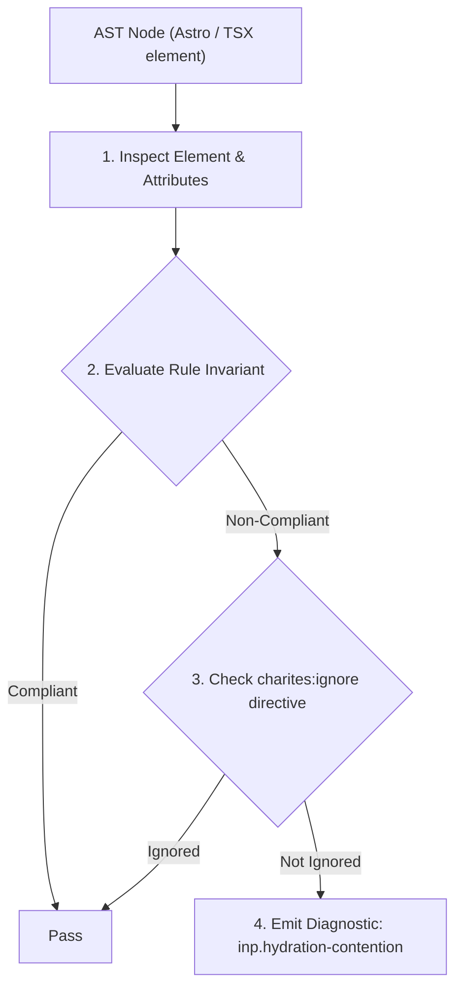
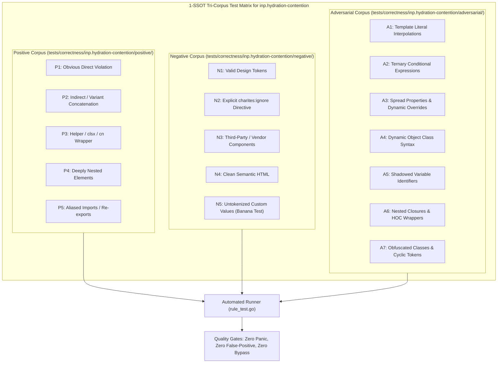

# inp.hydration-contention

> **Rule ID:** `inp.hydration-contention`
> **Severity:** `WARN`
> **Category:** `inp`
> **Target Standards:** Astro Islands Architecture & Partial Hydration Specification, W3C Cooperative Scheduling & Main-Thread Budget Invariants, Google Core Web Vitals (INP Input Delay & Hydration Contention)

---

## 1. Overview & Core Invariant

Concurrently hydrating multiple Astro client:load islands saturates the main thread and spikes input delay

### Core Invariant:
> **"Astro templates must avoid declaring multiple eager 'client:load' island directives simultaneously; non-critical islands must use deferred hydration directives ('client:idle' or 'client:visible')."**

---
## 2. Technical Grounding & Engine Realities

The 'client:load' directive instructs the browser to immediately fetch and execute island JavaScript upon page load, before user interaction or idle periods.

When multiple islands (3 or more) declare 'client:load' on the same page, their hydration phases execute in parallel or rapid succession on the main thread. This contention monopolizes CPU resources during initial user interactions, generating severe Long Tasks and inflating Input Delay.

By reserving 'client:load' strictly for critical interactive UI (such as primary navigation) and deferring secondary components to 'client:idle' or 'client:visible', the main thread remains responsive to user taps, clicks, and keystrokes.

---
## 3. Vulnerability & Risk Taxonomy

| Risk Vector | Severity | Impact |
| :--- | :---: | :--- |
| **Initial Hydration CPU Saturation** | HIGH | Multiple islands running concurrent React hydration lock the main thread during the window when users attempt first interaction. |
| **Severe Input Delay Spikes** | MEDIUM | User clicks or keystrokes are queued behind synchronous island hydration tasks, resulting in INP > 200ms. |

---
## 4. Non-Compliant Code Patterns (Bad Examples)
### ASTRO (Multiple non-critical islands concurrently hydrated with client:load):
```astro
---
import HeaderNav from '../components/HeaderNav.tsx';
import SearchBar from '../components/SearchBar.tsx';
import PromoBanner from '../components/PromoBanner.tsx';
---
<HeaderNav client:load />
<SearchBar client:load />
<PromoBanner client:load />
```

---
## 5. Compliant Implementation Patterns (Good Examples)
### ASTRO (Only critical navigation uses client:load; secondary islands use deferred hydration):
```astro
---
import HeaderNav from '../components/HeaderNav.tsx';
import SearchBar from '../components/SearchBar.tsx';
import PromoBanner from '../components/PromoBanner.tsx';
---
<HeaderNav client:load />
<SearchBar client:idle />
<PromoBanner client:visible />
```

---

## 6. Detection & Verification Pipeline (How The Rule Evaluates Code)
This rule evaluates source code through the standard AST inspection pipeline:



### Step-by-Step Evaluation:
1. **AST Traversal:** Visits normalized `ir.Node` structures during AST streaming.
2. **Invariant Check:** Compares node attributes against rule invariants.
3. **Directive Suppression Check:** Honors inline `charites:ignore inp.hydration-contention` directives.
4. **Diagnostic Emission:** Emits compiler-grade diagnostic on invariant violation.

---

## 7. Verification & Test Harness (How The Test Works: 1-SSOT Tri-Corpus)

This rule is rigorously tested and validated across the canonical **1-SSOT Tri-Corpus** in `tests/correctness/inp.hydration-contention/`:



- **Positive Fixtures (P1-P5):** Verified to trigger diagnostics at exact lines and column spans.
- **Negative Fixtures (N1-N5):** Verified to produce zero diagnostics on valid tokens and legitimate exemptions.
- **Adversarial Fixtures (A1-A7):** Verified to prevent evasion across dynamic expressions, string interpolations, and cyclic references.

---

## 8. How to Suppress (Ignore Directives)

If this pattern is required for an intentional exception, suppress the diagnostic using the canonical Charites Rule ID:

```astro
<!-- charites:ignore inp.hydration-contention intentional exception -->
```

```tsx
// charites:ignore inp.hydration-contention intentional exception
```

---

## 9. Configuration Reference (`charites.yaml`)

```yaml
rules:
  inp.hydration-contention:
    severity: warn # error | warn | info | off
```

